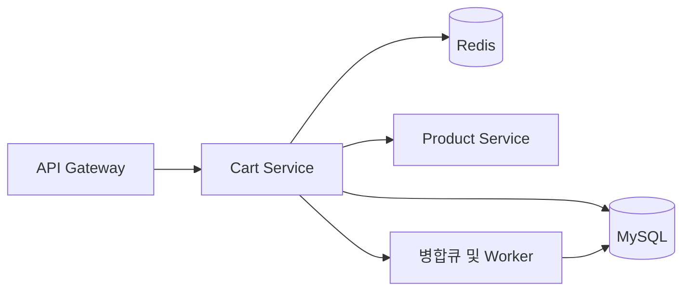
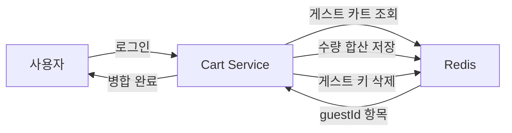
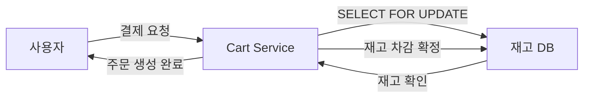

> **한 줄 요약**: 비로그인 임시 장바구니를 Redis에 보관하고, 로그인 시 병합 전략(수량 합산 vs 로그인 우선)으로 충돌을 해소하며, 재고는 결제 시점에만 잠그는 것이다.

## 실제 문제: 비로그인 장바구니 유실과 병합 충돌

올리브영 앱에서 립스틱 3개를 담고 회원가입을 하면 어떻게 될까요? 서버 내부에서는 쿠키 ID 기반 게스트 장바구니와 사용자 ID 기반 회원 장바구니가 충돌합니다.

- **문제 1 — 비로그인 장바구니 유실**: 로그인 순간 담아뒀던 상품이 사라집니다. 전환율(Conversion Rate) 직결 이슈입니다.
- **문제 2 — 병합 충돌**: 게스트로 A 상품 2개, 로그인 계정에 A 상품 1개가 있으면? 3개로 합산할지 2개로 덮어쓸지 규칙이 명확해야 합니다.
- **문제 3 — 재고 불일치**: 장바구니에 담는다고 재고가 예약되지 않아 결제 시 품절이 될 수 있습니다.
- **문제 4 — 가격 스냅샷 vs 실시간**: 담아둔 상품이 할인 행사에 들어갔을 때 어떤 가격으로 결제하는가?

---

## 설계 의사결정 로드맵

### 결정 1: 저장소 — 세션 vs Redis vs RDB

**문제**: 장바구니는 읽기·쓰기 모두 빈번하고 TTL이 있으며, 상품 페이지 이동마다 조회됩니다.

| 후보 | 장점 | 단점 | 언제 적합 |
|------|------|------|----------|
| 서버 세션 (메모리) | 구현 단순 | 서버 재시작 시 유실, 수평 확장 불가 | 단일 서버, 프로토타입 |
| Redis (인메모리 KV) | 고속 읽기쓰기, TTL 내장, Hash로 상품 단위 조작 | 장애 시 유실 가능 (AOF 설정 필요) | 활성·게스트 장바구니 |
| RDB (MySQL) | 영구 저장, 트랜잭션 보장 | 상품 추가/삭제마다 Row 조작, 높은 TPS 시 병목 | 로그인 회원 영구 저장 |

**우리의 선택: Redis (활성 장바구니) + RDB (로그인 회원 영구 저장) 이중 구조**
- 게스트 장바구니는 TTL 7일 Redis Hash로 저장합니다. `HSET cart:{guestId} {productId} {qty}`로 O(1) 조작이 가능합니다. 로그인 회원이 체크아웃하면 RDB에 영구 저장하고 Redis 캐시를 Write-Through로 동기화합니다.
- 안 하면: DAU 1,500만, 1인당 페이지뷰 10회면 초당 1,700 QPS가 장바구니 조회에 쏟아집니다. Redis 없이는 감당 불가합니다.

### 결정 2: 비로그인 장바구니 — 쿠키 vs 로컬스토리지 vs 서버 임시저장

**문제**: 로그인하지 않은 사용자의 장바구니를 클라이언트에 저장할 것인가, 서버에 저장할 것인가?

| 후보 | 장점 | 단점 | 언제 적합 |
|------|------|------|----------|
| 쿠키 (클라이언트) | 구현 단순 | 4KB 제한, 다른 기기에서 소실 | 상품 수 적은 단순 구현 |
| 로컬스토리지 (클라이언트) | 용량 충분, 빠름 | 다른 기기 연동 불가, 브라우저 삭제 시 유실 | SPA 환경 |
| 서버 임시저장 (Redis + guestId) | 기기 간 공유 가능, 병합 로직 일원화 | Redis 비용, guestId 관리 필요 | 전환율이 중요한 커머스 |

**우리의 선택: 서버 임시저장 (Redis) + guestId 쿠키**
- 쿠키에는 UUID guestId만 저장하고 실제 데이터는 Redis에 둡니다. 모바일에서 담고 PC에서 결제하는 크로스 디바이스 시나리오를 지원합니다.
- 안 하면: 로컬스토리지에만 저장하면 앱에서 담은 상품이 PC 웹에서 보이지 않습니다.

### 결정 3: 장바구니-재고 동기화 — 실시간 vs Lazy vs 결제 시점

**문제**: 사용자가 상품을 장바구니에 담을 때 재고를 예약(Lock)해야 하는가?

| 후보 | 장점 | 단점 | 언제 적합 |
|------|------|------|----------|
| 실시간 예약 (담을 때 Lock) | 결제 시 품절 없음 | 담고 이탈 시 재고 묶임, 전환율 하락 | 좌석·항공권 등 희소 재고 |
| Lazy 체크 (조회 때마다 표시) | 재고 묶임 없음 | 결제 시 품절 가능 | 재고 충분한 일반 상품 |
| 결제 시점 Hard Lock | 재고 묶임 없음 + 결제 직전 정확한 확인 | 결제 직전 품절 시 롤백 필요 | 대부분의 이커머스 |

**우리의 선택: Lazy 재고 표시 + 결제 시점 Hard Lock**
- 장바구니 단계에서는 재고 상태를 표시만 합니다. 결제 시점에 `SELECT ... FOR UPDATE`로 재고를 잠그고 부족 시 즉시 알립니다.
- 안 하면: 한정판 100켤레를 동시에 1만 명이 담으면 99,900명의 재고가 묶여 실제 구매 전환이 일어나지 않습니다.

### 결정 4: 가격 일관성 — 담을 때 가격 vs 조회 시 가격 vs 결제 시 가격

**문제**: 장바구니에 담은 후 가격이 변경됐을 때 어떤 가격으로 결제하는가?

| 후보 | 장점 | 단점 | 언제 적합 |
|------|------|------|----------|
| 담을 때 가격 고정 | 사용자 예측 가능 | 할인 행사 미반영 | 경매, 한시 특가 |
| 조회 시 실시간 가격 | 항상 최신 가격 | 페이지 이동마다 가격 변동으로 혼란 | 빠른 가격 변동 상품 |
| 결제 시점 최신 가격 | 최종 결제 가격 정확 | 결제 직전 가격 인상 시 사용자 놀람 | 대부분의 이커머스 표준 |

**우리의 선택: 조회 시 실시간 가격 표시 + 결제 시점 최신 가격 확정**
- 장바구니 조회 시 항상 현재 가격을 표시합니다. 결제 요청 시 가격이 변경됐으면 "가격이 변경되었습니다. 현재 가격으로 결제하시겠습니까?" 팝업으로 확인을 받습니다.
- 안 하면: 가격 스냅샷만 쓰면 3일 전 담은 상품의 50% 할인을 놓치고, CS 문의가 폭증합니다.

---

## 1. 요구사항 분석 및 규모 추정

### 기능 요구사항

1. **장바구니 CRUD**: 상품 추가, 수량 변경, 삭제, 전체 조회
2. **비로그인 장바구니**: 게스트 UUID 기반 임시 장바구니, 7일 TTL
3. **로그인 시 병합**: 게스트 → 회원 장바구니 자동 병합
4. **재고 상태 표시**: 조회 시 품절/품절임박 실시간 반영
5. **가격 최신화**: 조회 시 현재 가격 표시, 결제 시 가격 변경 알림
6. **저장 장바구니**: 나중에 사기 (위시리스트와 별개)

### 비기능 요구사항

- **가용성**: 99.99%
- **지연시간**: 장바구니 조회 P99 100ms 이하
- **내구성**: 로그인 회원 장바구니 유실 0
- **확장성**: 블랙프라이데이 평소 대비 10배 트래픽 처리

### 규모 추정

- DAU 1,500만 명
- 장바구니 조회: 사용자당 5회/일 → **초당 870 QPS**
- 장바구니 추가/수정: 사용자당 2회/일 → **초당 350 WPS**
- Redis 메모리: 게스트 600만 × 8개 × 50bytes = **약 2.4GB**
- RDB: 로그인 회원 900만 × 8개 = 7,200만 행 (~30GB)

---

## 2. 고수준 아키텍처

> **비유:** 게스트는 번호표(guestId)로 임시 사물함(Redis)을 쓰고, 회원이 되면 영구 사물함(RDB)으로 짐을 옮기는 **물품 보관함** 구조입니다.



| 컴포넌트 | 역할 |
|---------|------|
| **API Gateway** | guestId 쿠키 주입, 인증 토큰 검증. 비로그인 요청에도 guestId 없으면 UUID 발급해 쿠키에 삽입 |
| **Cart Service** | Redis Write-Through 캐시를 통해 조회 성능 보장 |
| **Redis Hash** | `cart:{userId}` 또는 `cart:guest:{guestId}` 키로 상품 ID → 수량 매핑 저장 |
| **MySQL** | 로그인 회원의 영구 장바구니. Redis 장애 시에도 데이터 유실 없음 |
| **Product Service** | 가격·재고 조회. Cart Service가 조회 시 호출 |
| **Merge Worker** | 로그인 이벤트를 Kafka로 수신해 비동기 병합. 동기 처리 시 로그인 응답 지연 방지 |

**로그인 시 게스트 장바구니 병합 흐름**



**결제 시 재고 Hard Lock 흐름**



---

## 3. 핵심 컴포넌트 상세 설계

### Redis 스키마 설계

**방법 A — 전체를 JSON String으로 저장:**
```
cart:user:12345 → '{"items":[{"productId":"P001","qty":2},...]}'
```
단점: 상품 1개 수량 변경에도 전체 JSON을 덮어써야 하고, 동시 수정 시 Lost Update 발생.

**방법 B — Hash로 상품 단위 저장 (선택):**
```
cart:user:12345 → Hash { "P001": "2", "P002": "1", "P003": "3" }
```
`HSET cart:user:12345 P001 3`으로 상품 단위 원자적 수정, `HINCRBY`로 수량 증감도 원자적입니다. 상품 메타데이터(가격·이름)는 조회 시 Product Service에서 가져옵니다.

**TTL 전략:**
```
게스트 장바구니: TTL = 7일 (마지막 활동 기준 갱신)
로그인 회원 Redis 캐시: TTL = 24시간 (RDB가 원본)
```

### 병합 알고리즘 (Guest → Login)

> **왜 Redis Lua 스크립트로 병합하는가?** Java 코드로 개별 명령을 순서대로 실행하면 동시에 두 기기에서 로그인 시 같은 게스트 장바구니를 두 번 합산해 수량이 2배로 부풀어오릅니다. Lua 스크립트는 읽기-합산-삭제를 단일 원자 연산으로 실행해 이중 합산을 원천 차단합니다.

```java
@Service
public class CartMergeService {

    // Redis Lua 스크립트로 게스트→회원 병합을 원자적으로 실행
    private static final String MERGE_SCRIPT = """
        local guestKey = KEYS[1]
        local userKey = KEYS[2]
        local maxQty = tonumber(ARGV[1])
        local items = redis.call('HGETALL', guestKey)
        if #items == 0 then return 0 end
        for i = 1, #items, 2 do
            local productId = items[i]
            local guestQty = tonumber(items[i+1])
            local userQty = tonumber(redis.call('HGET', userKey, productId) or '0')
            local merged = math.min(guestQty + userQty, maxQty)
            redis.call('HSET', userKey, productId, merged)
        end
        redis.call('DEL', guestKey)
        return 1
        """;

    // 프로덕션에서는 Lua 스크립트 버전을 사용해야 합니다.
    // 아래 Java 코드는 개별 명령이 원자적이지 않아 동시 로그인 시 이중 합산이 발생할 수 있습니다.
    // 병합 전략: 수량 합산 (양쪽에 같은 상품이 있으면 더함)
    public void mergeGuestCartToUser(String guestId, Long userId) {
        String guestKey = "cart:guest:" + guestId;
        String userKey  = "cart:user:" + userId;

        Map<String, String> guestItems = redisTemplate.opsForHash().entries(guestKey);
        if (guestItems.isEmpty()) return;

        for (Map.Entry<String, String> entry : guestItems.entrySet()) {
            int guestQty = Integer.parseInt(entry.getValue());
            redisTemplate.opsForHash().increment(userKey, entry.getKey(), guestQty);
        }

        // 최대 수량 상한 적용 (상품당 99개 제한)
        Map<String, String> merged = redisTemplate.opsForHash().entries(userKey);
        for (Map.Entry<String, String> entry : merged.entrySet()) {
            if (Integer.parseInt(entry.getValue()) > 99)
                redisTemplate.opsForHash().put(userKey, entry.getKey(), "99");
        }

        redisTemplate.delete(guestKey);
        cartEventPublisher.publishMergeCompleted(userId);  // RDB 동기화 (비동기)
    }
}
```

수량 합산을 선택한 이유: 게스트 2개 + 로그인 계정 1개일 때 사용자는 최소 3개를 원한다고 볼 수 있습니다. 강제 덮어쓰기보다 직접 수정하는 것이 낫습니다. SSG닷컴과 올리브영이 이 방식을 씁니다.

### 장바구니 상품 추가 (상한 체크)

```java
private static final int MAX_CART_ITEMS = 200;

public void addToCart(String cartKey, String productId, int quantity) {
    long currentSize = redisTemplate.opsForHash().size(cartKey);
    if (currentSize >= MAX_CART_ITEMS)
        throw new CartLimitExceededException("장바구니는 최대 200개 상품까지 담을 수 있습니다.");

    redisTemplate.opsForHash().increment(cartKey, productId, quantity);
}
```

### 장바구니 조회 API (재고·가격 통합)

> **왜 Bulk API로 한 번에 조회하는가?** 장바구니 상품이 20개일 때 각 productId마다 별도 API를 호출하면 네트워크 왕복이 20회입니다. P99 100ms 목표는 이 구조로는 불가능합니다. productId 목록을 모아 단일 요청으로 처리해 왕복을 1회로 줄입니다.

```java
@GetMapping("/cart")
public CartResponse getCart(
        @AuthenticationPrincipal Long userId,
        @CookieValue(required = false) String guestId) {

    String cartKey = userId != null
            ? "cart:user:" + userId
            : "cart:guest:" + guestId;

    Map<String, String> rawItems = redisTemplate.opsForHash().entries(cartKey);
    if (rawItems.isEmpty()) return CartResponse.empty();

    // Product Service 일괄 조회 — N+1 방지
    Map<String, ProductInfo> productMap =
        productService.getProductsBulk(new ArrayList<>(rawItems.keySet()));

    List<CartItem> items = rawItems.keySet().stream()
        .map(pid -> {
            ProductInfo info = productMap.get(pid);
            int qty = Integer.parseInt(rawItems.get(pid));
            return CartItem.builder()
                .productId(pid).name(info.getName()).quantity(qty)
                .currentPrice(info.getCurrentPrice())
                .stockStatus(info.getStockStatus())
                .isAvailable(info.getStock() > 0)
                .build();
        })
        .collect(Collectors.toList());

    return CartResponse.of(items);
}
```

### RDB 스키마

```sql
CREATE TABLE cart_items (
    id          BIGINT AUTO_INCREMENT PRIMARY KEY,
    user_id     BIGINT       NOT NULL,
    product_id  VARCHAR(64)  NOT NULL,
    quantity    INT          NOT NULL DEFAULT 1,
    added_at    DATETIME     NOT NULL DEFAULT CURRENT_TIMESTAMP,
    updated_at  DATETIME     NOT NULL DEFAULT CURRENT_TIMESTAMP ON UPDATE CURRENT_TIMESTAMP,
    UNIQUE KEY uq_user_product (user_id, product_id),
    INDEX idx_user_id (user_id)
) ENGINE=InnoDB;

-- 담을 당시 가격 기록 (감사·분석용)
CREATE TABLE cart_price_snapshots (
    id           BIGINT AUTO_INCREMENT PRIMARY KEY,
    user_id      BIGINT         NOT NULL,
    product_id   VARCHAR(64)    NOT NULL,
    price_at_add DECIMAL(12,2)  NOT NULL,
    added_at     DATETIME       NOT NULL,
    INDEX idx_user_added (user_id, added_at)
) ENGINE=InnoDB;
```

`UNIQUE KEY uq_user_product`는 같은 사용자가 같은 상품을 중복 INSERT할 때 자동으로 막습니다.

### 결제 시 재고 Hard Lock

> **왜 productId 오름차순으로 정렬 후 락을 잡는가?** Thread 1이 상품 A→B, Thread 2가 B→A 순서로 락을 잡으면 서로 상대방의 락을 영원히 기다리는 교착 상태가 발생합니다. 항상 동일한 순서(오름차순)로 잡으면 두 스레드 모두 A를 먼저 시도하므로 하나만 진행하고 나머지는 대기합니다.

```java
@Transactional
public OrderResult checkout(Long userId, List<String> productIds) {
    Map<String, Integer> cartItems = getCartItems(userId);

    // 데드락 방지: productId 오름차순으로 항상 동일 순서로 락
    List<String> sortedIds = productIds.stream().sorted().collect(Collectors.toList());

    for (String productId : sortedIds) {
        Stock stock = stockRepository.findByProductIdForUpdate(productId);
        int required = cartItems.get(productId);
        if (stock.getAvailable() < required)
            throw new OutOfStockException(productId, stock.getAvailable(), required);
        stock.reserve(required);
    }

    validatePrices(cartItems);
    return orderService.createOrder(userId, cartItems);
}
```

항상 `productId` 오름차순으로 락을 잡아야 교착 상태를 방지합니다. Thread 1이 A→B, Thread 2가 B→A 순서로 잡으면 교착이 발생합니다.

---

## 4. 장애 시나리오와 대응

### Redis 전체 장애

- **게스트 장바구니**: Redis가 원본이므로 완전 유실. "일시적으로 담기 기능을 사용할 수 없습니다" 배너 표시가 복잡한 복구 로직보다 낫습니다.
- **로그인 회원**: RDB에 원본이 있어 Fallback 가능합니다.

```java
public Map<String, String> getCartItems(String cartKey, Long userId) {
    try {
        return redisTemplate.opsForHash().entries(cartKey);
    } catch (RedisConnectionException e) {
        if (userId != null) {
            return cartRepository.findByUserId(userId).stream()
                .collect(Collectors.toMap(
                    CartItem::getProductId,
                    item -> String.valueOf(item.getQuantity())));
        }
        return Collections.emptyMap();
    }
}
```

### 블랙프라이데이: 동시 10만 명이 장바구니 담기

MySQL Write-Through가 10만 건 INSERT/UPDATE를 동시에 처리하면 병목이 됩니다. 이벤트 트래픽 시 Write-Back(비동기)으로 전환합니다.

```
1. Redis 즉시 업데이트 (응답 반환)
2. Kafka로 cart.updated 이벤트 발행
3. MySQL Worker가 비동기로 RDB 반영 (배치 INSERT ON DUPLICATE KEY UPDATE)
```

### 병합 중 서버 재시작

Kafka로 병합 이벤트를 처리해 멱등성을 보장합니다.

```
1. 로그인 이벤트 → Kafka cart.merge 토픽 발행
2. Merge Worker: Redis 게스트 → 회원 병합
3. RDB에 병합 완료 기록 (merge_log 테이블)
4. Kafka 커밋
서버 재시작 시: 미커밋 메시지 재처리 → merge_log로 중복 병합 방지
```

---

## 5. 확장 포인트

**위시리스트 분리**: 장바구니(TTL 7일, 단기 구매 의도)와 위시리스트(TTL 없음, 장기 관심)는 저장 목적이 다릅니다. 별도 `wish_items` 테이블로 분리하고 "위시리스트에서 장바구니로 이동" API를 제공합니다.

**그룹 장바구니**: 여러 사람이 하나의 장바구니를 공유하는 기능. 키를 `cart:group:{groupId}`로 하고 각 상품에 담은 사람의 userId를 메타데이터로 추가합니다. 동시 수정 충돌은 Redis Lua Script로 처리합니다.

**멀티 셀러 장바구니**: `cart_items`에 `seller_id`를 추가하고 결제 시 셀러별 주문 그룹으로 분리합니다.

---

## 각 컴포넌트 동작원리 상세

| 컴포넌트 | 핵심 역할 | 내부 동작 흐름 |
|----------|----------|--------------|
| **API Gateway** | guestId 주입 + 인증 분기 | 쿠키 확인 → guestId 없으면 UUID 발급 → JWT 검증 후 `X-User-Id` / `X-Guest-Id` 헤더에 주입 |
| **Cart Service** | Write-Through 캐시 코디네이터 | Redis HSET 즉시 응답 → RDB `INSERT ... ON DUPLICATE KEY UPDATE` 동기/비동기 반영 |
| **Redis Hash** | O(1) 상품 단위 원자 조작 | `HSET` 수량 교체, `HINCRBY` 원자 증감, `HGETALL` 단일 왕복 조회, 7일 `EXPIRE` 자동 갱신 |
| **MySQL** | 회원 영구 장바구니 원본 | `UNIQUE KEY(user_id, product_id)` 중복 방지 + Redis 장애 시 Fallback 원본 역할 |
| **Product Service** | 일괄 가격·재고 조회 | productId 목록 모아 단일 Bulk API 호출 → N+1 방지, 인기 Top 1000 Redis 30초 캐싱 |
| **Merge Worker** | 비동기 게스트 병합 | Kafka `cart.merge` 수신 → Lua 원자 병합 → `merge_log` 기록 → 오프셋 커밋 |

---

## 극한 시나리오

### 극한 시나리오 1: 블랙프라이데이 — 동시 10만 명이 1초 안에 장바구니 담기

오전 10시 정각, 할인 알림 푸시가 나가자마자 10만 건의 `HSET` 요청이 동시에 쏟아집니다. Redis는 초당 100만 ops를 처리하므로 Redis 자체는 문제없지만, Write-Through로 MySQL까지 동기 UPDATE하면 DB 커넥션 풀 100개가 즉시 소진됩니다.

**문제점:**
- MySQL 커넥션 풀 고갈로 신규 요청이 커넥션 대기 큐에 쌓임
- INSERT ON DUPLICATE KEY UPDATE 10만 건이 같은 테이블에 몰려 인덱스 경합 발생
- 응답 지연이 5초를 넘기면 프론트엔드 타임아웃 처리 후 재시도, 요청이 2배로 증폭

**대응 전략:**
1️⃣ 이벤트 트래픽 감지 시 Write-Back(비동기)으로 자동 전환 — Redis 응답 후 Kafka `cart.updated` 이벤트 발행
2️⃣ MySQL Worker가 500ms 배치로 `INSERT ON DUPLICATE KEY UPDATE` 묶음 처리
3️⃣ Redis Cluster 샤딩으로 단일 마스터 부하 분산 (userId 해시 기반)
4️⃣ 블랙프라이데이 전날 MySQL Read Replica 2대 추가 증설 및 커넥션 풀 200으로 확장
5️⃣ 이벤트 기간 중 게스트 장바구니 TTL을 7일 → 3일로 단축해 Redis 메모리 헤드룸 확보

---

### 극한 시나리오 2: Redis 전체 장애 — 게스트 장바구니 접근 불가

Redis Cluster 전체가 네트워크 파티션으로 응답을 멈춥니다. 초당 870건의 장바구니 조회가 전부 Redis 타임아웃을 기다리고, 회원과 게스트 모두 장바구니를 볼 수 없습니다.

**문제점:**
- 게스트 장바구니는 Redis가 원본이므로 완전 접근 불가
- 회원 장바구니는 MySQL에 원본이 있지만 Fallback 로직 없으면 동일하게 실패
- Redis 타임아웃 3초 × 870 QPS = 응답 지연 폭주로 서비스 전체 장애로 전파
- 결제 진행 중인 사용자의 장바구니 조회가 실패해 결제 포기 급증

**대응 전략:**
1️⃣ Circuit Breaker(Resilience4j) 적용 — Redis 연속 실패 5회 시 즉시 Open, MySQL Fallback 전환
2️⃣ 회원 장바구니는 MySQL Fallback으로 서비스 계속 — 타임아웃 없이 즉시 전환
3️⃣ 게스트 사용자에게 배너 노출: "일시적으로 임시 장바구니를 이용할 수 없습니다. 로그인 후 이용해 주세요."
4️⃣ Redis 복구 후 자동 재워밍 — MySQL에서 최근 24시간 내 활성 회원 장바구니를 배치로 Redis에 재적재
5️⃣ 사후 조치: Redis Cluster 구성(마스터 3 + 레플리카 3) + AOF persistence 활성화로 재발 방지

---

### 극한 시나리오 3: 병합 폭풍 — 대규모 마케팅 캠페인 후 동시 로그인

"회원가입하면 5000원 쿠폰" 이벤트로 1시간 내 30만 명이 가입 후 즉시 로그인합니다. 30만 건의 게스트→회원 병합 요청이 동시에 발생합니다.

**문제점:**
- Merge Worker Kafka Consumer가 30만 개 메시지를 처리하지 못해 lag 급증
- 동일 사용자가 모바일과 PC에서 동시 로그인 시 같은 게스트 장바구니를 두 번 병합해 수량이 2배로 부풀어오름
- 병합 완료 전 사용자가 장바구니를 조회하면 빈 장바구니가 표시돼 고객 문의 폭증
- MySQL `merge_log` 테이블에 30만 행이 동시에 INSERT되어 디스크 I/O 포화

**대응 전략:**
1️⃣ Kafka Consumer Group 파티션 수를 평소 4개 → 이벤트 전날 16개로 확장, 병렬 처리 4배
2️⃣ Redis Lua 스크립트로 게스트 키 읽기+병합+삭제 원자적 실행 — 동시 로그인 이중 병합 원천 차단
3️⃣ 병합 진행 중 조회 요청에 "장바구니 동기화 중..." 상태 표시 (polling 또는 SSE로 완료 알림)
4️⃣ `merge_log` 테이블을 파티셔닝(월별) 적용하고 이벤트 기간 bulk INSERT 배치 처리
5️⃣ 병합 완료 후 Redis TTL을 24시간으로 연장해 신규 회원의 첫 쇼핑 경험 보호

---

## 실무 실수 Top 5

**실수 1: 게스트 guestId를 로컬스토리지에 저장**
쿠키가 아닌 JavaScript 로컬스토리지에 guestId를 저장하면 크로스 디바이스 공유가 불가능합니다. 모바일에서 담은 상품이 PC에서 보이지 않아 고객 문의가 급증합니다. 또한 SSR 환경에서 서버가 guestId를 읽지 못해 비로그인 장바구니 조회가 항상 빈 상태로 반환됩니다. **올바른 방법**: `HttpOnly` 쿠키에 guestId를 저장하고 서버가 주입합니다.

**실수 2: 병합 시 게스트 장바구니로 회원 장바구니를 덮어쓰기**
게스트 상태에서 A 1개를 담았는데 로그인 계정에 A가 이미 5개 있다면, 덮어쓰면 5개가 1개로 줄어듭니다. 고객은 기존에 담아둔 상품이 사라졌다고 느끼고 신뢰를 잃습니다. **올바른 방법**: 수량 합산 후 상품당 최대 수량(99개) 상한만 적용합니다.

**실수 3: 장바구니 조회 시 Product Service를 N+1로 호출**
장바구니에 상품이 20개 있을 때 각 productId마다 별도 API를 20번 호출하면 네트워크 왕복만 20회입니다. P99 100ms 목표는 이 구조로는 불가능합니다. **올바른 방법**: productId 목록을 모아 단일 Bulk API `GET /products?ids=...`로 한 번에 조회합니다.

**실수 4: 결제 시 재고 락을 상품 순서 없이 잡기**
Thread 1이 상품 A→B 순으로, Thread 2가 B→A 순으로 락을 잡으면 서로 상대방의 락을 기다리는 교착 상태가 발생합니다. 타임아웃까지 두 주문이 모두 실패하고 고객은 결제 오류 화면을 만납니다. **올바른 방법**: 항상 `productId` 오름차순으로 정렬 후 락을 잡고, `innodb_lock_wait_timeout=5`를 설정합니다.

**실수 5: Redis 캐시에만 회원 장바구니를 저장하고 RDB 동기화 생략**
개발 편의로 MySQL 동기화를 빼면 Redis 재시작, 노드 교체, 메모리 eviction 시 회원 장바구니가 조용히 사라집니다. 고객은 "담아뒀던 상품이 다 없어졌다"는 CS를 넣고, 복구 방법이 없습니다. **올바른 방법**: 회원 장바구니는 MySQL이 원본이고 Redis는 캐시임을 명확히 하고, Write-Through 또는 Write-Back으로 항상 동기화합니다.

---

## Day 1 → Scale 진화

### Phase 1 — MAU 1만, 일 주문 500건 (스타트업 초기)

**아키텍처**: 단일 Spring Boot 서버 + MySQL 1대 + Redis 1대. 게스트 장바구니는 로컬스토리지, 회원 장바구니는 MySQL 직접 조회.
**월 비용**: ~$50 (t3.small 1대 + RDS db.t3.micro)
**한계**: 서버 재시작 시 인메모리 세션 유실, 다중 서버 확장 불가

### Phase 2 — MAU 10만, 일 주문 5,000건 (서비스 성장)

**아키텍처**: Redis 도입으로 게스트 장바구니 서버 저장 전환. MySQL Read Replica 1대 추가. 장바구니 조회는 Replica에서 처리.
**월 비용**: ~$300 (EC2 t3.medium × 2 + RDS db.t3.small + ElastiCache cache.t3.micro)
**한계**: Redis 단일 장애점, Product Service 호출 N+1 시작

### Phase 3 — MAU 100만, 일 주문 5만 건 (고성장)

**아키텍처**: Cart Service 마이크로서비스 분리. Redis Sentinel 고가용성 구성. Bulk Product API로 N+1 해소. Kafka 기반 비동기 병합 워커 도입. MySQL 샤딩(userId 기준 16 shard).
**월 비용**: ~$3,000 (ECS Fargate × 4 + RDS Multi-AZ + ElastiCache Cluster + MSK)
**한계**: 블랙프라이데이 스파이크에 MySQL Write 병목

### Phase 4 — MAU 1,000만, 일 주문 50만 건 (대형 커머스)

**아키텍처**: Redis Cluster(마스터 6 + 레플리카 6)로 수평 확장. Write-Back 비동기 전환으로 MySQL Write 부하 90% 감소. CDN 엣지 캐싱으로 인기 상품 가격·재고를 글로벌 PoP에서 서빙. 타임딜 전용 장바구니 서비스 분리.
**월 비용**: ~$30,000 (K8s 클러스터 + Redis Cluster + Aurora Global + Kafka MSK)
**한계**: 글로벌 다중 리전 장바구니 동기화 복잡도

---

## 핵심 메트릭

| 메트릭 | 정상 기준 | 이상 신호 | 원인 가설 |
|--------|-----------|-----------|-----------|
| 장바구니 조회 P99 지연 | < 100ms | > 500ms | Redis 장애 또는 Product Service N+1 호출 폭증 |
| Redis Hit Rate | > 95% | < 80% | TTL 만료 급증 또는 Redis 메모리 eviction 발생 |
| 병합 Kafka Lag | < 1,000 | > 10,000 | Merge Worker 처리량 부족, 파티션 확장 필요 |
| 게스트 → 회원 전환율 | > 15% | < 10% | 병합 실패로 장바구니 유실, 사용자 이탈 |
| 결제 시 품절 발생률 | < 0.5% | > 2% | 재고 Hard Lock 로직 누락 또는 재고 시스템 지연 |
| 장바구니 당 상품 수 | 3~8개 | > 50개 | 봇 또는 비정상 사용, 상한(200개) 미적용 |
| MySQL Write QPS | < 500 | > 2,000 | Write-Back 비동기 전환 미적용, 배치 처리 필요 |

---

## 실제 장애 사례

### 사례 1: 올리브영 앱 장바구니 유실 — 로그인 시 게스트 덮어쓰기

**상황**: 2023년 11월 올리브영 앱 대규모 업데이트 후 일부 사용자가 "로그인하자마자 장바구니가 비었다"는 CS를 폭발적으로 제기했습니다. 하루 약 2,300건의 장바구니 유실 보고가 접수됐습니다.

**근본 원인**: 병합 로직이 수량 합산 대신 "로그인 계정 우선" 덮어쓰기로 배포됐습니다. 로그인 계정의 장바구니가 비어 있으면 게스트 장바구니로 덮었지만, 로그인 계정에 상품이 하나라도 있으면 게스트 장바구니 전체를 무시하는 버그가 있었습니다. 앱 업데이트로 인해 대부분의 사용자가 로그아웃 상태에서 재로그인하면서 게스트 장바구니가 대량 유실됐습니다.

**해결책**: 긴급 핫픽스로 수량 합산 방식으로 복구했습니다. 유실된 사용자에게 1,000원 쿠폰을 일괄 지급했습니다. 이후 병합 전 반드시 두 장바구니를 모두 로깅하는 감사 로그를 추가하고, 병합 알고리즘 변경 시 A/B 테스트를 의무화했습니다.

**교훈**: 병합 전략은 작은 로직 변경처럼 보이지만 전환율과 고객 신뢰에 직결됩니다. 병합 알고리즘은 별도 단위 테스트 스위트를 갖추고, 배포 전 섀도 모드로 기존 결과와 비교해야 합니다.

---

### 사례 2: 무신사 블랙프라이데이 — Redis OOM으로 장바구니 전체 서비스 다운

**상황**: 2022년 블랙프라이데이 오전 10시, Redis 메모리 사용률이 97%를 넘어서며 `maxmemory-policy allkeys-lru`가 활성화됐습니다. 최근에 담은 장바구니 데이터가 LRU 기준으로 eviction되면서 회원 장바구니가 무작위로 빈 상태로 반환됐습니다.

**근본 원인**: 블랙프라이데이 대비 Redis 메모리를 8GB → 16GB로 증설 계획이 있었으나, 인프라 팀 일정 착오로 적용이 누락됐습니다. 이벤트 트래픽에서 게스트 장바구니 7일 TTL 데이터가 누적되어 평소 대비 3배의 메모리를 사용했습니다.

**해결책**: 오전 10시 30분 긴급 Redis 메모리 증설(16GB) 완료. 이벤트 기간 게스트 TTL을 7일 → 1일로 단축해 메모리 압박 해소. MySQL Fallback이 즉시 동작해 회원 장바구니는 30분 내 정상화됐습니다.

**교훈**: Redis 메모리 증설은 이벤트 1주 전 인프라 체크리스트 항목으로 의무화했습니다. eviction 발생 시 `keyspace_misses` 메트릭이 급증하므로 이를 P1 알람에 추가했습니다.

---

### 사례 3: 쿠팡 결제 직전 장바구니 — 가격 스냅샷 버그로 할인가 미반영

**상황**: 2021년 쿠팡 로켓배송 상품에 대해 "결제했는데 할인이 안 됐다"는 민원이 2주간 지속됐습니다. 조사 결과 결제 요청 시 가격 검증 로직이 Redis 캐시의 오래된 가격을 사용하고 있었습니다.

**근본 원인**: 가격 변경 이벤트(쿠폰 적용, 타임딜 시작)가 Cart Service Redis 캐시를 무효화하지 않았습니다. Product Service의 가격 캐시는 30초 TTL로 갱신됐지만, Cart Service 내부 Local Cache(Caffeine)의 TTL이 5분으로 설정되어 있어 타임딜 시작 후 최대 5분간 구가격이 사용됐습니다.

**해결책**: 가격 변경 이벤트 발생 시 Kafka `product.price.updated` 토픽으로 즉시 이벤트를 발행하고, Cart Service가 구독해 Local Cache를 즉시 무효화하도록 수정했습니다. 결제 시점에는 항상 Product Service를 직접 호출해 최신 가격을 확정하는 로직을 추가했습니다.

**교훈**: 장바구니의 가격 캐시와 결제 확정 가격은 반드시 분리해야 합니다. 조회 성능을 위한 캐시는 허용하되, 결제 확정 단계에서는 캐시를 우회하고 원본 소스를 참조해야 합니다.

---

## 면접 포인트

### 면접 포인트 1️⃣ "Redis 장애 시 게스트 장바구니가 유실되어도 괜찮은가?"

비즈니스 트레이드오프의 문제입니다. 게스트의 60~70%가 결제 없이 이탈한다는 점을 감안하면, 모든 게스트 장바구니를 RDB에도 저장하는 것은 비용 대비 효과가 낮습니다. Redis Cluster + AOF persistence로 구성하면 단일 노드 장애에서 유실 위험을 거의 없앨 수 있습니다.

### 면접 포인트 2️⃣ "병합 전략에서 수량 합산 vs 로그인 우선 중 어떤 것이 맞는가?"

- 정답은 없고 **제품 방향성**에 달려 있습니다.
- 올리브영처럼 "최근 담은 것을 존중" → 게스트 우선
- 쿠팡처럼 "장기 고객의 위시를 존중" → 로그인 우선
- **수량 합산**이 가장 보수적이고 데이터 유실이 없어 기본값으로 적합. 단, 수량 상한(99개) 반드시 적용

### 면접 포인트 3️⃣ "결제 시 재고 Hard Lock의 데드락을 어떻게 방지하는가?"

항상 동일한 순서(productId 오름차순)로 락을 잡습니다. Thread 1이 A→B, Thread 2가 B→A 순서로 잡으면 교착이 발생합니다. 정렬된 순서로 잡으면 두 스레드 모두 A를 먼저 시도하므로 하나만 진행하고 나머지는 대기합니다. MySQL InnoDB의 `innodb_lock_wait_timeout`을 5초로 설정해 교착 발생 시 자동 롤백 안전망도 함께 구성합니다.

### 면접 포인트 4️⃣ "장바구니 조회 QPS가 매우 높을 때 Product Service 호출을 어떻게 줄이는가?"

두 가지를 조합합니다.

- **Local Cache(Caffeine, TTL 30초)**: Cart Service 내부 캐시로 반복 호출 흡수
- **인기 상품 Top 1000 별도 캐싱**: 가격·재고를 Cart Service Redis에 보관

이 두 가지로 Product Service 호출의 90%를 줄일 수 있습니다. 단, 품절 이벤트는 즉시 캐시 무효화가 필요합니다.

### 면접 포인트 5️⃣ "가격이 결제 직전에 인상됐을 때 사용자에게 어떻게 알리는가?"

결제 요청(POST /orders)에서 장바구니 각 상품 가격을 스냅샷과 비교합니다. 가격이 상승한 상품이 있으면 `HTTP 409 Conflict`와 함께 변경된 상품 목록과 새 가격을 반환합니다. 프론트엔드는 "가격이 변경되었습니다. 새 가격으로 계속 진행하시겠습니까?" 다이얼로그를 표시합니다. 가격이 하락한 경우에는 조용히 최신 가격을 적용합니다.
