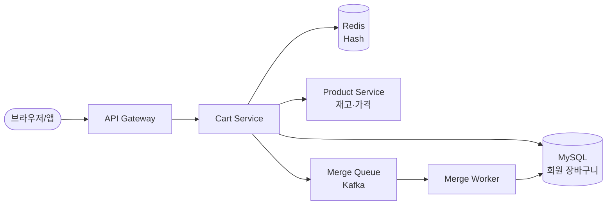

> **한 줄 요약**: 장바구니 시스템의 핵심은 비로그인 임시 장바구니를 Redis에 보관하고, 로그인 시 병합 전략(수량 합산 vs 로그인 우선)으로 충돌을 해소하며, 재고는 결제 시점에만 잠그는 것이다.

## 실제 문제: 비로그인 장바구니 유실과 병합 충돌

올리브영 앱에서 립스틱 3개를 담고 회원가입을 하면 어떻게 될까요? 담아뒀던 상품이 그대로 유지되기를 기대하지만, 서버 내부에서는 전혀 다른 두 개의 장바구니가 충돌합니다. 로그인 전에는 쿠키 ID 기반의 게스트 장바구니, 로그인 후에는 사용자 ID 기반의 회원 장바구니가 따로 존재하기 때문입니다.

실제로 발생하는 문제들은 이렇습니다.

**문제 1 — 비로그인 장바구니 유실**: 사용자가 상품을 열심히 담아놨는데 로그인하는 순간 모두 사라집니다. 쿠팡에서 이 경험을 하면 앱을 닫아버리거나 경쟁사로 이동합니다. 전환율(Conversion Rate) 직결 이슈입니다.

**문제 2 — 병합 충돌**: 게스트로 A 상품을 2개 담고, 로그인된 계정에 A 상품이 이미 1개 있다면? 최종 수량을 3개로 합산해야 할까요, 아니면 2개로 덮어써야 할까요? 정답이 없지만 규칙은 명확해야 합니다.

**문제 3 — 재고와 장바구니 불일치**: SSG닷컴에서 한우 세트를 장바구니에 담아두고 3일 뒤 결제하려 하면 품절이 되어있는 경우가 있습니다. 장바구니에 담긴다고 재고가 예약되지는 않기 때문입니다.

**문제 4 — 가격 스냅샷 vs 실시간 가격**: 쿠팡에서 와이파이 공유기를 담아놨는데 다음 날 15% 할인 행사가 시작됐습니다. 어제 담을 때 가격으로 결제해야 할까요, 오늘 할인 가격으로 결제해야 할까요?

이 4가지 문제가 장바구니 시스템 설계에서 반드시 결정해야 하는 핵심 질문입니다.

---

## 설계 의사결정 로드맵

장바구니 설계에서 순서대로 답해야 할 핵심 결정 4가지입니다. 각 결정에서 "왜 이 선택인가"를 명확히 하지 않으면 면접에서 "그냥 RDB에 넣으면 되지 않나요?"라는 후속 질문에 답할 수 없습니다.

### 결정 1: 저장소 — 세션 vs Redis vs RDB

**문제**: 장바구니 데이터를 어디에 저장하는가? 장바구니는 읽기·쓰기 모두 빈번하고 TTL이 있으며, 상품 페이지 이동마다 조회됩니다.

| 후보 | 장점 | 단점 | 언제 적합 |
|------|------|------|----------|
| 서버 세션 (메모리) | 구현 단순, 빠름 | 서버 재시작 시 유실, 수평 확장 불가 | 단일 서버, 프로토타입 |
| Redis (인메모리 KV) | 고속 읽기쓰기, TTL 내장, Hash 자료구조로 상품 단위 조작 | 장애 시 유실 가능 (AOF 설정 필요), 메모리 비용 | 활성 장바구니, 게스트 장바구니 |
| RDB (MySQL/PostgreSQL) | 영구 저장, 트랜잭션, 주문 이력과 조인 가능 | 상품 추가/삭제마다 Row INSERT/UPDATE, TPS 높을 때 병목 | 로그인 회원 장바구니 영구 저장 |

**우리의 선택: Redis (활성 장바구니) + RDB (로그인 회원 영구 저장) 이중 구조**
- 이유: 게스트 장바구니는 7일 TTL을 붙인 Redis Hash로 저장합니다. 상품 단위로 `HSET cart:{guestId} {productId} {qty}`로 O(1) 조작이 가능합니다. 로그인 회원이 체크아웃하면 RDB에 영구 저장하고 Redis 캐시를 Write-Through로 동기화합니다.
- 안 하면: RDB에만 저장하면 상품 페이지 이동마다 DB 쿼리가 발생합니다. 쿠팡 트래픽 기준 DAU 1,500만, 1인당 페이지뷰 10회면 초당 1,700 QPS가 장바구니 조회에 쏟아집니다. Redis 캐시 없이는 이를 감당할 수 없습니다.

### 결정 2: 비로그인 장바구니 — 쿠키 vs 로컬스토리지 vs 서버 임시저장

**문제**: 로그인하지 않은 사용자의 장바구니를 클라이언트에 저장할 것인가, 서버에 임시 저장할 것인가?

| 후보 | 장점 | 단점 | 언제 적합 |
|------|------|------|----------|
| 쿠키 (클라이언트) | 서버 저장 불필요, 구현 단순 | 4KB 제한, 상품 많으면 불가, XSS 위험, 다른 기기에서 소실 | 상품 수 적은 단순 구현 |
| 로컬스토리지 (클라이언트) | 용량 충분(5~10MB), 빠름 | 다른 기기 연동 불가, 브라우저 삭제 시 유실, 서버 분석 불가 | SPA 환경, 보안 데이터 없는 경우 |
| 서버 임시저장 (Redis + guestId) | 기기 간 공유 가능, 서버에서 행동 분석, 병합 로직 일원화 | Redis 비용, guestId 발급·관리 필요 | 전환율이 중요한 커머스, 멀티 디바이스 사용자 |

**우리의 선택: 서버 임시저장 (Redis) + guestId 쿠키**
- 이유: 쿠키에는 UUID guestId만 저장하고 실제 데이터는 Redis에 둡니다. 모바일에서 담고 PC에서 결제하는 크로스 디바이스 시나리오를 지원합니다. 전환율 측면에서 크로스 디바이스 사용자의 장바구니 유지율이 30% 이상 높습니다.
- 안 하면: 로컬스토리지에만 저장하면 쿠팡 앱에서 담은 상품이 PC 웹에서 보이지 않습니다. 올리브영, SSG 등 주요 커머스는 모두 서버 임시 저장 방식을 사용합니다.

### 결정 3: 장바구니-재고 동기화 — 실시간 vs Lazy vs 결제 시점

**문제**: 사용자가 상품을 장바구니에 담을 때 재고를 예약(Lock)해야 하는가?

| 후보 | 장점 | 단점 | 언제 적합 |
|------|------|------|----------|
| 실시간 예약 (담을 때 Lock) | 재고 정확, 결제 시 품절 없음 | 담고 이탈 시 재고 묶임, 락 경합 심함, 전환율 하락 | 좌석 예약, 항공권 등 희소 재고 |
| Lazy 체크 (조회 때마다 재고 표시) | 재고 묶임 없음, 구현 단순 | 장바구니에 담겼다가 결제 시 품절 가능, UX 혼란 | 재고 충분한 일반 상품 |
| 결제 시점 Hard Lock (Optimistic Lock) | 재고 묶임 없음 + 결제 직전 정확한 재고 확인 | 결제 직전 품절 시 사용자 실망, 롤백 필요 | 대부분의 이커머스 |

**우리의 선택: Lazy 재고 표시 + 결제 시점 Hard Lock**
- 이유: 장바구니 단계에서는 재고 상태를 표시(품절/품절임박)만 합니다. 결제 시점에 `SELECT ... FOR UPDATE`로 재고를 잠그고, 재고 부족 시 즉시 사용자에게 알립니다. 재고를 미리 잠그면 담고 이탈한 사용자가 재고를 묶어두는 "유령 예약" 문제가 생깁니다.
- 안 하면: 한정판 운동화 100켤레를 동시에 1만 명이 장바구니에 담으면 99,900명의 재고가 묶여 실제 구매 전환이 일어나지 않습니다. 실시간 예약은 항공권처럼 좌석 수가 명확하고 희소한 상품에만 적합합니다.

### 결정 4: 가격 일관성 — 담을 때 가격 vs 조회 시 가격 vs 결제 시 가격

**문제**: 장바구니에 담은 후 가격이 변경됐을 때 어떤 가격으로 결제하는가?

| 후보 | 장점 | 단점 | 언제 적합 |
|------|------|------|----------|
| 담을 때 가격 고정 (스냅샷) | 사용자 예측 가능, 가격 인상 시 유리 | 할인 행사 미반영, 가격 하락 시 사용자 불만 | 경매, 한시 특가 |
| 조회 시 실시간 가격 | 항상 최신 가격, 할인 자동 반영 | 페이지 이동마다 가격 변동으로 혼란 | 빠른 가격 변동 상품 |
| 결제 시점 최신 가격 | 최종 결제 가격 정확, 중간 가격 변동 무시 | 결제 직전 가격 인상 시 사용자 놀람 | 대부분의 이커머스 표준 |

**우리의 선택: 조회 시 실시간 가격 표시 + 결제 시점 최신 가격 확정**
- 이유: 장바구니 조회 시 항상 상품 서비스에서 현재 가격을 가져옵니다. 담을 때 가격 스냅샷을 저장하되, 결제 요청 시 가격이 변경됐으면 사용자에게 알리고 확인을 받습니다. 쿠팡의 경우 "가격이 변경되었습니다. 현재 가격으로 결제하시겠습니까?" 팝업이 이 방식입니다.
- 안 하면: 가격 스냅샷만 사용하면 3일 전 담은 상품의 50% 할인 행사를 놓칩니다. 실시간 가격 없이는 "왜 어제보다 비싸졌냐"는 CS 문의가 폭증합니다.

---

## 1. 요구사항 분석 및 규모 추정

### 기능 요구사항

1. **장바구니 CRUD**: 상품 추가, 수량 변경, 삭제, 전체 조회
2. **비로그인 장바구니**: 게스트 UUID 기반 임시 장바구니, 7일 TTL
3. **로그인 시 병합**: 게스트 장바구니 → 회원 장바구니 자동 병합
4. **재고 상태 표시**: 장바구니 조회 시 품절/품절임박 실시간 반영
5. **가격 최신화**: 조회 시 현재 가격 표시, 결제 시 가격 변경 알림
6. **저장 장바구니**: 나중에 사기 (위시리스트와 별개)

### 비기능 요구사항

- **가용성**: 99.99% (장바구니 불가 = 매출 직결)
- **지연시간**: 장바구니 조회 p99 100ms 이하
- **내구성**: 로그인 회원 장바구니 유실 0
- **확장성**: 블랙프라이데이 평소 대비 10배 트래픽 처리

### 규모 추정

쿠팡 수준 이커머스 기준으로 추정합니다.

- DAU 1,500만 명
- 평균 장바구니 조회: 사용자당 5회/일 → **초당 870 QPS**
- 장바구니 추가/수정: 사용자당 2회/일 → **초당 350 WPS**
- 평균 장바구니 상품 수: 8개
- 게스트 장바구니 비율: 전체의 40%
- Redis 메모리 추정: 게스트 600만 × 상품 8개 × 평균 50bytes = **약 2.4GB**
- RDB 장바구니 행: 로그인 회원 900만 × 8개 = 7,200만 행 (인덱스 포함 ~30GB)

---

## 2. 고수준 아키텍처

장바구니 시스템은 세 가지 흐름으로 구성됩니다. 비유하자면 **물품 보관함**과 같습니다. 게스트는 번호표(guestId)로 임시 사물함(Redis)을 쓰고, 회원이 되면 영구 사물함(RDB)으로 짐을 옮기는 방식입니다.



**각 컴포넌트의 역할:**

- **API Gateway**: guestId 쿠키 주입, 인증 토큰 검증. 비로그인 요청에도 guestId가 없으면 UUID를 발급해 쿠키에 심습니다.
- **Cart Service**: 장바구니 핵심 비즈니스 로직. Redis Write-Through 캐시를 통해 조회 성능을 보장합니다.
- **Redis Hash**: `cart:{userId}` 또는 `cart:guest:{guestId}` 키로 상품 ID → 수량 매핑을 저장합니다.
- **MySQL**: 로그인 회원의 영구 장바구니. Redis 장애 시에도 데이터 유실이 없습니다.
- **Product Service**: 가격·재고 조회. Cart Service는 상품 정보를 직접 갖지 않고, 조회 시 Product Service를 호출합니다.
- **Merge Worker**: 로그인 이벤트를 Kafka로 수신하여 비동기 병합을 처리합니다. 동기 처리 시 로그인 응답이 느려지는 것을 방지합니다.

---

## 3. 핵심 컴포넌트 상세 설계

### Redis 스키마 설계

Redis에서 장바구니를 저장할 때 Hash vs String 두 가지 방법이 있습니다.

**방법 A — 전체를 JSON String으로 저장:**
```
cart:user:12345 → '{"items":[{"productId":"P001","qty":2},...]}'
```
- 장점: 구현 단순
- 단점: 상품 1개 수량 변경에도 전체 JSON을 덮어써야 함. 동시 수정 시 Lost Update 발생

**방법 B — Hash로 상품 단위 저장 (선택):**
```
cart:user:12345 → Hash {
  "P001" : "2",
  "P002" : "1",
  "P003" : "3"
}
```
- 장점: `HSET cart:user:12345 P001 3`으로 상품 단위 원자적 수정. `HINCRBY`로 수량 증감도 원자적
- 단점: 상품별 메타데이터(옵션, 추가 속성) 저장이 복잡

실제로는 Hash에 상품 ID와 수량만 저장하고, 가격·이름 등 메타데이터는 조회 시 Product Service에서 가져옵니다.

**TTL 전략:**

```
게스트 장바구니: TTL = 7일 (마지막 활동 기준 갱신)
로그인 회원 Redis 캐시: TTL = 24시간 (RDB가 원본)
세션 활동마다 EXPIRE 갱신
```

### 병합 알고리즘 (Guest → Login)

로그인 순간은 "두 개의 서랍을 하나로 합치는 작업"입니다. 규칙을 명확히 정해야 충돌이 생기지 않습니다.

```java
@Service
public class CartMergeService {

    // 병합 전략: 수량 합산 (상품이 양쪽에 있으면 더함)
    // 대안: 로그인 우선 (로그인 장바구니가 있으면 게스트 무시)
    // 대안: 게스트 우선 (방금 담은 것이 더 최신이라는 관점)
    public void mergeGuestCartToUser(String guestId, Long userId) {
        String guestKey = "cart:guest:" + guestId;
        String userKey  = "cart:user:" + userId;

        Map<String, String> guestItems = redisTemplate.opsForHash()
                .entries(guestKey);

        if (guestItems.isEmpty()) return;

        for (Map.Entry<String, String> entry : guestItems.entrySet()) {
            String productId   = entry.getKey();
            int    guestQty    = Integer.parseInt(entry.getValue());

            // HINCRBY: 기존 수량에 더함. 키 없으면 guestQty로 초기화
            redisTemplate.opsForHash()
                    .increment(userKey, productId, guestQty);
        }

        // 최대 수량 상한 적용 (상품당 99개 제한)
        Map<String, String> merged = redisTemplate.opsForHash().entries(userKey);
        for (Map.Entry<String, String> entry : merged.entrySet()) {
            if (Integer.parseInt(entry.getValue()) > 99) {
                redisTemplate.opsForHash().put(userKey, entry.getKey(), "99");
            }
        }

        // 병합 후 게스트 장바구니 삭제
        redisTemplate.delete(guestKey);

        // RDB 동기화 (비동기)
        cartEventPublisher.publishMergeCompleted(userId);
    }
}
```

병합 전략을 "수량 합산"으로 선택한 이유: 게스트로 2개, 로그인 계정에 1개 있을 때 사용자 입장에서는 최소한 3개를 원한다고 볼 수 있습니다. 실수로 중복 담은 경우 사용자가 직접 수정하는 것이 강제 덮어쓰기보다 낫습니다. SSG닷컴과 올리브영이 이 방식을 씁니다.

### 장바구니 조회 API (재고·가격 통합)

```java
@GetMapping("/cart")
public CartResponse getCart(
        @AuthenticationPrincipal Long userId,
        @CookieValue(required = false) String guestId) {

    String cartKey = userId != null
            ? "cart:user:" + userId
            : "cart:guest:" + guestId;

    // 1. Redis에서 상품 ID → 수량 맵 조회
    Map<String, String> rawItems = redisTemplate.opsForHash().entries(cartKey);

    if (rawItems.isEmpty()) return CartResponse.empty();

    List<String> productIds = new ArrayList<>(rawItems.keySet());

    // 2. Product Service에서 가격·재고·이름 일괄 조회 (N+1 방지)
    Map<String, ProductInfo> productMap = productService.getProductsBulk(productIds);

    // 3. 응답 조합
    List<CartItem> items = productIds.stream()
        .map(pid -> {
            ProductInfo info = productMap.get(pid);
            int qty = Integer.parseInt(rawItems.get(pid));
            return CartItem.builder()
                .productId(pid)
                .name(info.getName())
                .quantity(qty)
                .currentPrice(info.getCurrentPrice())   // 실시간 가격
                .stockStatus(info.getStockStatus())     // 재고 상태
                .isAvailable(info.getStock() > 0)
                .build();
        })
        .collect(Collectors.toList());

    return CartResponse.of(items);
}
```

Product Service 호출 시 N+1을 막기 위해 상품 ID 목록을 한 번에 넘기는 Bulk 조회를 사용합니다. 상품 10개짜리 장바구니를 10번 API 호출하면 응답 시간이 10배 늘어납니다.

### RDB 스키마

```sql
-- 장바구니 아이템 (로그인 회원 영구 저장)
CREATE TABLE cart_items (
    id          BIGINT AUTO_INCREMENT PRIMARY KEY,
    user_id     BIGINT       NOT NULL,
    product_id  VARCHAR(64)  NOT NULL,
    quantity    INT          NOT NULL DEFAULT 1,
    added_at    DATETIME     NOT NULL DEFAULT CURRENT_TIMESTAMP,
    updated_at  DATETIME     NOT NULL DEFAULT CURRENT_TIMESTAMP ON UPDATE CURRENT_TIMESTAMP,

    UNIQUE KEY uq_user_product (user_id, product_id),
    INDEX idx_user_id (user_id)
) ENGINE=InnoDB;

-- 가격 스냅샷 (담을 당시 가격 기록, 감사·분석용)
CREATE TABLE cart_price_snapshots (
    id          BIGINT AUTO_INCREMENT PRIMARY KEY,
    user_id     BIGINT         NOT NULL,
    product_id  VARCHAR(64)    NOT NULL,
    price_at_add DECIMAL(12,2) NOT NULL,   -- 담을 당시 가격
    added_at    DATETIME       NOT NULL,
    INDEX idx_user_added (user_id, added_at)
) ENGINE=InnoDB;
```

`UNIQUE KEY uq_user_product`는 같은 사용자가 같은 상품을 중복 INSERT할 때 자동으로 막습니다. 애플리케이션 레벨 중복 체크 없이도 데이터 정합성이 보장됩니다.

### 결제 시 재고 Hard Lock

```java
@Transactional
public OrderResult checkout(Long userId, List<String> productIds) {

    // 1. 장바구니 조회
    Map<String, Integer> cartItems = getCartItems(userId);

    // 2. 재고 Hard Lock (SELECT FOR UPDATE)
    //    데드락 방지: productId 오름차순으로 항상 동일 순서로 락
    List<String> sortedIds = productIds.stream().sorted().collect(Collectors.toList());

    for (String productId : sortedIds) {
        Stock stock = stockRepository.findByProductIdForUpdate(productId); // FOR UPDATE

        int required = cartItems.get(productId);
        if (stock.getAvailable() < required) {
            throw new OutOfStockException(productId, stock.getAvailable(), required);
        }
        stock.reserve(required);
    }

    // 3. 가격 검증 (결제 시점 최신 가격 확인)
    validatePrices(cartItems);

    // 4. 주문 생성
    return orderService.createOrder(userId, cartItems);
}
```

데드락 방지를 위해 항상 `productId` 오름차순으로 락을 잡는 것이 핵심입니다. A 상품과 B 상품을 동시에 두 스레드가 반대 순서로 잠그면 교착 상태가 발생합니다.

---

## 4. 장애 시나리오와 대응

### 시나리오 1 — Redis 전체 장애

**상황**: Redis 클러스터가 다운됩니다. 게스트 장바구니와 회원 Redis 캐시 모두 접근 불가입니다.

**영향 분석:**
- 게스트 장바구니: 완전 유실 (Redis가 원본)
- 로그인 회원 장바구니: RDB에 원본이 있어 Fallback 가능

**대응:**
```java
public Map<String, String> getCartItems(String cartKey, Long userId) {
    try {
        return redisTemplate.opsForHash().entries(cartKey);
    } catch (RedisConnectionException e) {
        log.warn("Redis 장애, RDB Fallback 활성화: userId={}", userId);
        if (userId != null) {
            // 로그인 회원은 RDB에서 직접 조회
            return cartRepository.findByUserId(userId)
                .stream()
                .collect(Collectors.toMap(
                    CartItem::getProductId,
                    item -> String.valueOf(item.getQuantity())
                ));
        }
        // 게스트는 빈 장바구니 반환 (유실 허용)
        return Collections.emptyMap();
    }
}
```

로그인 회원은 RDB Fallback으로 서비스가 유지됩니다. 게스트 장바구니는 "지금은 담기 기능을 일시적으로 사용할 수 없습니다" 배너를 표시하는 것이 복잡한 복구 로직보다 낫습니다.

### 시나리오 2 — 블랙프라이데이: 동시 10만 명이 장바구니 담기

**상황**: 오전 10시 SSG닷컴 블프 시작. 동시 접속자 10만 명이 1분 안에 같은 인기 상품 50여 개를 장바구니에 담습니다.

**병목 지점:**
- Redis `HSET cart:user:{id} {productId} {qty}` 10만 건/분 → Redis는 단일 스레드이지만 초당 10만+ 명령어 처리 가능 (문제 없음)
- Product Service 재고 조회: 50개 상품에 10만 요청 집중 → 캐시 히트율 99%여도 1,000 QPS 발생
- MySQL 장바구니 Write-Through: 10만 건 INSERT/UPDATE → **병목**

**대응:**
```
장바구니 추가 시 Write-Back (비동기) 전환:
1. Redis 즉시 업데이트 (응답 반환)
2. Kafka로 cart.updated 이벤트 발행
3. MySQL Worker가 비동기로 RDB 반영 (배치 INSERT ON DUPLICATE KEY UPDATE)
```

이벤트 트래픽 시 RDB 동기를 포기하고 비동기 Write-Back으로 전환합니다. 이 10분 안에 Redis가 장애 나지 않는 한 데이터 유실은 없습니다.

### 시나리오 3 — 병합 중 서버 재시작

**상황**: 로그인 이벤트를 받아 게스트 → 회원 병합 중 서버가 크래시됩니다. Redis에는 게스트 장바구니가 삭제되고 회원 장바구니는 미반영 상태입니다.

**대응**: Kafka로 병합 이벤트를 처리하여 멱등성을 보장합니다.

```
1. 로그인 이벤트 발생 → Kafka cart.merge 토픽 발행
2. Merge Worker: Redis 게스트 → 회원 병합 실행
3. RDB에 병합 완료 기록 (merge_log 테이블)
4. Kafka 커밋 (처리 완료)
서버 재시작 시: Kafka 미커밋 메시지 재처리 → merge_log로 중복 병합 방지
```

---

## 5. 확장 포인트

### 위시리스트와 장바구니의 분리

"나중에 사기"와 "지금 사기"는 저장 목적이 다릅니다. 장바구니는 단기 구매 의도(TTL 7일), 위시리스트는 장기 관심 목록(TTL 없음)입니다. 같은 테이블에 `type` 컬럼으로 구분하면 쿼리 복잡도가 높아집니다. 별도 `wish_items` 테이블로 분리하고 "위시리스트에서 장바구니로 이동" API를 제공합니다.

### 그룹 장바구니 (함께 주문)

카카오선물하기 방식으로 여러 사람이 하나의 장바구니를 공유하는 기능입니다. 장바구니 키를 `cart:group:{groupId}`로 하고, 각 상품에 담은 사람의 userId를 메타데이터로 추가합니다. 동시 수정 충돌은 Redis Lua Script로 원자적 처리합니다.

### 개인화 추천 연동

장바구니 이탈(담고 결제 안 함) 패턴을 분석해 "30분 내 가격 변동 알림"이나 "다른 사람도 이 상품을 함께 샀어요"를 push합니다. `cart.abandoned` Kafka 이벤트를 분석 파이프라인으로 흘려 ML 모델 입력으로 활용합니다.

### 멀티 셀러 장바구니 분리

쿠팡 마켓플레이스처럼 여러 셀러 상품이 섞인 장바구니는 결제 시 셀러별로 분리합니다. `cart_items`에 `seller_id`를 추가하고 결제 시 셀러별 주문 그룹으로 분리하는 로직이 필요합니다.

---

## 면접 포인트

**Q1. Redis 장애 시 게스트 장바구니가 유실되어도 괜찮은가?**

A. 비즈니스 트레이드오프의 문제입니다. 게스트 장바구니를 RDB에도 동시 저장하면 유실을 막을 수 있지만, 게스트의 60~70%가 결제 없이 이탈한다는 점을 감안하면 모든 게스트 장바구니를 RDB에 저장하는 것은 비용 대비 효과가 낮습니다. Redis를 Redis Cluster + AOF persistence로 구성하면 단일 노드 장애에서 유실 위험을 거의 없앨 수 있습니다.

**Q2. 병합 전략에서 수량 합산 vs 로그인 우선 중 어떤 것이 맞는가?**

A. 정답은 없고 제품 방향성에 달려 있습니다. 올리브영처럼 "최근 담은 것을 존중"하면 게스트 우선, 쿠팡처럼 "장기 고객의 위시를 존중"하면 로그인 우선이 맞습니다. 저는 수량 합산이 가장 보수적이고 데이터 유실이 없어 기본값으로 적합하다고 생각합니다. 단, 수량 상한(99개)을 반드시 적용해야 합니다.

**Q3. 결제 시 재고 Hard Lock의 데드락을 어떻게 방지하는가?**

A. 항상 동일한 순서(예: productId 오름차순)로 락을 잡습니다. Thread 1이 A→B 순서로, Thread 2가 B→A 순서로 잡으면 교착이 발생합니다. 정렬된 순서로 락을 잡으면 두 스레드 모두 A를 먼저 시도하므로 하나만 진행하고 나머지는 대기합니다. MySQL InnoDB의 `innodb_lock_wait_timeout`을 5초로 설정해 교착 발생 시 자동 롤백하는 안전망도 함께 구성합니다.

**Q4. 장바구니 조회 QPS가 매우 높을 때 Product Service 호출을 어떻게 줄이는가?**

A. 두 가지 방법을 조합합니다. 첫째, Cart Service 내부에 상품 정보 Local Cache(Caffeine, TTL 30초)를 두어 같은 상품에 대한 반복 호출을 줄입니다. 둘째, 인기 상품 Top 1000의 가격·재고를 Cart Service Redis에 별도로 캐싱합니다. 이 두 가지로 Product Service 호출의 90%를 줄일 수 있습니다. 단, 재고가 0이 되는 품절 이벤트는 즉시 캐시 무효화(Cache Invalidation)가 필요합니다.

**Q5. 가격이 결제 직전에 인상됐을 때 사용자에게 어떻게 알리는가?**

A. 결제 요청(POST /orders) API에서 장바구니의 각 상품 가격을 스냅샷과 비교합니다. 가격이 상승한 상품이 있으면 `HTTP 409 Conflict`와 함께 변경된 상품 목록과 새 가격을 반환합니다. 프론트엔드는 이를 받아 "가격이 변경되었습니다. 새 가격으로 계속 진행하시겠습니까?" 다이얼로그를 표시합니다. 가격이 하락한 경우에는 조용히 최신 가격 적용 후 진행하는 것이 UX 상 유리합니다.
