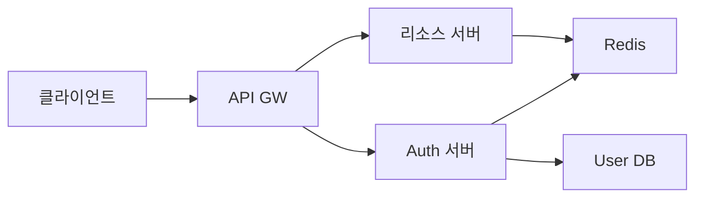
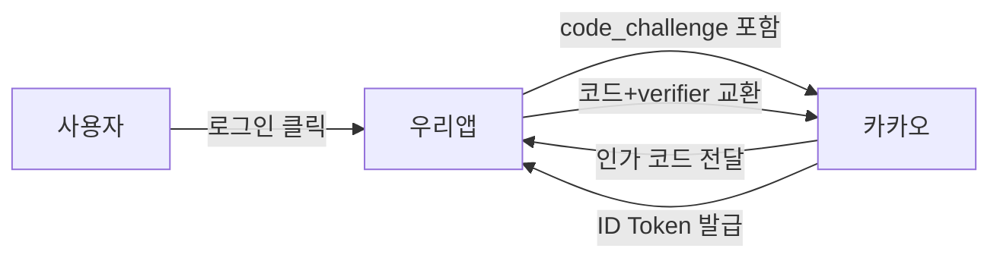
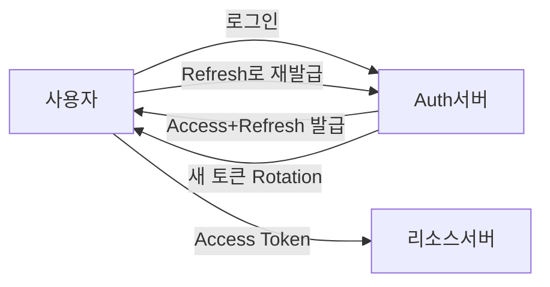
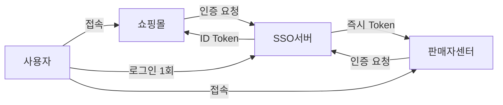

> **한 줄 요약**: 인증/인가 시스템의 핵심은 Access Token의 수명을 짧게 유지하고, Refresh Token을 Rotation시키며, 탈취 시 즉시 무효화할 수 있는 블랙리스트 체계를 갖추는 것이다.

## 실제 문제: JWT 하나로 시스템이 무너진 사례

2023년 국내 B 핀테크 서비스에서 Access Token 유효기간을 "사용자 편의"를 이유로 7일로 설정했습니다. 한 내부 직원의 노트북이 분실되었고, 세션 고정 공격으로 탈취된 토큰이 7일 내내 유효했습니다. 피해자는 비밀번호를 바꿔도 소용없었습니다. JWT는 서버 DB를 조회하지 않기 때문에 비밀번호 변경이 기존 토큰을 무효화하지 못합니다. 피해는 수백 개 계정, 수천만 원 규모였습니다.

카카오도 2022년 데이터센터 화재 당시 OAuth 인가 서버가 영향을 받아 수십 분간 카카오 로그인을 사용하는 수만 개 서비스의 로그인이 전부 중단됐습니다. SSO(Single Sign-On)의 편의성이 단일 장애 지점(SPOF)이 된 사례입니다.

인증/인가 시스템이 해결해야 할 핵심 문제:
- **토큰 탈취 대응**: 탈취된 토큰을 즉시 무효화하는 방법
- **분산 시스템에서의 세션 공유**: 여러 서버가 동일한 인증 상태를 볼 수 있는가
- **권한 모델 확장**: 단순 Role을 넘어 복잡한 접근 정책을 어떻게 표현하는가
- **SSO 장애 격리**: 인가 서버 장애가 전체 서비스 로그인 불능으로 이어지지 않도록

---

## 설계 의사결정 로드맵

인증/인가 시스템 설계에서 순서대로 답해야 할 핵심 결정 4가지입니다. 각 결정에서 "왜 이 선택인가"를 명확히 하지 않으면 "그냥 세션 쿠키 쓰면 되지 않나요?"라는 후속 질문에 막힙니다.

### 결정 1: 토큰 방식 — Session vs JWT

**문제**: 사용자 인증 상태를 어떻게 관리하는가? 서버가 기억해야 하는가, 토큰 안에 넣어야 하는가?

| 후보 | 장점 | 단점 | 언제 적합 |
|------|------|------|----------|
| Server-Side Session | 즉시 무효화 가능, 민감 정보 서버 보관 | 서버 메모리 공유 필요(Redis 등), 수평 확장 시 복잡 | 모놀리식, 즉시 무효화 필수 서비스 |
| JWT (Stateless) | 서버 무상태, 수평 확장 용이, 검증 빠름 | 만료 전 무효화 어려움, 페이로드 노출 가능 | 마이크로서비스, 분산 환경 |
| JWT + Redis 블랙리스트 | Stateless + 즉시 무효화 모두 확보 | Redis 의존성 추가 | 보안과 확장성 모두 필요 |

**우리의 선택: JWT + Redis 블랙리스트**
- 이유: 마이크로서비스 환경에서 각 서비스가 DB 조회 없이 JWT 서명만 검증하면 됩니다. 단, 탈취 대응을 위해 블랙리스트를 Redis에 보관합니다. Access Token은 15분, Refresh Token은 7일로 설정하고 Rotation 정책으로 재사용 탐지합니다.
- 안 하면: Access Token 만료 전까지 탈취된 토큰을 막을 방법이 없습니다. "비밀번호 변경 후 로그아웃"을 해도 기존 토큰이 유효한 상태가 됩니다.

### 결정 2: OAuth 프로토콜 플로우 — Implicit vs Authorization Code + PKCE

**문제**: 외부 서비스(카카오, 네이버)와 연동할 때 어떤 OAuth 플로우를 사용하는가?

| 후보 | 장점 | 단점 | 언제 적합 |
|------|------|------|----------|
| Implicit Flow | 단순, 리다이렉트 빠름 | Access Token이 URL에 노출, 보안 취약 | 사용 금지 (RFC 9700에서 deprecated) |
| Authorization Code Flow | 코드만 URL에 노출, 토큰은 서버-서버 교환 | 백엔드 서버 필요 | 서버 사이드 앱 |
| Authorization Code + PKCE | 백엔드 없어도 안전, 코드 탈취 방어 | 약간의 구현 복잡도 | SPA, 모바일 앱 필수 |

**우리의 선택: Authorization Code + PKCE**
- 이유: PKCE(Proof Key for Code Exchange)는 인가 코드를 탈취해도 토큰을 얻지 못하게 막습니다. `code_verifier`(랜덤 문자열)의 해시인 `code_challenge`를 인가 요청에 포함하고, 토큰 교환 시 원본 `code_verifier`를 제시해야 합니다. 중간자가 코드를 가로채도 `code_verifier` 없이는 토큰을 못 얻습니다.
- 안 하면: Implicit Flow를 쓰면 Access Token이 URL Fragment에 노출되어 브라우저 히스토리, 리퍼러 헤더, 서버 로그에 기록됩니다. 공개 클라이언트(SPA, 모바일)에서 Authorization Code를 PKCE 없이 쓰면 코드 인터셉트 공격에 노출됩니다.

### 결정 3: 권한 모델 — RBAC vs ABAC

**문제**: "관리자는 전체 조회, 일반 사용자는 본인 데이터만 조회, 파트너사는 특정 리소스만"을 어떻게 표현하는가?

| 후보 | 장점 | 단점 | 언제 적합 |
|------|------|------|----------|
| RBAC (Role-Based) | 구현 단순, 이해 쉬움, 성능 좋음 | 역할 폭발(Role Explosion), 세밀한 조건 표현 어려움 | 역할 수가 적고 단순한 경우 |
| ABAC (Attribute-Based) | 리소스·환경·사용자 속성 조합, 매우 세밀한 제어 | 구현 복잡, 정책 디버깅 어려움, 성능 부담 | 복잡한 접근 정책, 멀티테넌트 |
| RBAC + 리소스 소유권 | RBAC 단순성 + 본인 데이터 접근 제어 | 복잡한 정책 표현 한계 | 대부분의 서비스에 충분 |

**우리의 선택: RBAC + 리소스 소유권 체크**
- 이유: 대부분의 서비스는 "관리자/일반 사용자" 수준의 역할 분리 + "본인 데이터만" 제약으로 충분합니다. ABAC는 OPA(Open Policy Agent) 같은 추가 인프라가 필요하고 정책 디버깅이 매우 어렵습니다. 실제로 필요한 세밀한 제어는 서비스 레이어에서 소유권 체크로 구현합니다.
- 안 하면: RBAC만 쓰면 "ADMIN 역할 없이도 타인의 주문 조회" 같은 수평 권한 상승(Horizontal Privilege Escalation) 취약점이 생깁니다. 인가 체크 없이 `GET /orders/{id}`를 호출하면 타인 주문이 보입니다.

### 결정 4: SSO — 자체 구축 vs IdP 위임

**문제**: 여러 서비스(쇼핑몰, 판매자 센터, 어드민)에서 한 번 로그인으로 모두 사용할 수 있도록 어떻게 구현하는가?

| 후보 | 장점 | 단점 | 언제 적합 |
|------|------|------|----------|
| 쿠키 기반 공유 세션 | 구현 단순 | 같은 도메인만 가능, 크로스 도메인 불가 | 같은 도메인 서비스 |
| 자체 OIDC 서버 (Keycloak 등) | 완전 제어, 오프라인 동작 | 운영 부담, 장애 = 전체 로그인 불가 | 대규모 엔터프라이즈 |
| 외부 IdP 위임 (카카오, 구글) | 구현 최소, 사용자 마찰 적음 | IdP 장애 = 로그인 불가, 데이터 의존성 | 소규모, B2C |

**우리의 선택: 자체 OIDC 서버 + 외부 IdP 소셜 로그인 연동**
- 이유: 자체 계정 시스템을 OIDC 서버로 만들어 내부 서비스들의 SSO를 처리하면서, 카카오/네이버 로그인은 소셜 로그인(연동 계정)으로 흡수합니다. 카카오 장애 시 일반 이메일 로그인은 동작합니다.
- 안 하면: 카카오 로그인만 지원하면 카카오 장애 = 우리 서비스 전체 로그인 불가입니다. 2022년 카카오 화재 사태에서 카카오 로그인만 붙인 서비스들이 수시간 로그인 불가를 경험했습니다.

---

## 1. 요구사항 분석 및 규모 추정

### 기능 요구사항

1️⃣ **회원가입 / 로그인**: 이메일+비밀번호, 소셜 로그인 (카카오, 네이버, 구글)
2️⃣ **토큰 발급**: Access Token (15분), Refresh Token (7일) 이중 토큰
3️⃣ **토큰 갱신**: Refresh Token으로 Access Token 재발급 (Rotation)
4️⃣ **로그아웃 / 강제 만료**: 디바이스별, 전체 세션 만료
5️⃣ **권한 관리**: RBAC 역할 할당, 리소스 접근 정책 검사
6️⃣ **MFA (다중 요소 인증)**: OTP, SMS 인증

### 비기능 요구사항

- **가용성**: 99.99% (인증 서버 다운 = 전 서비스 로그인 불가)
- **지연시간**: 토큰 검증 10ms 이하 (P99), 로그인 응답 200ms 이하
- **보안**: OWASP Top 10 대응, PII 암호화 저장
- **확장성**: DAU 500만, 동시 로그인 QPS 10,000

### 규모 추정

```
DAU: 500만 명
평균 로그인 횟수: 2회/일
로그인 QPS = 500만 × 2 / 86,400 ≈ 116 QPS
피크 QPS = 116 × 10 ≈ 1,160 QPS (출근 시간대)

토큰 검증 (모든 API 요청):
  API QPS: 50,000
  토큰 검증은 Redis 캐시에서 처리 → 1ms 이하

Redis 저장 용량:
  활성 Refresh Token: 500만 × 200 bytes = 1GB
  블랙리스트 (탈취 신고): 하루 수천 건 × 100 bytes = 무시 가능
```

---

## 2. 고수준 아키텍처

> **비유:** 인증 시스템은 공항 출입국 심사와 같습니다. 처음 입국할 때(로그인) 여권(자격증명)을 심사하고 입국 스탬프(토큰)를 찍어줍니다. 이후 면세점, 식당, 게이트(각 서비스)에서는 스탬프만 보고 통과시킵니다. 스탬프가 위조됐으면 블랙리스트에서 확인합니다.



### 핵심 컴포넌트 역할

**Auth 서버 (Authorization Server)**
로그인, 토큰 발급, Refresh Token 갱신, 로그아웃을 담당합니다. OIDC 표준을 구현해 외부 소셜 로그인과의 연동도 처리합니다. 장애 시 전체 로그인이 불가능하므로 Active-Active 다중화가 필수입니다.

**API Gateway (토큰 검증 레이어)**
모든 API 요청의 진입점입니다. Access Token의 서명을 검증하고, 블랙리스트를 Redis에서 조회합니다. 유효하면 사용자 정보를 헤더에 추가해 downstream 서비스로 전달합니다. 각 리소스 서버가 직접 토큰 검증을 하지 않아도 됩니다.

**Redis (토큰 저장소)**
Refresh Token 저장(user_id 기준), 블랙리스트(탈취 토큰 jti 저장), 로그인 시도 횟수(Brute Force 방어)를 담당합니다. Sentinel 또는 Cluster 구성으로 고가용성을 확보합니다.

**User DB**
사용자 자격증명(해시된 비밀번호), 소셜 계정 연동 정보, 역할(Role) 정보를 저장합니다. 읽기가 압도적으로 많으므로 Read Replica를 두고 로그인 외의 조회는 Replica에서 처리합니다.

---

## 3. OAuth 2.0 / OIDC — 카카오 로그인은 어떻게 동작하는가

> **비유:** 카카오 로그인은 "카카오가 보증하는 신분증 발급"과 같습니다. 우리 서비스는 사용자에게 "카카오에 가서 신분 확인 받고 와"라고 합니다. 카카오는 확인 후 "이 사람 맞다"는 서명된 증명서를 발급합니다. 우리 서비스는 카카오의 서명이 유효하면 믿습니다. 사용자의 실제 비밀번호는 우리가 절대 알 수 없습니다.

### Authorization Code + PKCE 플로우

PKCE가 없으면 인가 코드가 중간에 탈취됐을 때 공격자가 토큰을 얻을 수 있습니다. PKCE는 이를 막는 추가 검증 레이어입니다.



### PKCE 동작 원리

```python
import hashlib, base64, secrets

# 1. 클라이언트 (앱)에서 생성
code_verifier = secrets.token_urlsafe(64)  # 랜덤 문자열
code_challenge = base64.urlsafe_b64encode(
    hashlib.sha256(code_verifier.encode()).digest()
).rstrip(b'=').decode()

# 2. 인가 요청 URL에 code_challenge 포함
auth_url = (
    "https://kauth.kakao.com/oauth/authorize"
    f"?client_id={CLIENT_ID}"
    f"&redirect_uri={REDIRECT_URI}"
    f"&response_type=code"
    f"&code_challenge={code_challenge}"
    f"&code_challenge_method=S256"
)

# 3. 토큰 교환 시 code_verifier 제출
# 카카오가 hash(code_verifier) == code_challenge 검증
# 중간자가 코드를 가로챠도 code_verifier 없이는 토큰 교환 불가
```

### ID Token (OIDC)

OIDC는 OAuth 2.0 위에 사용자 정보를 담은 ID Token을 추가한 프로토콜입니다.

```
ID Token (JWT):
{
  "iss": "https://kauth.kakao.com",   // 발급자
  "sub": "12345678",                  // 카카오 사용자 고유 ID
  "aud": "our_client_id",             // 수신자 (우리 앱)
  "exp": 1716518400,                  // 만료 시각
  "iat": 1716514800,                  // 발급 시각
  "email": "user@example.com",
  "nickname": "홍길동"
}
```

ID Token을 받으면:
1. 서명 검증 (카카오 공개키로)
2. `iss` 확인 (예상 발급자와 일치하는지)
3. `aud` 확인 (우리 client_id와 일치하는지)
4. `exp` 확인 (만료 여부)
5. 검증 통과 → 해당 `sub`(카카오 ID)로 우리 계정과 연동

---

## 4. JWT — 구조, 서명, 그리고 무효화 딜레마

> **비유:** JWT는 회사 출입증과 같습니다. 처음 발급 시 회사 직인(서명)을 찍습니다. 이후 보안 게이트는 직인이 진짜인지만 확인합니다. 인사팀(Auth 서버)에 매번 전화하지 않습니다. 그런데 출입증을 분실했다면? 만료될 때까지 그 출입증은 유효합니다. 이것이 JWT의 무효화 딜레마입니다.

### JWT 구조

```
Header.Payload.Signature

Header: {"alg": "RS256", "typ": "JWT"}
Payload:
{
  "jti": "a1b2c3d4-...",   // JWT ID (블랙리스트 키)
  "sub": "user_123",        // 사용자 ID
  "roles": ["USER"],
  "iss": "auth.myapp.com",
  "exp": 1716515700,        // 15분 후 만료
  "iat": 1716514800
}
Signature: RS256(base64(header) + "." + base64(payload), private_key)
```

**HS256 vs RS256**:

| 항목 | HS256 (대칭키) | RS256 (비대칭키) |
|------|---------------|----------------|
| 키 관리 | 단일 비밀키 공유 | Private키(Auth), Public키(검증 서버) |
| 검증 서버 위험 | 비밀키 노출 시 토큰 위조 가능 | Public키만 있어 위조 불가 |
| 적합 | 단일 서비스 | 마이크로서비스, 여러 서비스가 검증 |

마이크로서비스에서는 반드시 RS256입니다. 각 서비스가 Public키만 보유하므로 검증 서버가 해킹당해도 토큰 위조가 불가능합니다.

### 토큰 이중 구조 — Access + Refresh



**Refresh Token Rotation**이 핵심입니다. Refresh Token을 사용할 때마다 새 Refresh Token으로 교체합니다. 탈취된 Refresh Token이 사용되면 기존 사용자의 Refresh Token도 무효화됩니다. 두 개의 요청이 같은 Refresh Token으로 들어오면 계정 탈취로 판단하고 전체 세션을 파기합니다.

```python
def refresh_access_token(refresh_token: str) -> TokenPair:
    # 1. Refresh Token 검증
    payload = verify_jwt(refresh_token)
    jti = payload["jti"]
    user_id = payload["sub"]

    # 2. Redis에서 유효한 Refresh Token인지 확인
    stored_jti = redis.get(f"refresh:{user_id}")
    if stored_jti != jti:
        # Rotation 재사용 감지! 전체 세션 파기
        redis.delete(f"refresh:{user_id}")
        raise SecurityException("Refresh Token 재사용 감지 — 계정 보안 위협")

    # 3. 새 토큰 쌍 발급 (Rotation)
    new_access = create_access_token(user_id)
    new_refresh = create_refresh_token(user_id)

    # 4. Redis 업데이트 (이전 Refresh Token 자동 무효화)
    redis.setex(f"refresh:{user_id}", 604800, new_refresh.jti)

    return TokenPair(new_access, new_refresh)
```

### 블랙리스트 — 탈취 토큰 즉시 무효화

JWT는 Stateless라 만료 전 무효화가 기본적으로 불가합니다. 블랙리스트로 이를 해결합니다.

```python
def logout(access_token: str, refresh_token: str):
    access_payload = verify_jwt(access_token)
    refresh_payload = verify_jwt(refresh_token)

    # Access Token의 남은 TTL만큼 블랙리스트에 등록
    remaining_ttl = access_payload["exp"] - int(time.time())
    if remaining_ttl > 0:
        redis.setex(
            f"blacklist:{access_payload['jti']}",
            remaining_ttl,
            "1"
        )

    # Refresh Token 삭제
    redis.delete(f"refresh:{access_payload['sub']}")

def verify_token(access_token: str):
    payload = verify_jwt(access_token)  # 서명 + 만료 검증
    jti = payload["jti"]

    # 블랙리스트 확인 (Redis 조회, ~1ms)
    if redis.exists(f"blacklist:{jti}"):
        raise TokenBlacklistedException("이미 무효화된 토큰")

    return payload
```

**주의사항**: 블랙리스트는 Access Token 유효기간(15분)만큼만 Redis에 보관하면 됩니다. 만료된 토큰은 어차피 서명 검증에서 걸리므로 블랙리스트에서 지워도 됩니다. 유효기간이 짧을수록 블랙리스트 항목 수가 적고 Redis 부하도 낮습니다. 이것이 Access Token 만료를 짧게 유지하는 또 다른 이유입니다.

---

## 5. RBAC vs ABAC — 권한 모델 설계

> **비유:** RBAC는 "직함표"입니다. 부장이면 회의실 예약 가능, 사원이면 불가. 단순명확합니다. ABAC는 "상황 판단 규정집"입니다. 부서가 같고, 근무 중이고, VPN 접속 중이면 허용. 유연하지만 복잡합니다.

### RBAC 구현

```python
# 역할 정의
class Role:
    ADMIN = "ADMIN"
    SELLER = "SELLER"
    USER = "USER"
    CS_AGENT = "CS_AGENT"

# 역할별 권한 매핑
ROLE_PERMISSIONS = {
    Role.ADMIN:    ["order:read", "order:write", "user:read", "user:write"],
    Role.SELLER:   ["order:read", "product:write"],
    Role.USER:     ["order:read_own", "profile:write_own"],
    Role.CS_AGENT: ["order:read", "user:read"],
}

def check_permission(user_roles: list, required_permission: str) -> bool:
    for role in user_roles:
        if required_permission in ROLE_PERMISSIONS.get(role, []):
            return True
    return False

# 리소스 소유권 체크 (수평 권한 상승 방어)
def get_order(order_id: str, current_user: User):
    order = db.get_order(order_id)

    # ADMIN은 모든 주문 조회 가능
    if Role.ADMIN in current_user.roles:
        return order

    # 일반 사용자는 본인 주문만
    if order.user_id != current_user.id:
        raise ForbiddenException("본인 주문만 조회 가능합니다")

    return order
```

### Spring Security RBAC 연동

```java
@RestController
public class OrderController {

    // 역할 기반 접근 제어
    @PreAuthorize("hasRole('ADMIN') or hasRole('CS_AGENT')")
    @GetMapping("/admin/orders")
    public List<Order> getAllOrders() { ... }

    // 소유권 체크 (SpEL 표현식)
    @PreAuthorize("hasRole('ADMIN') or @orderService.isOwner(#orderId, authentication.name)")
    @GetMapping("/orders/{orderId}")
    public Order getOrder(@PathVariable String orderId) { ... }
}

@Service
public class OrderService {
    public boolean isOwner(String orderId, String username) {
        Order order = orderRepository.findById(orderId).orElseThrow();
        return order.getUserId().equals(username);
    }
}
```

### ABAC — 복잡한 정책이 필요할 때

```python
# OPA(Open Policy Agent) 정책 예시 (Rego 언어)
# allow if: 같은 부서 AND 근무시간 AND VPN 접속
package authz

allow {
    input.user.department == input.resource.department
    is_business_hours
    input.context.network == "VPN"
}

is_business_hours {
    hour := time.clock(time.now_ns())[0]
    hour >= 9
    hour < 18
}
```

ABAC는 OPA 같은 정책 엔진을 별도로 운영해야 합니다. 대부분의 서비스는 RBAC + 소유권 체크로 충분하며, ABAC는 멀티테넌트 SaaS나 금융 규제가 복잡한 경우에 도입합니다.

---

## 6. SSO — 한 번 로그인으로 여러 서비스 사용

> **비유:** 대학교 학생증 하나로 도서관, 식당, 체육관, 기숙사를 모두 이용하는 것과 같습니다. 각 시설마다 별도 카드를 만들지 않아도 됩니다. SSO는 이 학생증 역할을 하는 중앙 인증 서비스입니다.

### OIDC 기반 SSO 플로우



### 세션 관리와 Single Logout

SSO의 핵심 과제는 로그아웃도 SSO여야 한다는 것입니다. 쇼핑몰에서 로그아웃했는데 판매자 센터는 여전히 로그인 상태이면 보안 문제입니다.

```python
# Auth 서버: 세션 등록
def create_sso_session(user_id: str, client_ids: list) -> str:
    session_id = generate_session_id()
    # 이 세션에 연결된 모든 클라이언트 기록
    redis.setex(
        f"sso_session:{session_id}",
        86400,
        json.dumps({"user_id": user_id, "clients": client_ids})
    )
    return session_id

# Single Logout: 모든 연결 서비스에 로그아웃 통보
def single_logout(session_id: str):
    session = json.loads(redis.get(f"sso_session:{session_id}"))

    for client_id in session["clients"]:
        # 각 서비스의 Back-Channel Logout 엔드포인트 호출
        client_logout_url = CLIENT_REGISTRY[client_id]["logout_url"]
        requests.post(client_logout_url, json={
            "logout_token": create_logout_token(session_id)
        })

    redis.delete(f"sso_session:{session_id}")
```

---

## 7. 토큰 탈취 대응 — 디바이스 핑거프린팅과 이상 탐지

> **비유:** 서울에서 로그인한 계정이 5초 후 뉴욕에서 API를 호출하면, 이는 물리적으로 불가능합니다. 이런 "불가능한 이동(Impossible Travel)"을 감지하는 것이 이상 탐지의 출발점입니다.

### 디바이스 핑거프린팅

```python
class DeviceFingerprint:
    def compute(self, request) -> str:
        components = [
            request.headers.get("User-Agent", ""),
            request.headers.get("Accept-Language", ""),
            request.headers.get("Accept-Encoding", ""),
            # IP 대역 (전체 IP 아님 — NAT 때문에 변할 수 있음)
            ".".join(request.remote_addr.split(".")[:3]),
        ]
        return hashlib.sha256("|".join(components).encode()).hexdigest()

    def verify(self, token_fingerprint: str, request_fingerprint: str) -> bool:
        # 완전 일치보다 유사도 기반 (모바일은 IP가 자주 바뀜)
        return token_fingerprint == request_fingerprint
```

### 이상 탐지 규칙

```python
class TokenAnomalyDetector:
    def detect(self, token_payload: dict, request) -> AnomalyResult:
        user_id = token_payload["sub"]
        current_ip = request.remote_addr
        current_time = int(time.time())

        # 1. Impossible Travel 탐지
        last_location = redis.get(f"last_location:{user_id}")
        if last_location:
            last_ip, last_time = last_location.split(":")
            distance_km = ip_to_distance(last_ip, current_ip)
            time_diff_hours = (current_time - int(last_time)) / 3600
            # 시속 1000km 이상이면 불가능
            if distance_km / max(time_diff_hours, 0.001) > 1000:
                return AnomalyResult(risk="HIGH", reason="impossible_travel")

        # 2. 토큰 발급 IP vs 사용 IP 국가 불일치
        if get_country(token_payload.get("login_ip")) != get_country(current_ip):
            return AnomalyResult(risk="MEDIUM", reason="country_mismatch")

        # 3. 비정상 시간대 (새벽 2~4시) + 고가 API
        if is_unusual_hour(current_time) and is_high_risk_api(request.path):
            return AnomalyResult(risk="MEDIUM", reason="unusual_time_high_risk")

        # 위치 업데이트
        redis.setex(f"last_location:{user_id}", 3600, f"{current_ip}:{current_time}")
        return AnomalyResult(risk="LOW")
```

---

## 8. 극한 시나리오 3가지

### 시나리오 1: Auth 서버 전체 다운

**문제점**: Auth 서버가 장애나면 신규 로그인 불가, 토큰 갱신 불가. Access Token 15분 만료 후 모든 인증된 세션이 끊깁니다.

**대응 5단계**:
1. **Active-Active 이중화**: 두 리전에 Auth 서버를 배포하고 DNS Failover로 자동 전환합니다
2. **Access Token 만료 유예**: 장애 감지 시 API Gateway에서 만료된 Access Token의 유예 시간을 임시로 연장합니다 (서명은 여전히 검증)
3. **캐시된 Public Key**: 각 서비스가 Public Key를 로컬 캐시에 보관해 Auth 서버 없이도 서명 검증을 수행합니다
4. **Read-Only 모드**: 신규 로그인은 불가하지만 기존 세션 사용자는 계속 서비스를 이용합니다
5. **장애 복구 후 강제 갱신**: Auth 서버 복구 시 만료된 Refresh Token 보유 사용자에게 재로그인을 요구합니다

### 시나리오 2: Redis 블랙리스트 서버 장애

**문제점**: 블랙리스트를 조회하는 Redis가 다운되면 탈취된 토큰도 통과시키게 됩니다. 보안과 가용성 사이의 트레이드오프입니다.

**대응 5단계**:
1. **Fail-Open vs Fail-Closed 정책 결정**: B2C 서비스는 Fail-Open(블랙리스트 조회 실패 시 통과), 금융 서비스는 Fail-Closed(블랙리스트 조회 실패 시 차단)으로 설정합니다
2. **Redis Sentinel/Cluster**: Redis 자체를 다중화해 단일 장애 지점을 없앱니다
3. **로컬 캐시 폴백**: 최근 30초의 블랙리스트를 API Gateway 프로세스 메모리에 캐시합니다
4. **짧은 Access Token**: 15분 만료로 탈취 토큰의 유효 시간을 최소화합니다
5. **이상 탐지 강화**: Redis 장애 중에는 IP 기반 이상 탐지를 강화해 탈취 토큰 사용을 감지합니다

### 시나리오 3: Refresh Token 대량 탈취 (DB 해킹)

**문제점**: DB에 저장된 Refresh Token 정보가 유출됩니다. 공격자가 수백만 개의 Refresh Token으로 Access Token을 대량 발급받을 수 있습니다.

**대응 5단계**:
1. **전체 Refresh Token 강제 만료**: Redis의 `refresh:*` 키를 전체 삭제해 모든 활성 Refresh Token을 즉시 무효화합니다
2. **비밀키 교체**: JWT 서명 비밀키(RS256 Private Key)를 교체해 기존 발급된 모든 토큰을 무효화합니다
3. **재로그인 요구**: 전 사용자에게 "보안 정책으로 재로그인이 필요합니다" 공지 후 재인증을 유도합니다
4. **Refresh Token 암호화 저장**: DB에 Refresh Token을 해시하여 저장합니다 (bcrypt, argon2). 유출 시 원본 복원을 막습니다
5. **Token Binding**: Refresh Token에 디바이스 핑거프린트를 바인딩해 다른 디바이스에서의 사용을 차단합니다

---

## 9. 면접 포인트 5가지

### Q. JWT를 무효화하는 방법은?

JWT는 Stateless라 기본적으로 만료 전 무효화가 불가합니다. 세 가지 방법이 있습니다.

**방법 1 — 짧은 만료 시간**: Access Token을 15분으로 설정합니다. 탈취 피해 시간을 15분으로 제한합니다. 단, 사용자는 자주 갱신해야 합니다.

**방법 2 — Redis 블랙리스트**: 탈취 신고된 토큰의 `jti`를 Redis에 저장합니다. 모든 API 요청에서 블랙리스트를 확인합니다. Redis 조회 비용(~1ms)이 추가되지만 즉시 무효화가 가능합니다.

**방법 3 — 짧은 만료 + 블랙리스트 병행**: 실무에서는 두 가지를 함께 사용합니다. 15분 만료로 Redis 항목 수를 최소화하면서, 즉시 무효화도 지원합니다.

### Q. Session vs JWT 어떤 걸 선택하는가?

서비스 특성에 따라 다릅니다.

**Session이 유리한 경우**: 즉시 무효화가 절대 필요한 경우(금융, 의료), 모놀리식 아키텍처, 클라이언트가 쿠키를 지원하는 웹 브라우저 환경.

**JWT가 유리한 경우**: 마이크로서비스 환경(각 서비스가 DB 조회 없이 검증), 모바일 앱 + 웹 + 제3자 API가 동일 토큰 사용, 수평 확장이 잦은 경우.

**중요한 함정**: "JWT는 Session보다 빠르다"는 오해가 있습니다. JWT 검증은 서명 검증(비대칭키는 공개키 연산)이 필요하고, 블랙리스트를 Redis에서 조회하면 Session의 Redis 조회와 성능이 유사합니다.

### Q. RBAC만으로 "본인 데이터만 접근" 구현이 가능한가?

가능하지 않습니다. RBAC는 역할(Role) 기반이므로 "USER 역할이면 order:read 허용"처럼 작동합니다. "본인 주문만"은 역할이 아닌 리소스 소유권 문제입니다.

해결 방법은 두 가지입니다. **서비스 레이어 소유권 체크**: 모든 개별 리소스 접근에서 `resource.owner_id == current_user.id`를 명시적으로 확인합니다. **ABAC 정책**: `user.id == resource.owner_id`를 정책으로 표현합니다.

실무에서는 서비스 레이어 체크가 일반적입니다. ABAC는 정책 관리가 복잡해서 실수가 잦습니다.

### Q. Refresh Token Rotation이 필요한 이유는?

Refresh Token이 한 번 발급되면 7일간 유효하므로, 탈취 시 7일간 공격자가 Access Token을 계속 갱신할 수 있습니다.

Rotation은 이를 탐지합니다. 정상 사용자가 Refresh Token을 쓰면 새 토큰으로 교체됩니다. 공격자가 탈취한 토큰으로 갱신하려 하면, 이미 사용된 토큰(정상 사용자가 이미 Rotation함)이므로 "이전에 사용된 토큰"으로 탐지됩니다. 이 시점에 전체 세션을 무효화해 공격을 차단합니다.

주의사항: 네트워크 지연으로 정상 사용자의 재시도가 "재사용 탐지"로 오인될 수 있습니다. 짧은 Grace Period(수초)를 두거나, 재시도 요청을 멱등하게 처리해야 합니다.

### Q. SSO에서 한 서비스 로그아웃이 다른 서비스에도 적용되어야 하는가?

요구사항에 따라 다릅니다. 두 가지 모델이 있습니다.

**Front-Channel Logout**: 사용자 브라우저를 통해 각 서비스에 로그아웃 요청을 보냅니다. 브라우저가 닫혀있거나 광고 차단기가 이미지 요청을 막으면 실패합니다. 신뢰도가 낮습니다.

**Back-Channel Logout (OIDC 표준)**: Auth 서버가 각 서비스의 Logout 엔드포인트를 직접 서버-서버로 호출합니다. 브라우저 상태와 무관하게 신뢰성이 높습니다. 각 서비스가 Back-Channel Logout 엔드포인트를 구현해야 합니다.

실무에서는 보안 중요도에 따라 다릅니다. 금융 서비스는 Back-Channel, 일반 서비스는 Front-Channel + 짧은 세션 만료 조합이 일반적입니다.

---

## 10. 실무 실수 Top 5

### 실수 1: Access Token 만료를 너무 길게 설정

"사용자가 자꾸 로그아웃된다"는 민원을 줄이려고 Access Token을 24시간, 심지어 7일로 설정합니다. 탈취 시 7일간 피해가 지속됩니다. **해결**: Access Token 15분 + Refresh Token 자동 갱신. 사용자는 만료를 인지하지 못합니다.

### 실수 2: JWT Payload에 민감 정보 저장

JWT는 Base64 인코딩이지 암호화가 아닙니다. Payload는 누구나 디코딩할 수 있습니다. 결제 수단, 주소, 전화번호를 JWT에 담으면 클라이언트 로그, 프록시 서버 로그에 평문 노출됩니다. **해결**: JWT에는 `user_id`, `roles`, `exp`만 담습니다.

### 실수 3: RBAC 체크만 하고 소유권 체크를 빠뜨림

`@PreAuthorize("hasRole('USER')")`만 하고 `order.userId == currentUser.id` 체크를 빠뜨립니다. 인증된 사용자가 타인의 주문을 조회하는 IDOR(Insecure Direct Object Reference) 취약점이 생깁니다. OWASP Top 10의 1위 취약점입니다. **해결**: 모든 리소스 접근에서 소유권 체크를 강제합니다.

### 실수 4: HTTP로 토큰 전송

`Authorization: Bearer {token}` 헤더를 HTTPS가 아닌 HTTP로 전송하면 중간자가 토큰을 그대로 가로챕니다. **해결**: 모든 통신은 HTTPS 강제. HSTS(HTTP Strict Transport Security) 헤더 설정.

### 실수 5: Refresh Token을 LocalStorage에 저장

XSS(Cross-Site Scripting) 공격으로 `localStorage.getItem('refresh_token')`을 탈취당합니다. **해결**: Refresh Token은 반드시 `HttpOnly; Secure; SameSite=Strict` 쿠키에 저장합니다. JavaScript에서 접근 불가능합니다.

---

## 11. Phase별 진화

### Phase 1 — MVP (월 ~10만원)

단일 서버, 이메일 로그인, JWT(HS256), Redis Standalone.
- Auth 서버 1대 (t3.small): 월 $15
- Redis Standalone (cache.t3.micro): 월 $15
- 소셜 로그인(카카오, 네이버) 연동
- 토큰: Access 1시간, Refresh 7일

### Phase 2 — 성장기 (월 ~50만원)

Auth 서버 2대 Active-Active, JWT(RS256) 전환, Redis Sentinel.
- Auth 서버 2대 (t3.medium): 월 $60
- Redis Sentinel 3-node: 월 $60
- MFA (TOTP 앱) 추가
- 블랙리스트 도입, Access Token 15분으로 단축

### Phase 3 — 스케일업 (월 ~200만원)

Auth 서버 Auto Scaling, Redis Cluster, 이상 탐지 고도화.
- Auth 서버 4~8대 Auto Scaling (c5.large): 월 $400
- Redis Cluster (6 nodes): 월 $300
- Impossible Travel 탐지
- 디바이스 핑거프린팅 + 리스크 기반 MFA

### Phase 4 — 엔터프라이즈 (월 ~500만원 이상)

멀티 리전 Auth, Keycloak 자체 OIDC, OPA 기반 ABAC.
- 멀티 리전 배포 (2개 리전): 월 $1,200
- OPA Policy Server: 월 $200
- HSM(Hardware Security Module)으로 Private Key 관리
- 전체 감사 로그(Audit Trail) 시스템

---

## 12. 핵심 메트릭 테이블

| 메트릭 | 목표 | 경보 임계값 | 측정 방법 |
|--------|------|------------|---------|
| 로그인 성공률 | >99.5% | <99% | 로그인 요청 대비 성공 수 |
| 토큰 검증 지연 (P99) | <10ms | >50ms | API GW 미들웨어 계측 |
| Refresh Token 갱신 성공률 | >99.9% | <99% | Refresh 요청 대비 성공 수 |
| 블랙리스트 Redis 응답 (P99) | <5ms | >20ms | Redis LATENCY HISTORY |
| 비정상 로그인 시도율 | <0.1% | >1% | Brute Force 감지 카운터 |
| 토큰 재사용 감지 건수 | 0건/일 목표 | >10건/일 | Rotation 재사용 카운터 |
| 소셜 로그인 실패율 | <1% | >5% | 카카오/네이버 API 오류율 |
| MFA 우회 시도 건수 | 0건/일 | >1건/일 | 비정상 OTP 입력 탐지 |

---

## 13. 실제 장애 사례

### 사례 1: 카카오 2022년 데이터센터 화재 — SSO SPOF

2022년 10월 SK C&C 판교 데이터센터 화재로 카카오 서버가 중단됐습니다. 카카오 로그인에 의존하던 수만 개 서비스가 수시간~수일간 로그인 불가 상태가 됐습니다. OAuth 인가 서버가 단일 장애 지점(SPOF)이 된 사례입니다.

**교훈**: 소셜 로그인을 유일한 로그인 수단으로 사용하면 안 됩니다. 반드시 이메일/폰 번호 로그인을 대안으로 제공해야 합니다. 소셜 로그인 서비스별 장애 격리가 필요합니다.

### 사례 2: 국내 핀테크 서비스 — Refresh Token DB 유출

2023년 국내 핀테크 C사에서 DB 백업 파일이 잘못된 S3 버킷 권한 설정으로 외부에 노출됐습니다. Refresh Token이 평문으로 저장되어 있었고, 유출된 토큰으로 수천 명의 계정이 탈취됐습니다.

**교훈**: Refresh Token은 반드시 해시하여 저장합니다 (bcrypt, argon2). 단방향 해시라 검증 시 입력값을 해시해서 비교합니다. 평문 저장은 절대 금지입니다.

### 사례 3: 글로벌 SaaS — JWT Algorithm Confusion 공격

`alg: none` 또는 `alg: HS256`으로 알고리즘을 변조한 JWT를 서버가 수락하는 취약점입니다. 서버가 RS256을 기대하는데, 공격자가 `alg: HS256`으로 바꾸고 Public Key로 서명한 토큰을 보내면, 서버가 Public Key를 HS256 비밀키로 사용해 검증하는 취약점입니다.

**교훈**: JWT 라이브러리에서 반드시 허용 알고리즘을 명시적으로 고정합니다. `algorithm=["RS256"]`처럼 허용 목록을 화이트리스트로 관리합니다. `alg: none`은 절대 허용하지 않습니다.

```python
# 취약한 코드
payload = jwt.decode(token, public_key)  # 알고리즘 미지정!

# 올바른 코드
payload = jwt.decode(
    token,
    public_key,
    algorithms=["RS256"],  # 허용 알고리즘 명시
    options={"verify_exp": True}
)
```
