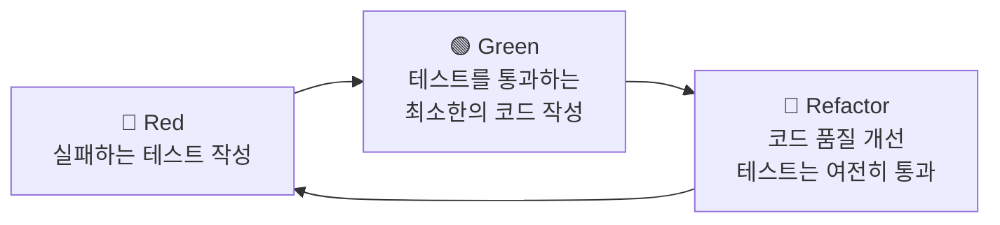
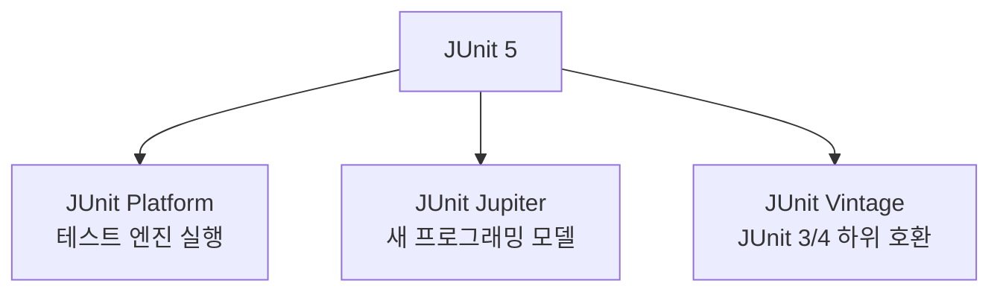
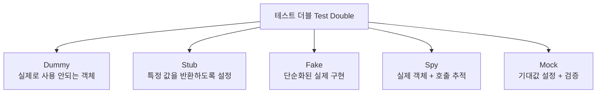
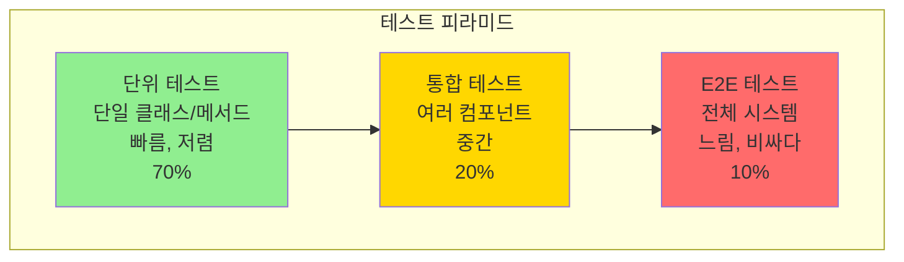
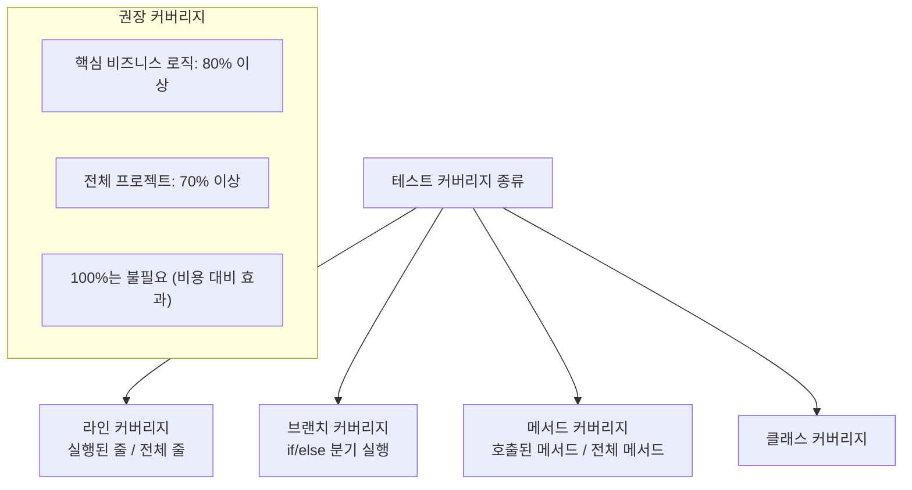
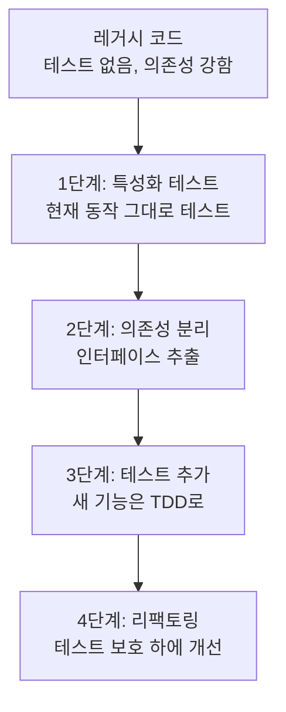
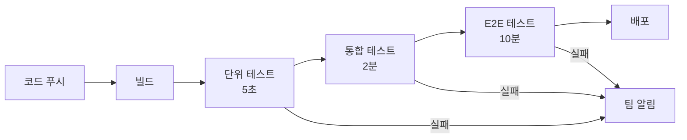
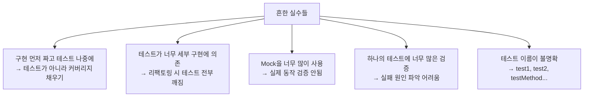

## 실생활 비유: 설계도 먼저, 집은 나중에

집을 지을 때 설계도(테스트) 없이 벽돌을 쌓으면(코드 작성) 어떻게 될까요? 나중에 "화장실이 거실 한가운데 있네요"라는 문제가 생깁니다. TDD는 **설계도(테스트)를 먼저 그리고, 그 설계도에 맞는 집(코드)을 짓는 방법**입니다.

---

## 1. TDD란 무엇인가?



**TDD의 세 가지 법칙 (Robert C. Martin):**
1. 실패하는 단위 테스트를 작성하기 전에는 제품 코드를 작성하지 않는다.
2. 컴파일은 실패하지 않으면서 실행이 실패하는 정도로만 단위 테스트를 작성한다.
3. 현재 실패하는 테스트를 통과할 정도로만 제품 코드를 작성한다.

---

## 2. TDD 실전 예제: 계산기 만들기

### Step 1: 실패하는 테스트 작성 (Red)

```java
// CalculatorTest.java
import org.junit.jupiter.api.Test;
import static org.assertj.core.api.Assertions.assertThat;
import static org.assertj.core.api.Assertions.assertThatThrownBy;

class CalculatorTest {

    @Test
    void 두_수를_더할_수_있다() {
        // given
        Calculator calculator = new Calculator();

        // when
        int result = calculator.add(3, 4);

        // then
        assertThat(result).isEqualTo(7);
    }
}
// 컴파일 에러! Calculator 클래스 없음 → RED
```

### Step 2: 최소한의 코드 작성 (Green)

```java
// Calculator.java
public class Calculator {
    public int add(int a, int b) {
        return a + b;
    }
}
// 테스트 통과! → GREEN
```

### Step 3: 기능 추가와 리팩토링 반복

```java
// 더 많은 테스트 추가
class CalculatorTest {

    private Calculator calculator = new Calculator();

    @Test
    void 두_수를_더할_수_있다() {
        assertThat(calculator.add(3, 4)).isEqualTo(7);
    }

    @Test
    void 두_수를_뺄_수_있다() {
        assertThat(calculator.subtract(10, 3)).isEqualTo(7);
    }

    @Test
    void 두_수를_곱할_수_있다() {
        assertThat(calculator.multiply(3, 4)).isEqualTo(12);
    }

    @Test
    void 두_수를_나눌_수_있다() {
        assertThat(calculator.divide(10, 2)).isEqualTo(5);
    }

    @Test
    void 0으로_나누면_예외가_발생한다() {
        assertThatThrownBy(() -> calculator.divide(10, 0))
            .isInstanceOf(ArithmeticException.class)
            .hasMessageContaining("0으로 나눌 수 없습니다");
    }
}
```

---

## 3. JUnit 5 완전 가이드



### 핵심 어노테이션

```java
import org.junit.jupiter.api.*;
import org.junit.jupiter.params.ParameterizedTest;
import org.junit.jupiter.params.provider.*;

@DisplayName("주문 서비스 테스트")
class OrderServiceTest {

    private OrderService orderService;
    private OrderRepository orderRepository;

    @BeforeAll
    static void setUpAll() {
        // 전체 테스트 클래스에서 한 번만 실행
        System.out.println("테스트 클래스 초기화");
    }

    @BeforeEach
    void setUp() {
        // 각 테스트 전 실행
        orderRepository = new InMemoryOrderRepository();
        orderService = new OrderService(orderRepository);
    }

    @AfterEach
    void tearDown() {
        // 각 테스트 후 실행
        orderRepository.clear();
    }

    @AfterAll
    static void tearDownAll() {
        // 전체 테스트 클래스 후 한 번만 실행
    }

    @Test
    @DisplayName("정상적인 주문 생성")
    void createOrder_Success() {
        // given
        OrderRequest request = new OrderRequest("user1", "product1", 2);

        // when
        Order order = orderService.createOrder(request);

        // then
        assertThat(order.getId()).isNotNull();
        assertThat(order.getStatus()).isEqualTo(OrderStatus.PENDING);
        assertThat(order.getQuantity()).isEqualTo(2);
    }

    @Test
    @DisplayName("재고 부족 시 예외 발생")
    void createOrder_InsufficientStock() {
        // given
        OrderRequest request = new OrderRequest("user1", "product1", 1000);

        // when & then
        assertThatThrownBy(() -> orderService.createOrder(request))
            .isInstanceOf(InsufficientStockException.class)
            .hasMessage("재고가 부족합니다. 요청: 1000, 현재: 10");
    }

    @Disabled("아직 구현 중")
    @Test
    void 미구현_기능_테스트() { }

    // 파라미터화 테스트
    @ParameterizedTest
    @DisplayName("다양한 수량으로 주문 테스트")
    @ValueSource(ints = {1, 5, 10})
    void createOrder_VariousQuantities(int quantity) {
        OrderRequest request = new OrderRequest("user1", "product1", quantity);
        Order order = orderService.createOrder(request);
        assertThat(order.getQuantity()).isEqualTo(quantity);
    }

    @ParameterizedTest
    @CsvSource({
        "1, 10000, 10000",
        "3, 10000, 30000",
        "5, 10000, 50000"
    })
    @DisplayName("수량과 가격으로 총액 계산")
    void calculateTotal(int qty, int price, int expected) {
        assertThat(orderService.calculateTotal(qty, price)).isEqualTo(expected);
    }

    @ParameterizedTest
    @MethodSource("orderRequestProvider")
    void createOrder_FromMethodSource(OrderRequest request, OrderStatus expectedStatus) {
        Order order = orderService.createOrder(request);
        assertThat(order.getStatus()).isEqualTo(expectedStatus);
    }

    static Stream<Arguments> orderRequestProvider() {
        return Stream.of(
            Arguments.of(new OrderRequest("user1", "product1", 1), OrderStatus.PENDING),
            Arguments.of(new OrderRequest("user2", "product2", 5), OrderStatus.PENDING)
        );
    }

    // 중첩 테스트 (관련 테스트 그룹화)
    @Nested
    @DisplayName("주문 취소 테스트")
    class CancelOrderTest {

        @Test
        @DisplayName("PENDING 상태 주문은 취소 가능")
        void cancel_PendingOrder() {
            Order order = createPendingOrder();
            orderService.cancelOrder(order.getId());
            assertThat(order.getStatus()).isEqualTo(OrderStatus.CANCELLED);
        }

        @Test
        @DisplayName("DELIVERED 상태 주문은 취소 불가")
        void cancel_DeliveredOrder_ThrowsException() {
            Order order = createDeliveredOrder();
            assertThatThrownBy(() -> orderService.cancelOrder(order.getId()))
                .isInstanceOf(IllegalStateException.class);
        }
    }
}
```

---

## 4. Mockito 완전 가이드



```java
import org.mockito.*;
import static org.mockito.Mockito.*;
import static org.mockito.BDDMockito.*;

@ExtendWith(MockitoExtension.class)
class OrderServiceTest {

    @Mock
    private OrderRepository orderRepository;

    @Mock
    private PaymentService paymentService;

    @Mock
    private NotificationService notificationService;

    @InjectMocks  // 위의 Mock들을 자동 주입
    private OrderService orderService;

    @Test
    void createOrder_성공_시나리오() {
        // given - 스텁 설정
        Product product = new Product("p1", "MacBook", 10, 1500000);
        given(orderRepository.findProductById("p1")).willReturn(Optional.of(product));
        given(paymentService.processPayment(any())).willReturn(PaymentResult.success("pay-001"));

        // when
        Order order = orderService.createOrder(new OrderRequest("user1", "p1", 1));

        // then
        assertThat(order.getStatus()).isEqualTo(OrderStatus.PAID);

        // verify - 메서드 호출 검증
        verify(orderRepository).save(any(Order.class));
        verify(notificationService).sendOrderConfirmation(eq("user1"), any());
        verify(paymentService, times(1)).processPayment(any());

        // 특정 메서드가 호출되지 않았음을 검증
        verify(notificationService, never()).sendRefundNotification(any());
    }

    @Test
    void createOrder_결제_실패_시나리오() {
        // given
        given(orderRepository.findProductById(any()))
            .willReturn(Optional.of(new Product("p1", "MacBook", 10, 1500000)));

        // 결제 실패 시뮬레이션
        given(paymentService.processPayment(any()))
            .willThrow(new PaymentException("카드 한도 초과"));

        // when & then
        assertThatThrownBy(() -> orderService.createOrder(new OrderRequest("user1", "p1", 1)))
            .isInstanceOf(PaymentException.class)
            .hasMessage("카드 한도 초과");

        // 주문이 저장되지 않았음을 검증
        verify(orderRepository, never()).save(any());
    }

    @Test
    void ArgumentCaptor_사용_예시() {
        // given
        given(orderRepository.findProductById(any()))
            .willReturn(Optional.of(new Product("p1", "MacBook", 5, 1500000)));
        given(paymentService.processPayment(any())).willReturn(PaymentResult.success("pay-001"));

        // when
        orderService.createOrder(new OrderRequest("user1", "p1", 2));

        // then - 저장된 주문 내용 캡처하여 검증
        ArgumentCaptor<Order> orderCaptor = ArgumentCaptor.forClass(Order.class);
        verify(orderRepository).save(orderCaptor.capture());

        Order savedOrder = orderCaptor.getValue();
        assertThat(savedOrder.getUserId()).isEqualTo("user1");
        assertThat(savedOrder.getQuantity()).isEqualTo(2);
        assertThat(savedOrder.getTotalAmount()).isEqualTo(3000000);
    }

    @Test
    void Spy_사용_예시() {
        // Spy: 실제 객체를 사용하되 일부 메서드만 스텁
        List<String> realList = new ArrayList<>();
        List<String> spyList = spy(realList);

        // 실제 메서드 사용
        spyList.add("item1");
        spyList.add("item2");

        // 특정 메서드만 스텁
        doReturn(100).when(spyList).size();

        assertThat(spyList.get(0)).isEqualTo("item1");  // 실제 데이터
        assertThat(spyList.size()).isEqualTo(100);        // 스텁된 값
    }
}
```

---

## 5. 테스트 피라미드



| 테스트 종류 | 범위 | 속도 | 비용 | 신뢰도 |
|-----------|------|------|------|--------|
| 단위 테스트 | 함수/클래스 | 밀리초 | 낮음 | 낮음 |
| 통합 테스트 | 모듈 간 | 초 | 중간 | 중간 |
| E2E 테스트 | 전체 시스템 | 분 | 높음 | 높음 |

---

## 6. 통합 테스트 (Spring Boot)

```java
@SpringBootTest(webEnvironment = SpringBootTest.WebEnvironment.RANDOM_PORT)
@AutoConfigureMockMvc
@Transactional  // 테스트 후 롤백
class OrderControllerIntegrationTest {

    @Autowired
    private MockMvc mockMvc;

    @Autowired
    private ObjectMapper objectMapper;

    @Autowired
    private UserRepository userRepository;

    @Test
    @DisplayName("POST /api/orders - 주문 생성 성공")
    void createOrder_Success() throws Exception {
        // given
        User user = userRepository.save(User.create("testuser", "test@email.com"));

        OrderRequest request = new OrderRequest(user.getId(), "product1", 2);

        // when & then
        mockMvc.perform(
                post("/api/orders")
                    .contentType(MediaType.APPLICATION_JSON)
                    .header("Authorization", "Bearer " + getToken(user))
                    .content(objectMapper.writeValueAsString(request))
            )
            .andExpect(status().isCreated())
            .andExpect(jsonPath("$.orderId").exists())
            .andExpect(jsonPath("$.status").value("PENDING"))
            .andExpect(jsonPath("$.quantity").value(2))
            .andDo(print());
    }

    @Test
    @DisplayName("인증 없이 주문 시도 시 401")
    void createOrder_Unauthorized() throws Exception {
        mockMvc.perform(
                post("/api/orders")
                    .contentType(MediaType.APPLICATION_JSON)
                    .content("{}")
            )
            .andExpect(status().isUnauthorized());
    }
}

// DB를 실제 사용하는 레포지토리 테스트
@DataJpaTest  // JPA 관련 빈만 로드 (경량)
@AutoConfigureTestDatabase(replace = Replace.NONE)  // 실제 DB 사용
class OrderRepositoryTest {

    @Autowired
    private OrderRepository orderRepository;

    @Autowired
    private TestEntityManager entityManager;

    @Test
    void findByUserIdAndStatus() {
        // given
        Order order1 = Order.create("user1", "prod1", 1);
        order1.complete();
        entityManager.persist(order1);

        Order order2 = Order.create("user1", "prod2", 2);  // PENDING
        entityManager.persist(order2);

        entityManager.flush();
        entityManager.clear();

        // when
        List<Order> result = orderRepository.findByUserIdAndStatus("user1", OrderStatus.PENDING);

        // then
        assertThat(result).hasSize(1);
        assertThat(result.get(0).getProductId()).isEqualTo("prod2");
    }
}
```

---

## 7. 테스트 컨테이너 (Testcontainers)

실제 DB/Redis를 도커 컨테이너로 테스트에서 사용합니다.

```java
@SpringBootTest
@Testcontainers
class OrderRepositoryIntegrationTest {

    @Container
    static MySQLContainer<?> mysql = new MySQLContainer<>("mysql:8.0")
        .withDatabaseName("testdb")
        .withUsername("test")
        .withPassword("test");

    @Container
    static GenericContainer<?> redis = new GenericContainer<>("redis:7")
        .withExposedPorts(6379);

    @DynamicPropertySource
    static void setProperties(DynamicPropertyRegistry registry) {
        registry.add("spring.datasource.url", mysql::getJdbcUrl);
        registry.add("spring.datasource.username", mysql::getUsername);
        registry.add("spring.datasource.password", mysql::getPassword);
        registry.add("spring.redis.host", redis::getHost);
        registry.add("spring.redis.port", () -> redis.getMappedPort(6379));
    }

    @Test
    void realDatabaseTest() {
        // 실제 MySQL 컨테이너를 사용한 테스트
    }
}
```

---

## 8. BDD (Behavior Driven Development)

Given-When-Then 스타일로 비즈니스 관점의 테스트를 작성합니다.

```java
// Spock Framework (Groovy)
class OrderServiceSpec extends Specification {

    def orderService = Mock(OrderService)
    def paymentService = Mock(PaymentService)

    def "주문을 생성하면 결제가 처리되어야 한다"() {
        given: "사용자와 상품이 존재한다"
        def request = new OrderRequest("user1", "product1", 2)
        def product = new Product("product1", "MacBook", 10, 1500000)

        when: "주문을 생성한다"
        def order = orderService.createOrder(request)

        then: "결제 서비스가 호출되어야 한다"
        1 * paymentService.processPayment(_)
        order.status == OrderStatus.PAID
        order.totalAmount == 3000000
    }

    def "재고가 #stock개일 때 #quantity개 주문하면 #expected"() {
        expect:
        orderService.canOrder(stock, quantity) == canOrder

        where:
        stock | quantity | canOrder | expected
        10    | 5        | true     | "성공"
        10    | 10       | true     | "성공 (경계값)"
        10    | 11       | false    | "실패"
        0     | 1        | false    | "재고 없음"
    }
}
```

---

## 9. 테스트 커버리지



**JaCoCo 설정 (Maven):**
```xml
<plugin>
    <groupId>org.jacoco</groupId>
    <artifactId>jacoco-maven-plugin</artifactId>
    <configuration>
        <excludes>
            <exclude>**/*Config.class</exclude>
            <exclude>**/*Application.class</exclude>
            <exclude>**/dto/**</exclude>  <!-- DTO는 제외 -->
        </excludes>
    </configuration>
    <executions>
        <execution>
            <id>check</id>
            <goals><goal>check</goal></goals>
            <configuration>
                <rules>
                    <rule>
                        <limits>
                            <limit>
                                <counter>LINE</counter>
                                <value>COVEREDRATIO</value>
                                <minimum>0.80</minimum>  <!-- 80% 미만이면 빌드 실패 -->
                            </limit>
                        </limits>
                    </rule>
                </rules>
            </configuration>
        </execution>
    </executions>
</plugin>
```

---

## 10. 테스트 픽스처 (Test Fixture)

```java
// Object Mother 패턴: 테스트 데이터 팩토리
public class OrderFixture {

    public static Order pendingOrder() {
        return Order.builder()
            .id("order-001")
            .userId("user-001")
            .productId("prod-001")
            .quantity(2)
            .totalAmount(100000)
            .status(OrderStatus.PENDING)
            .createdAt(LocalDateTime.now())
            .build();
    }

    public static Order paidOrder() {
        return pendingOrder().toBuilder()
            .status(OrderStatus.PAID)
            .paidAt(LocalDateTime.now())
            .build();
    }

    public static Order deliveredOrder() {
        return paidOrder().toBuilder()
            .status(OrderStatus.DELIVERED)
            .deliveredAt(LocalDateTime.now())
            .build();
    }
}

// 빌더 패턴 + 기본값 (Test Builder)
public class OrderRequestBuilder {
    private String userId = "default-user";
    private String productId = "default-product";
    private int quantity = 1;

    public static OrderRequestBuilder aRequest() {
        return new OrderRequestBuilder();
    }

    public OrderRequestBuilder withUserId(String userId) {
        this.userId = userId;
        return this;
    }

    public OrderRequestBuilder withQuantity(int quantity) {
        this.quantity = quantity;
        return this;
    }

    public OrderRequest build() {
        return new OrderRequest(userId, productId, quantity);
    }
}

// 사용 예시
@Test
void 대량_주문_테스트() {
    OrderRequest request = OrderRequestBuilder.aRequest()
        .withUserId("vip-user")
        .withQuantity(100)
        .build();

    assertThatThrownBy(() -> orderService.createOrder(request))
        .isInstanceOf(ExceedsMaxQuantityException.class);
}
```

---

## 11. 테스트 더블 심화

```java
// Fake 구현체 - 테스트용 인메모리 구현
public class InMemoryOrderRepository implements OrderRepository {

    private final Map<String, Order> store = new HashMap<>();
    private long idSequence = 1L;

    @Override
    public Order save(Order order) {
        if (order.getId() == null) {
            order = order.toBuilder()
                .id(String.valueOf(idSequence++))
                .build();
        }
        store.put(order.getId(), order);
        return order;
    }

    @Override
    public Optional<Order> findById(String id) {
        return Optional.ofNullable(store.get(id));
    }

    @Override
    public List<Order> findByUserId(String userId) {
        return store.values().stream()
            .filter(o -> o.getUserId().equals(userId))
            .collect(Collectors.toList());
    }

    public void clear() {
        store.clear();
    }
}

// 이 Fake를 사용하면 Mockito 없이도 빠른 단위 테스트 가능
class OrderServiceTest {

    private final OrderRepository repository = new InMemoryOrderRepository();
    private final OrderService service = new OrderService(repository);

    @Test
    void 주문_목록_조회() {
        repository.save(OrderFixture.pendingOrder());
        repository.save(OrderFixture.paidOrder());

        List<Order> orders = service.getOrdersByUser("user-001");
        assertThat(orders).hasSize(2);
    }
}
```

---

## 12. 극한 시나리오: 레거시 코드에 TDD 적용



```java
// 레거시 코드 (테스트 어려움)
public class LegacyOrderProcessor {
    public void process(int orderId) {
        // DB 직접 접근
        Connection conn = DriverManager.getConnection("jdbc:mysql://...");
        // 외부 API 직접 호출
        HttpClient.post("https://payment-api.com/charge", ...);
        // 이메일 직접 발송
        new SmtpClient().send(...);
    }
}

// 리팩토링 후 (테스트 가능)
public class RefactoredOrderProcessor {

    private final OrderRepository orderRepository;    // 인터페이스로 분리
    private final PaymentGateway paymentGateway;      // 인터페이스로 분리
    private final EmailSender emailSender;            // 인터페이스로 분리

    public void process(int orderId) {
        Order order = orderRepository.findById(orderId)
            .orElseThrow(() -> new OrderNotFoundException(orderId));

        PaymentResult result = paymentGateway.charge(order.getAmount());

        if (result.isSuccess()) {
            order.complete();
            orderRepository.save(order);
            emailSender.sendConfirmation(order.getUserEmail(), order);
        }
    }
}

// 이제 Mock으로 테스트 가능!
@Test
void 주문_처리_성공() {
    given(orderRepository.findById(1)).willReturn(Optional.of(sampleOrder));
    given(paymentGateway.charge(any())).willReturn(PaymentResult.success());

    processor.process(1);

    verify(orderRepository).save(argThat(o -> o.getStatus() == COMPLETED));
    verify(emailSender).sendConfirmation(any(), any());
}
```

---

## 13. CI/CD 파이프라인과 테스트



**GitHub Actions 설정:**
```yaml
# .github/workflows/test.yml
name: Test

on: [push, pull_request]

jobs:
  test:
    runs-on: ubuntu-latest

    services:
      mysql:
        image: mysql:8.0
        env:
          MYSQL_ROOT_PASSWORD: test
          MYSQL_DATABASE: testdb
        ports:
          - 3306:3306

      redis:
        image: redis:7
        ports:
          - 6379:6379

    steps:
      - uses: actions/checkout@v3

      - name: Set up JDK 17
        uses: actions/setup-java@v3
        with:
          java-version: '17'

      - name: Run tests
        run: ./mvnw test -Dspring.profiles.active=test

      - name: Check coverage
        run: ./mvnw jacoco:check

      - name: Upload coverage report
        uses: codecov/codecov-action@v3
```

---

## TDD 도입 시 흔한 실수



**좋은 테스트의 특성 (F.I.R.S.T):**
```
F - Fast: 빠르게 실행 (밀리초 단위)
I - Independent: 독립적 (다른 테스트에 의존 없음)
R - Repeatable: 반복 가능 (언제나 같은 결과)
S - Self-validating: 자가 검증 (pass/fail 명확)
T - Timely: 적시에 작성 (코드 작성 전 또는 동시)
```

---

## 핵심 설계 결정 요약

| 결정 사항 | 권장 | 이유 |
|----------|------|------|
| 테스트 비율 | 70% 단위 / 20% 통합 / 10% E2E | 속도와 신뢰성 균형 |
| 커버리지 목표 | 핵심 로직 80% | 100%는 비용 낭비 |
| Mock 사용 | 외부 시스템만 | 내부 로직은 실제 구현 |
| 테스트 데이터 | Object Mother 패턴 | 중복 제거 |
| 통합 테스트 DB | Testcontainers | 실제와 동일 환경 |
| 네이밍 | 한글 메서드명 허용 | 의도 명확하게 |
