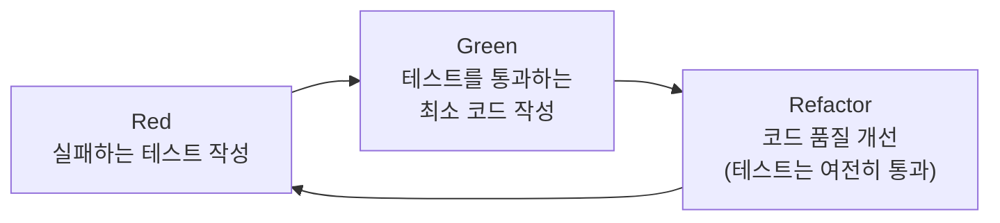
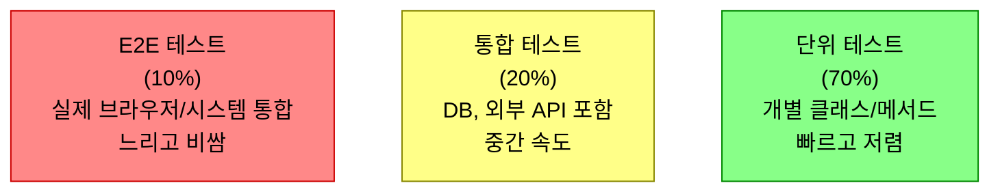

"테스트는 나중에 쓰면 되잖아요?" 맞다. 그런데 나중에 쓰는 테스트와 먼저 쓰는 테스트는 근본적으로 다르다. 코드를 먼저 짜면 테스트는 그 코드의 동작을 확인하는 도구가 된다. 테스트를 먼저 쓰면 테스트가 설계 도구가 된다. **TDD는 테스트 방법론이 아니라 설계 방법론이다.**

## TDD란 무엇인가

> **비유**: 집을 지을 때 설계도(테스트)를 먼저 그리고 집(코드)을 짓는 것이다. 설계도 없이 벽돌부터 쌓으면 나중에 "화장실이 거실 한가운데"인 상황이 생긴다. 설계도가 먼저 있으면 짓기 전에 문제를 발견한다.



**TDD의 세 가지 법칙 (Robert C. Martin)**:
1. 실패하는 단위 테스트를 먼저 작성하기 전에는 프로덕션 코드를 작성하지 않는다.
2. 컴파일이 되면서 실행이 실패하는 정도로만 테스트를 작성한다.
3. 현재 실패하는 테스트를 통과하는 정도로만 프로덕션 코드를 작성한다.

만약 이 규칙 없이 코드를 먼저 짜면? 테스트를 나중에 추가할 때 이미 구현된 코드에 맞게 테스트를 짜게 된다. "잘 통과하는 테스트"를 만드는 데 집중하고, "올바른 동작을 검증하는 테스트"가 아니게 된다.

---

## TDD 실전: 계산기 → 주문 서비스

### Step 1: 실패하는 테스트 먼저 (Red)

Calculator 클래스가 아직 존재하지 않는다. 테스트가 컴파일조차 안 된다. 그게 정상이다.

```java
class CalculatorTest {

    @Test
    void 두_수를_더할_수_있다() {
        // given
        Calculator calculator = new Calculator();  // 아직 없는 클래스

        // when
        int result = calculator.add(3, 4);

        // then
        assertThat(result).isEqualTo(7);
    }

    @Test
    void 0으로_나누면_예외가_발생한다() {
        Calculator calculator = new Calculator();

        assertThatThrownBy(() -> calculator.divide(10, 0))
            .isInstanceOf(ArithmeticException.class)
            .hasMessage("0으로 나눌 수 없습니다");
    }
}
// 컴파일 에러! → RED 단계
```

### Step 2: 통과하는 최소 코드 (Green)

"최소한"이 중요하다. 테스트를 통과하는 가장 단순한 코드를 쓴다:

```java
public class Calculator {

    public int add(int a, int b) {
        return a + b;  // 가장 단순한 구현
    }

    public int divide(int a, int b) {
        if (b == 0) {
            throw new ArithmeticException("0으로 나눌 수 없습니다");
        }
        return a / b;
    }
}
// 테스트 통과! → GREEN 단계
```

### Step 3: 리팩토링 (Refactor)

테스트가 있으므로 마음 놓고 내부를 바꿀 수 있다. 테스트가 깨지면 실수한 것이다:

```java
public class Calculator {
    // 상수 추출, 검증 메서드 분리 등 — 동작은 그대로
    private void validateNotZero(int divisor) {
        if (divisor == 0) {
            throw new ArithmeticException("0으로 나눌 수 없습니다");
        }
    }

    public int divide(int a, int b) {
        validateNotZero(b);
        return a / b;
    }
}
// 테스트 여전히 통과 → REFACTOR 완료
```

---

## 실무 예제: 주문 서비스 TDD

단순 계산기가 아닌 실제 비즈니스 로직으로 TDD를 적용한다.

### 요구사항: "재고가 있으면 주문하고, 없으면 예외를 던진다"

**Red — 테스트 먼저:**

```java
@ExtendWith(MockitoExtension.class)
class OrderServiceTest {

    @Mock
    private ProductRepository productRepository;

    @Mock
    private OrderRepository orderRepository;

    @InjectMocks
    private OrderService orderService;

    @Test
    void 재고가_있으면_주문이_생성된다() {
        // given
        Product product = Product.builder()
            .id(1L).name("노트북").price(1_000_000).stock(5).build();

        given(productRepository.findById(1L)).willReturn(Optional.of(product));
        given(orderRepository.save(any())).willAnswer(inv -> inv.getArgument(0));

        // when
        Order order = orderService.createOrder(1L, 2);  // 아직 없는 메서드

        // then
        assertThat(order.getQuantity()).isEqualTo(2);
        assertThat(order.getTotalPrice()).isEqualTo(2_000_000);
    }

    @Test
    void 재고가_부족하면_예외가_발생한다() {
        // given
        Product product = Product.builder()
            .id(1L).name("노트북").stock(1).build();  // 재고 1개

        given(productRepository.findById(1L)).willReturn(Optional.of(product));

        // when & then
        assertThatThrownBy(() -> orderService.createOrder(1L, 5))  // 5개 주문
            .isInstanceOf(InsufficientStockException.class)
            .hasMessageContaining("재고 부족");
    }
}
```

**Green — 최소 구현:**

```java
@Service
@RequiredArgsConstructor
public class OrderService {

    private final ProductRepository productRepository;
    private final OrderRepository orderRepository;

    public Order createOrder(Long productId, int quantity) {
        Product product = productRepository.findById(productId)
            .orElseThrow(() -> new ProductNotFoundException(productId));

        // 비즈니스 규칙: 재고 확인
        if (product.getStock() < quantity) {
            throw new InsufficientStockException(
                "재고 부족: 요청 " + quantity + ", 현재 " + product.getStock()
            );
        }

        Order order = Order.builder()
            .productId(productId)
            .quantity(quantity)
            .totalPrice(product.getPrice() * quantity)
            .build();

        return orderRepository.save(order);
    }
}
```

테스트를 먼저 써야 이 코드의 인터페이스(메서드 시그니처, 예외 타입, 반환값)가 자연스럽게 결정된다. 코드를 먼저 쓰면 "일단 구현하고 나중에 맞춰보자"가 된다.

---

## 테스트 피라미드 — 어떤 테스트를 얼마나 써야 하는가



단위 테스트를 70%로 가져가는 이유: E2E 테스트 1개가 실패하면 어디서 깨졌는지 알기 어렵다. 단위 테스트가 깨지면 정확히 어떤 클래스의 어떤 조건에서 문제가 생겼는지 즉시 알 수 있다.

---

## Mockito — 의존성 격리

```java
@ExtendWith(MockitoExtension.class)
class PaymentServiceTest {

    @Mock
    private PaymentGateway paymentGateway;   // 외부 결제 API

    @Mock
    private OrderRepository orderRepository;

    @InjectMocks
    private PaymentService paymentService;

    @Test
    void 결제_성공_시_주문_상태가_변경된다() {
        // given — 외부 API가 성공 응답을 반환한다고 가정
        Order order = Order.builder().id(1L).totalPrice(50_000).build();
        given(orderRepository.findById(1L)).willReturn(Optional.of(order));
        given(paymentGateway.pay(any())).willReturn(PaymentResult.success("TX-001"));

        // when
        paymentService.processPayment(1L);

        // then
        assertThat(order.getStatus()).isEqualTo(OrderStatus.PAID);
        // 외부 API가 정확히 1번 호출됐는지 검증
        then(paymentGateway).should(times(1)).pay(any());
    }

    @Test
    void 결제_실패_시_예외가_발생한다() {
        // given — 외부 API가 실패를 반환
        given(orderRepository.findById(1L)).willReturn(
            Optional.of(Order.builder().id(1L).build())
        );
        given(paymentGateway.pay(any())).willReturn(PaymentResult.fail("잔액 부족"));

        // when & then
        assertThatThrownBy(() -> paymentService.processPayment(1L))
            .isInstanceOf(PaymentFailedException.class);
    }
}
```

Mock을 쓰는 이유: 단위 테스트에서 실제 결제 API를 호출하면 돈이 나간다. DB가 없어도 테스트가 실행되어야 빠르게 피드백을 받을 수 있다.

---

## Testcontainers — 실제 DB로 통합 테스트

Mock으로는 실제 DB 동작(인덱스, 제약조건, 트랜잭션)을 검증할 수 없다. Testcontainers는 테스트 시 실제 Docker 컨테이너를 띄운다:

```java
@SpringBootTest
@Testcontainers
class OrderRepositoryTest {

    @Container
    static MySQLContainer<?> mysql = new MySQLContainer<>("mysql:8.0")
        .withDatabaseName("testdb")
        .withUsername("test")
        .withPassword("test");

    @DynamicPropertySource
    static void configureProperties(DynamicPropertyRegistry registry) {
        // 테스트 컨테이너의 동적 포트를 Spring 설정에 주입
        registry.add("spring.datasource.url", mysql::getJdbcUrl);
        registry.add("spring.datasource.username", mysql::getUsername);
        registry.add("spring.datasource.password", mysql::getPassword);
    }

    @Autowired
    private OrderRepository orderRepository;

    @Test
    void 주문을_저장하고_조회할_수_있다() {
        // given
        Order order = Order.builder()
            .userId(1L).productId(1L).quantity(2).totalPrice(100_000).build();

        // when
        Order saved = orderRepository.save(order);

        // then
        assertThat(saved.getId()).isNotNull();
        assertThat(orderRepository.findById(saved.getId())).isPresent();
    }
}
```

Testcontainers 없이 H2 메모리 DB로 테스트하면? MySQL 특화 쿼리나 제약조건이 H2에서는 다르게 동작해서 프로덕션에서만 에러가 난다.

---

## BDD — 비즈니스 언어로 테스트 쓰기

```java
// 기존 TDD
@Test
void orderService_createOrder_withInsufficientStock_throwsException() { ... }

// BDD — Given/When/Then + 비즈니스 언어
@Test
void 재고가_부족할_때_주문하면_예외가_발생한다() {
    // Given: 재고가 1개인 상품이 있다
    given(productRepository.findById(1L))
        .willReturn(Optional.of(product.withStock(1)));

    // When: 재고보다 많은 수량을 주문하면
    ThrowableAssert.ThrowingCallable action = () -> orderService.createOrder(1L, 5);

    // Then: 재고 부족 예외가 발생한다
    assertThatThrownBy(action)
        .isInstanceOf(InsufficientStockException.class);
}
```

BDD 스타일의 장점: 테스트 이름과 Given/When/Then 구조가 비즈니스 요구사항을 그대로 표현한다. 기획자나 PM이 읽어도 의미를 이해할 수 있다.

---

## TDD가 어려운 이유와 해결책

| 어려움 | 해결책 |
|--------|--------|
| "뭘 테스트해야 할지 모르겠다" | 요구사항을 시나리오로 쪼개라. "정상 케이스", "예외 케이스", "경계값" |
| "테스트가 너무 느리다" | 단위 테스트에서 DB/외부 API는 Mock으로 격리 |
| "레거시 코드에 테스트를 못 붙인다" | 변경이 필요한 부분만 작은 메서드로 추출 후 테스트 추가 |
| "테스트가 구현 세부사항에 종속된다" | 내부 구현이 아닌 공개 인터페이스 기준으로 테스트 |

---

## 정리

| 항목 | 핵심 |
|------|------|
| TDD 사이클 | Red → Green → Refactor 반복 |
| 가장 큰 혜택 | 설계 개선 — 테스트하기 어려운 코드는 설계가 나쁜 코드 |
| 단위 테스트 | Mock으로 의존성 격리, 빠르고 독립적으로 |
| 통합 테스트 | Testcontainers로 실제 환경에 가깝게 |
| 테스트 피라미드 | 단위 70% + 통합 20% + E2E 10% |
