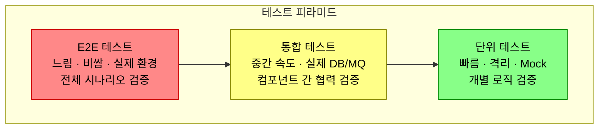
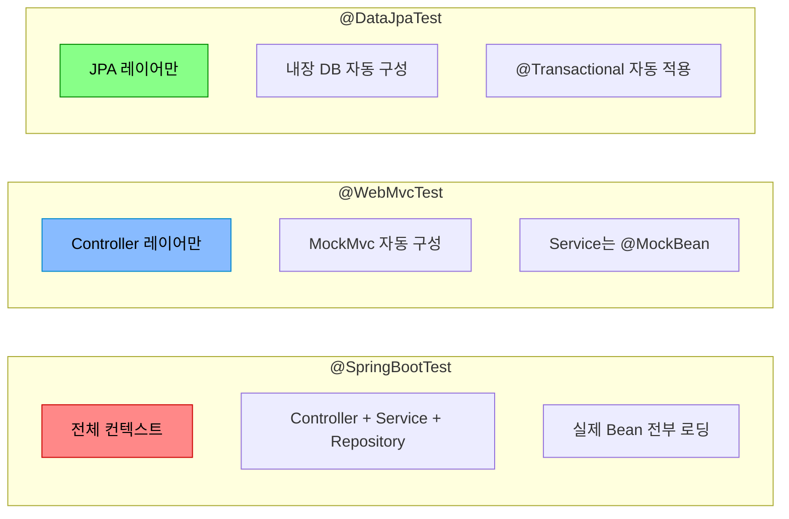
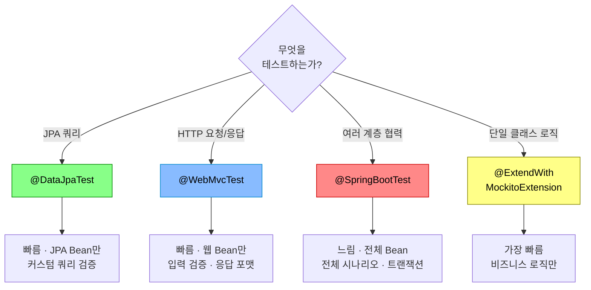
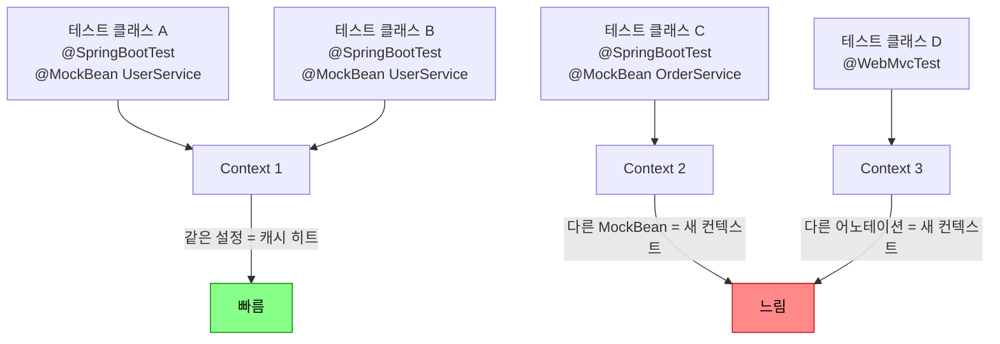

단위 테스트가 1000개 통과해도 실제 DB 연결에서 터지면 서비스는 장애다. **통합 테스트는 부품이 아니라 조립된 기계가 돌아가는지 확인하는 테스트다.** 이 글에서는 Spring Boot 환경에서 통합 테스트를 설계하고, 실제 인프라를 띄워 검증하며, CI에서 속도까지 잡는 전략을 다룬다.

---

## 테스트 피라미드 — 각 층의 역할을 정확히 이해하기

> **비유:** 자동차를 만들 때를 생각해보자. 단위 테스트는 엔진, 브레이크, 에어백을 각각 따로 검사하는 것이다. 통합 테스트는 엔진을 차체에 장착하고 브레이크를 밟았을 때 실제로 차가 멈추는지 확인하는 것이다. E2E 테스트는 완성된 차를 도로에 올려 출발부터 도착까지 달려보는 것이다. 엔진이 단독으로 잘 돌아도 변속기와 연결했을 때 안 맞물리면 차는 움직이지 않는다.



각 층이 검증하는 대상이 완전히 다르다. 단위 테스트는 "이 메서드가 올바른 값을 반환하는가"를 본다. 통합 테스트는 "이 메서드가 실제 DB에 저장하고, 트랜잭션이 롤백되고, 인덱스가 걸리는가"를 본다. E2E 테스트는 "사용자가 버튼을 눌렀을 때 주문이 완료되는가"를 본다.

흔한 실수는 단위 테스트만 잔뜩 쓰고 "테스트 커버리지 90%"라고 안심하는 것이다. Mock으로 가짜 DB를 주입한 테스트 100개가 있어도, 실제 MySQL에서 `GROUP BY` 쿼리가 다르게 동작하면 프로덕션에서 장애가 난다. 통합 테스트가 그 틈을 메운다.

---

## Spring Boot 테스트 어노테이션 — 언제 무엇을 쓰는가

Spring Boot는 테스트 범위에 따라 다른 어노테이션을 제공한다. 핵심은 **필요한 만큼만 띄우는 것**이다. 전체 컨텍스트를 매번 올리면 테스트가 느려지고, 너무 적게 올리면 통합 지점을 검증할 수 없다.

> **비유:** 레스토랑 검사를 생각해보자. `@SpringBootTest`는 주방, 홀, 결제 시스템까지 전부 가동하고 실제 손님을 받아보는 것이다. `@DataJpaTest`는 주방만 열어서 요리가 제대로 나오는지 확인하는 것이다. `@WebMvcTest`는 홀만 열어서 주문을 받고 메뉴판을 보여주는 과정만 테스트하는 것이다. 모든 검사에 레스토랑 전체를 가동할 필요는 없다.



### 1️⃣ `@DataJpaTest` — Repository 계층 검증

Repository가 올바른 쿼리를 실행하는지, JPA 매핑이 정확한지를 검증한다. JPA 관련 Bean만 로딩하므로 빠르다. 기본적으로 내장 H2 DB를 사용하고, 매 테스트마다 트랜잭션을 롤백한다.

`@DataJpaTest`는 `@Entity`, `@Repository`, `EntityManager` 등 JPA 관련 컴포넌트만 스캔한다. `@Service`나 `@Controller`는 로딩하지 않는다. 따라서 Repository의 커스텀 쿼리(`@Query`)나 QueryDSL 동작을 검증하기에 적합하다.

단, H2와 실제 MySQL/PostgreSQL의 SQL 방언이 다를 수 있다. 프로덕션 DB와 동일한 환경이 필요하면 Testcontainers를 함께 쓴다.

```java
@DataJpaTest
@AutoConfigureTestDatabase(replace = Replace.NONE) // 내장 DB 대신 실제 DB 사용
class OrderRepositoryTest {

    @Autowired
    private OrderRepository orderRepository;

    @Autowired
    private TestEntityManager em;

    @Test
    void 특정_사용자의_최근_주문을_조회한다() {
        // given
        Order order1 = Order.builder()
            .userId(1L).totalPrice(10_000)
            .createdAt(LocalDateTime.of(2026, 5, 1, 10, 0)).build();
        Order order2 = Order.builder()
            .userId(1L).totalPrice(20_000)
            .createdAt(LocalDateTime.of(2026, 5, 2, 10, 0)).build();

        em.persist(order1);
        em.persist(order2);
        em.flush();

        // when
        List<Order> recent = orderRepository
            .findByUserIdOrderByCreatedAtDesc(1L, PageRequest.of(0, 1));

        // then
        assertThat(recent).hasSize(1);
        assertThat(recent.get(0).getTotalPrice()).isEqualTo(20_000);
    }
}
```

**이 코드의 핵심:** `TestEntityManager`로 데이터를 직접 넣고, Repository 메서드가 정확한 정렬과 페이징으로 결과를 반환하는지 검증한다. `em.flush()`를 호출해야 실제 SQL이 실행된다.

### 2️⃣ `@WebMvcTest` — Controller 계층 검증

HTTP 요청/응답, 입력 검증(`@Valid`), 예외 핸들링을 테스트한다. Service 계층은 `@MockBean`으로 대체한다.

Controller는 비즈니스 로직을 직접 수행하지 않는다. 요청을 받아 Service에 위임하고, 결과를 JSON으로 변환해 응답한다. 따라서 Controller 테스트에서는 "올바른 HTTP 상태 코드를 반환하는가", "요청 파라미터 검증이 동작하는가", "예외가 적절한 에러 응답으로 변환되는가"를 확인한다.

`@WebMvcTest`는 `@Controller`, `@ControllerAdvice`, `@JsonComponent` 등 웹 관련 Bean만 로딩한다. Service나 Repository는 `@MockBean`으로 주입해야 한다.

```java
@WebMvcTest(OrderController.class)
class OrderControllerTest {

    @Autowired
    private MockMvc mockMvc;

    @MockBean
    private OrderService orderService;

    @Test
    void 주문_생성_성공_시_201을_반환한다() throws Exception {
        // given
        OrderResponse response = new OrderResponse(1L, 50_000, "CREATED");
        given(orderService.createOrder(any())).willReturn(response);

        // when & then
        mockMvc.perform(post("/api/orders")
                .contentType(MediaType.APPLICATION_JSON)
                .content("""
                    {"productId": 1, "quantity": 2}
                    """))
            .andExpect(status().isCreated())
            .andExpect(jsonPath("$.totalPrice").value(50_000))
            .andExpect(jsonPath("$.status").value("CREATED"));
    }

    @Test
    void 수량이_0이면_400을_반환한다() throws Exception {
        mockMvc.perform(post("/api/orders")
                .contentType(MediaType.APPLICATION_JSON)
                .content("""
                    {"productId": 1, "quantity": 0}
                    """))
            .andExpect(status().isBadRequest());
    }
}
```

**이 코드의 핵심:** 실제 HTTP 요청을 시뮬레이션하여 Controller의 입력 검증과 응답 형식을 검증한다. Service는 Mock이므로 비즈니스 로직은 테스트하지 않는다.

### 3️⃣ `@SpringBootTest` — 전체 통합 검증

모든 Bean을 로딩하고 실제 환경에 가깝게 테스트한다. 가장 느리지만 가장 현실적이다.

전체 컨텍스트를 올리는 만큼 비용이 크다. 따라서 `@SpringBootTest`는 "여러 컴포넌트가 협력하는 시나리오"나 "트랜잭션 전파가 올바른지"를 검증할 때만 사용한다. 개별 클래스의 로직 검증에는 단위 테스트를 쓴다.

`webEnvironment` 옵션으로 내장 서버를 실제로 띄울 수도 있고(`RANDOM_PORT`), MockMvc만 사용할 수도 있다(`MOCK`).

```java
@SpringBootTest(webEnvironment = SpringBootTest.WebEnvironment.RANDOM_PORT)
@Testcontainers
class OrderIntegrationTest {

    @Container
    static MySQLContainer<?> mysql = new MySQLContainer<>("mysql:8.0")
        .withDatabaseName("testdb");

    @DynamicPropertySource
    static void dbProps(DynamicPropertyRegistry registry) {
        registry.add("spring.datasource.url", mysql::getJdbcUrl);
        registry.add("spring.datasource.username", mysql::getUsername);
        registry.add("spring.datasource.password", mysql::getPassword);
    }

    @Autowired
    private TestRestTemplate restTemplate;

    @Autowired
    private ProductRepository productRepository;

    @Test
    void 주문_생성_전체_흐름을_검증한다() {
        // given — 실제 DB에 상품 저장
        productRepository.save(
            Product.builder().name("노트북").price(1_000_000).stock(10).build()
        );

        // when — 실제 HTTP 요청
        OrderRequest request = new OrderRequest(1L, 2);
        ResponseEntity<OrderResponse> response = restTemplate
            .postForEntity("/api/orders", request, OrderResponse.class);

        // then
        assertThat(response.getStatusCode()).isEqualTo(HttpStatus.CREATED);
        assertThat(response.getBody().getTotalPrice()).isEqualTo(2_000_000);
    }
}
```

**이 코드의 핵심:** Controller → Service → Repository → 실제 MySQL까지 전체 흐름을 한 번에 검증한다. `TestRestTemplate`으로 실제 HTTP 요청을 보내므로 직렬화/역직렬화도 함께 테스트된다.

### 어노테이션 선택 가이드



---

## Testcontainers 심화 — 실제 인프라를 테스트에 끌어오기

> **비유:** H2 같은 내장 DB로 테스트하는 것은 운전면허 시험장에서만 연습하는 것이다. 시험장 도로는 깔끔하고 신호가 예측 가능하다. 하지만 실제 도로에 나가면 끼어들기, 공사 구간, 비포장 도로가 있다. Testcontainers는 테스트 환경에 실제 도로를 가져오는 것이다. MySQL의 독특한 정렬 규칙, Redis의 만료 정책, Kafka의 파티션 리밸런싱 — 이런 것들은 가짜 환경에서 재현할 수 없다.

### 다중 컨테이너 환경 구성

실무에서는 DB 하나만 쓰는 경우가 드물다. MySQL + Redis + Kafka를 동시에 띄워야 할 때가 많다. Testcontainers는 Docker Compose 파일 없이도 여러 컨테이너를 프로그래밍 방식으로 관리할 수 있다.

각 컨테이너는 독립적으로 시작되고, 랜덤 포트에 바인딩된다. 따라서 로컬에서 이미 MySQL이 3306으로 돌아가고 있어도 충돌하지 않는다. `@DynamicPropertySource`로 Spring 설정에 동적 포트를 주입하면 된다.

```java
@SpringBootTest
@Testcontainers
class MultiContainerTest {

    @Container
    static MySQLContainer<?> mysql = new MySQLContainer<>("mysql:8.0")
        .withDatabaseName("testdb");

    @Container
    static GenericContainer<?> redis = new GenericContainer<>("redis:7-alpine")
        .withExposedPorts(6379);

    @Container
    static KafkaContainer kafka = new KafkaContainer(
        DockerImageName.parse("confluentinc/cp-kafka:7.5.0")
    );

    @DynamicPropertySource
    static void configureProperties(DynamicPropertyRegistry registry) {
        // MySQL
        registry.add("spring.datasource.url", mysql::getJdbcUrl);
        registry.add("spring.datasource.username", mysql::getUsername);
        registry.add("spring.datasource.password", mysql::getPassword);
        // Redis
        registry.add("spring.data.redis.host", redis::getHost);
        registry.add("spring.data.redis.port", () -> redis.getMappedPort(6379));
        // Kafka
        registry.add("spring.kafka.bootstrap-servers", kafka::getBootstrapServers);
    }

    @Autowired
    private OrderService orderService;

    @Autowired
    private StringRedisTemplate redisTemplate;

    @Test
    void 주문_생성_후_캐시와_이벤트가_동작한다() {
        // given
        OrderRequest request = new OrderRequest(1L, 2);

        // when
        OrderResponse response = orderService.createOrder(request);

        // then — DB에 저장되었는지
        assertThat(response.getId()).isNotNull();
        // then — Redis 캐시에 올라갔는지
        String cached = redisTemplate.opsForValue()
            .get("order:" + response.getId());
        assertThat(cached).isNotNull();
    }
}
```

**이 코드의 핵심:** MySQL, Redis, Kafka 세 컨테이너를 동시에 띄워 "주문 생성 → DB 저장 → 캐시 적재 → 이벤트 발행"이라는 실제 흐름 전체를 검증한다.

### 컨테이너 재사용으로 속도 개선

매 테스트 클래스마다 컨테이너를 새로 띄우면 시간이 오래 걸린다. `@Container`에 `static`을 붙이면 클래스 내 테스트끼리는 공유하지만, 클래스가 달라지면 다시 띄운다.

여러 테스트 클래스에서 같은 컨테이너를 공유하려면 `abstract` 부모 클래스에 컨테이너를 선언하고 상속받는 방법이 효과적이다.

```java
public abstract class IntegrationTestBase {

    static final MySQLContainer<?> MYSQL;
    static final GenericContainer<?> REDIS;

    static {
        MYSQL = new MySQLContainer<>("mysql:8.0")
            .withDatabaseName("testdb")
            .withReuse(true);  // 컨테이너 재사용
        MYSQL.start();

        REDIS = new GenericContainer<>("redis:7-alpine")
            .withExposedPorts(6379)
            .withReuse(true);
        REDIS.start();
    }

    @DynamicPropertySource
    static void configureProperties(DynamicPropertyRegistry registry) {
        registry.add("spring.datasource.url", MYSQL::getJdbcUrl);
        registry.add("spring.datasource.username", MYSQL::getUsername);
        registry.add("spring.datasource.password", MYSQL::getPassword);
        registry.add("spring.data.redis.host", REDIS::getHost);
        registry.add("spring.data.redis.port",
            () -> REDIS.getMappedPort(6379));
    }
}

// 상속받아 사용
@SpringBootTest
class OrderServiceIntegrationTest extends IntegrationTestBase {
    // 컨테이너가 이미 떠 있으므로 빠르게 시작
}

@SpringBootTest
class PaymentServiceIntegrationTest extends IntegrationTestBase {
    // 같은 컨테이너를 공유
}
```

**이 코드의 핵심:** `static` 블록에서 컨테이너를 한 번만 시작하고, `withReuse(true)`로 JVM이 종료되어도 컨테이너를 유지한다. 전체 테스트 스위트 실행 시간이 대폭 줄어든다.

---

## 테스트 격리 전략 — 테스트끼리 영향을 주면 안 된다

> **비유:** 실험실에서 화학 실험을 할 때, 이전 실험의 시약이 비커에 남아 있으면 다음 실험 결과가 오염된다. 테스트도 마찬가지다. A 테스트가 DB에 데이터를 넣고, B 테스트가 그 데이터를 보고 통과하면 — B는 A 없이는 실패하는 "기생 테스트"가 된다. 매 실험 전에 비커를 깨끗이 씻는 것처럼, 매 테스트 전에 환경을 초기화해야 한다.

### 전략 1: 트랜잭션 롤백 (`@Transactional`)

가장 간단한 방법이다. 테스트 메서드를 트랜잭션으로 감싸고, 테스트가 끝나면 자동으로 롤백한다. 데이터가 DB에 커밋되지 않으므로 다른 테스트에 영향을 주지 않는다.

다만 주의점이 있다. `@SpringBootTest(webEnvironment = RANDOM_PORT)`처럼 실제 서버를 띄우면, HTTP 요청은 별도 스레드에서 실행된다. 테스트 메서드의 `@Transactional`이 그 스레드까지 전파되지 않으므로 롤백이 안 된다.

```java
@DataJpaTest
@Transactional  // @DataJpaTest는 기본 포함이지만 명시적으로 표기
class ProductRepositoryTest {

    @Autowired
    private ProductRepository productRepository;

    @Test
    void 상품을_저장하고_조회한다() {
        // 이 데이터는 테스트 끝나면 롤백된다
        Product saved = productRepository.save(
            Product.builder().name("키보드").price(50_000).stock(100).build()
        );

        assertThat(productRepository.findById(saved.getId())).isPresent();
    }
    // 테스트 종료 → 자동 롤백 → DB는 깨끗한 상태
}
```

**이 코드의 핵심:** `@Transactional` 덕분에 `save()`로 넣은 데이터가 테스트 종료 시 자동 롤백된다. 다른 테스트에 영향을 주지 않는다.

### 전략 2: DB 클리닝 (TRUNCATE)

트랜잭션 롤백이 불가능한 상황(실제 HTTP 요청, 비동기 처리 등)에서는 매 테스트 전후로 DB를 직접 청소한다.

`TRUNCATE`는 `DELETE`보다 빠르다. 테이블의 모든 행을 제거하되 구조는 유지한다. 외래 키 제약이 있으면 `SET FOREIGN_KEY_CHECKS = 0`으로 잠시 해제해야 한다.

```java
@Component
public class DatabaseCleaner {

    @Autowired
    private JdbcTemplate jdbcTemplate;

    private List<String> tableNames;

    @PostConstruct
    void findTableNames() {
        tableNames = jdbcTemplate.queryForList(
            "SELECT table_name FROM information_schema.tables " +
            "WHERE table_schema = DATABASE() AND table_type = 'BASE TABLE'",
            String.class
        );
    }

    public void clean() {
        jdbcTemplate.execute("SET FOREIGN_KEY_CHECKS = 0");
        tableNames.forEach(table ->
            jdbcTemplate.execute("TRUNCATE TABLE " + table)
        );
        jdbcTemplate.execute("SET FOREIGN_KEY_CHECKS = 1");
    }
}
```

```java
@SpringBootTest(webEnvironment = SpringBootTest.WebEnvironment.RANDOM_PORT)
class OrderApiTest extends IntegrationTestBase {

    @Autowired
    private DatabaseCleaner databaseCleaner;

    @BeforeEach
    void setUp() {
        databaseCleaner.clean();  // 매 테스트 전 DB 초기화
    }

    @Test
    void 주문_API_전체_흐름() {
        // DB가 깨끗한 상태에서 시작
    }
}
```

**이 코드의 핵심:** `DatabaseCleaner`가 모든 테이블을 `TRUNCATE`하여 깨끗한 상태를 보장한다. 외래 키를 잠시 끄고 다시 켜서 삭제 순서 문제를 회피한다.

### 전략 3: 테스트별 고유 데이터

각 테스트가 고유한 식별자(UUID, 타임스탬프 등)로 데이터를 생성하면, 다른 테스트의 데이터와 섞이지 않는다. DB 클리닝 없이도 격리가 가능하지만, 테스트가 복잡해질 수 있다.

```java
@Test
void 고유_사용자의_주문을_검증한다() {
    String uniqueEmail = "user-" + UUID.randomUUID() + "@test.com";
    User user = userService.register(uniqueEmail, "password");

    Order order = orderService.createOrder(user.getId(), 1L, 2);

    assertThat(order.getUserId()).isEqualTo(user.getId());
}
```

**이 코드의 핵심:** UUID로 고유한 사용자를 생성하므로, 다른 테스트의 사용자와 절대 충돌하지 않는다.

### 격리 전략 비교

| 전략 | 속도 | 적용 범위 | 주의점 |
|------|------|-----------|--------|
| 트랜잭션 롤백 | 빠름 | 같은 스레드 내 | 멀티스레드 환경에서 안 먹힘 |
| TRUNCATE | 보통 | 모든 상황 | 테이블 많으면 느려짐 |
| 고유 데이터 | 빠름 | 모든 상황 | 테스트 코드가 복잡해짐 |

---

## CI에서의 통합 테스트 속도 최적화

> **비유:** 마라톤 대회를 운영한다고 생각해보자. 모든 참가자가 한 줄로 출발하면 병목이 생긴다. 그룹별로 시간차 출발(웨이브 스타트)을 하면 도로를 효율적으로 쓸 수 있다. CI에서 테스트도 마찬가지다. 모든 테스트를 순차 실행하면 30분 걸리지만, 병렬 실행하면 10분으로 줄일 수 있다.

### 1️⃣ 테스트 병렬 실행

JUnit 5는 `junit-platform.properties`에서 병렬 실행을 설정할 수 있다. 단, 통합 테스트는 DB 상태를 공유하므로 격리 전략이 완벽해야 한다.

```properties
# src/test/resources/junit-platform.properties
junit.jupiter.execution.parallel.enabled=true
junit.jupiter.execution.parallel.mode.default=same_thread
junit.jupiter.execution.parallel.mode.classes.default=concurrent
junit.jupiter.execution.parallel.config.strategy=fixed
junit.jupiter.execution.parallel.config.fixed.parallelism=4
```

클래스 단위로 병렬 실행하되, 클래스 내 테스트는 순차 실행한다. 이렇게 하면 같은 클래스의 `@BeforeEach`에서 DB를 클리닝해도 안전하다.

### 2️⃣ Spring Context 캐싱

Spring Boot는 동일한 설정의 ApplicationContext를 캐싱한다. `@MockBean`이나 `@DynamicPropertySource`가 다르면 별도 컨텍스트가 생성된다.

컨텍스트 수를 줄이는 것이 속도 최적화의 핵심이다. 모든 통합 테스트가 같은 부모 클래스를 상속받아 동일한 설정을 공유하면, 컨텍스트가 한 번만 생성된다.



### 3️⃣ 테스트 태깅과 프로파일 분리

빠른 피드백이 필요한 PR 빌드에서는 단위 테스트만 실행하고, 머지 후에 통합 테스트를 돌리는 전략이 효과적이다.

```java
@Tag("integration")
@SpringBootTest
class PaymentIntegrationTest {
    // ...
}

@Tag("unit")
class PaymentServiceTest {
    // ...
}
```

```groovy
// build.gradle
tasks.register('unitTest', Test) {
    useJUnitPlatform {
        includeTags 'unit'
    }
}

tasks.register('integrationTest', Test) {
    useJUnitPlatform {
        includeTags 'integration'
    }
}
```

```yaml
# GitHub Actions
jobs:
  unit-test:
    runs-on: ubuntu-latest
    steps:
      - uses: actions/checkout@v4
      - run: ./gradlew unitTest           # PR 빌드: 빠른 피드백

  integration-test:
    runs-on: ubuntu-latest
    needs: unit-test                       # 단위 테스트 통과 후 실행
    steps:
      - uses: actions/checkout@v4
      - run: ./gradlew integrationTest     # 머지 빌드: 전체 검증
```

**이 코드의 핵심:** `@Tag`로 테스트를 분류하고, Gradle 태스크와 CI 파이프라인에서 선택적으로 실행한다. PR에서는 단위 테스트만 돌려 빠른 피드백을, 머지 후에는 통합 테스트로 전체 검증을 한다.

### 4️⃣ Gradle Build Cache와 테스트 결과 캐싱

변경된 모듈의 테스트만 재실행하면 CI 시간을 크게 줄일 수 있다.

```groovy
// settings.gradle
buildCache {
    local {
        enabled = true
    }
    remote(HttpBuildCache) {
        url = 'https://cache.example.com/cache/'
        push = System.getenv('CI') != null
    }
}
```

---

<details class="extreme-scenario-details" ontoggle="if(this.open){var ad=this.querySelector('.extreme-scenario-ad');if(ad&&!ad.dataset.loaded){ad.dataset.loaded='1';(adsbygoogle=window.adsbygoogle||[]).push({});}}">
<summary class="extreme-scenario-summary">
<span class="extreme-scenario-icon">🔥</span>
<span class="extreme-scenario-label">극한 시나리오 — 클릭하여 펼치기</span>
<span class="extreme-scenario-toggle"></span>
</summary>
<div class="extreme-scenario-body">
<div class="extreme-scenario-ad" style="text-align:center; margin-bottom:1.5em;">
<ins class="adsbygoogle"
     style="display:block"
     data-ad-client="ca-pub-7225106491387870"
     data-ad-slot="0000000000"
     data-ad-format="auto"
     data-full-width-responsive="true"></ins>
</div>
<div class="extreme-scenario-content" markdown="1">

### 시나리오 1: 테스트 순서에 따라 통과/실패가 달라진다

> **비유:** 이것은 **도미노 효과**와 같다. A 도미노가 쓰러져야 B 도미노가 쓰러지는 구조라면, B 도미노만 건드려서는 쓰러지지 않는다. 테스트도 마찬가지로, 각 테스트는 독립적으로 서 있어야 한다. 이전 테스트가 남긴 데이터에 의존하면, 그 테스트는 "다른 도미노가 쓰러져야만 동작하는" 기생 테스트가 된다.

A 테스트가 DB에 데이터를 넣고, B 테스트가 그 데이터에 의존한다. A → B 순서로는 통과하지만, B → A 순서로는 실패한다. CI에서는 통과하는데 로컬에서는 실패하는 미스터리가 발생한다.

**해결:** 모든 테스트를 랜덤 순서로 실행해보라. `@TestMethodOrder(MethodOrderer.Random.class)`를 붙이면 테스트 순서가 매번 바뀐다. 순서 의존적인 테스트가 즉시 드러난다.

### 시나리오 2: Testcontainers에서 포트 충돌

> **비유:** 이것은 **주차장 번호 충돌**과 같다. 내 차가 이미 A-1번 자리에 있는데, 새 차도 A-1번에 주차하려고 하면 충돌한다. Testcontainers는 "빈 자리를 자동으로 찾아주는 발렛 파킹"이다. 어떤 자리(포트)가 비어있는지 알아서 배정하므로, 기존 차량(로컬 MySQL)과 절대 충돌하지 않는다.

로컬에서 MySQL이 3306으로 돌아가는 상태에서 Testcontainers도 3306을 쓰려고 하면 충돌한다.

**해결:** Testcontainers는 기본적으로 랜덤 포트를 사용한다. `withExposedPorts(3306)`은 컨테이너 내부 포트이고, 호스트에서는 `getMappedPort(3306)`으로 실제 매핑된 포트를 가져온다. 포트를 하드코딩하지 마라.

### 시나리오 3: CI에서 Docker가 없다

> **비유:** Testcontainers가 Docker 없이 실행되는 것은 **수영장 없이 수영 대회를 여는 것**과 같다. 아무리 선수(테스트 코드)가 준비되어 있어도, 물(Docker)이 없으면 시작할 수 없다. CI 환경에서는 먼저 "수영장이 있는지(Docker 존재 여부)"를 확인하고, 없으면 대회를 건너뛰거나 간이 수영장(DinD)을 설치해야 한다.

CI 환경에 Docker가 설치되지 않은 경우 Testcontainers가 실패한다.

**해결:** CI의 Docker-in-Docker(DinD)를 활성화하거나, Docker가 없으면 통합 테스트를 건너뛰도록 설정한다.

**Docker 감지 메커니즘:** Testcontainers는 시작 시 `DockerClientFactory`를 통해 Docker 데몬 연결을 시도한다. 내부적으로 다음 순서로 탐색한다. 1) `DOCKER_HOST` 환경변수가 있으면 해당 소켓으로 연결, 2) 없으면 `unix:///var/run/docker.sock`(Linux) 또는 `npipe:////./pipe/docker_engine`(Windows)으로 시도, 3) Docker Desktop의 TCP 소켓(`tcp://localhost:2375`)으로 폴백. 모든 시도가 실패하면 `IllegalStateException("Could not find a valid Docker environment")`를 던진다. `@Testcontainers(disabledWithoutDocker = true)`를 붙이면 이 예외를 잡아 테스트 클래스 전체를 `@Disabled`로 처리한다.

**DinD(Docker-in-Docker) 구성 방법:** GitHub Actions에서는 기본적으로 Docker가 제공되므로 추가 설정이 불필요하다. GitLab CI에서는 Runner에 DinD를 구성해야 한다. `.gitlab-ci.yml`에서 `services: [docker:dind]`를 추가하고 `DOCKER_HOST: tcp://docker:2375`를 설정한다. Jenkins에서는 파이프라인에서 `docker.inside()` 또는 Kubernetes Pod Template에 Docker 사이드카를 추가한다. 보안상 DinD보다는 **Docker-outside-of-Docker(DooD)** — 호스트의 Docker 소켓을 컨테이너에 마운트하는 방식 — 이 권장된다. `-v /var/run/docker.sock:/var/run/docker.sock`으로 마운트하면 된다.

```java
@SpringBootTest
@Testcontainers(disabledWithoutDocker = true)
class OrderIntegrationTest {
    // Docker가 없으면 이 테스트 클래스 전체가 스킵된다
}
```

### 시나리오 4: 테스트용 컨테이너가 좀비가 된다

> **비유:** 좀비 컨테이너는 **공원에 버려진 텐트**와 같다. 캠핑이 끝났는데(테스트 종료) 텐트를 치우지 않으면, 시간이 지나면서 공원(서버) 곳곳에 버려진 텐트가 쌓여 새 캠핑객(새 테스트)이 자리를 잡을 수 없게 된다. Ryuk은 공원 관리인이다. 캠핑객(테스트 프로세스)이 사라지면 30초 후에 자동으로 텐트를 철거한다.

테스트 중 강제 종료되면 Docker 컨테이너가 정리되지 않고 남아 있다. 반복되면 디스크와 메모리를 잡아먹는다.

**해결:** Testcontainers는 `ryuk`라는 가비지 컬렉터 컨테이너를 자동으로 띄운다. 테스트 프로세스가 죽으면 `ryuk`이 관련 컨테이너를 정리한다. `ryuk`을 비활성화하지 마라.

**Ryuk의 동작 원리:** Testcontainers가 처음 컨테이너를 생성할 때, `testcontainers/ryuk` 이미지를 먼저 실행한다. Ryuk 컨테이너는 Docker 소켓(`/var/run/docker.sock`)을 마운트하여 Docker API에 접근할 수 있다. Testcontainers 라이브러리는 Ryuk에게 TCP 연결을 유지하면서 "이 라벨이 붙은 컨테이너/네트워크/볼륨을 관리해줘"라고 등록한다. Testcontainers가 생성하는 모든 리소스에는 `org.testcontainers=true` 라벨이 자동으로 붙는다. 테스트 프로세스가 정상 종료되면 `@Container`의 `close()`가 호출되어 컨테이너를 삭제하지만, **비정상 종료(SIGKILL, OOM 등)** 시에는 이 정리 코드가 실행되지 않는다. 이때 Ryuk이 TCP 연결 끊김을 감지하고, 10초 대기 후 등록된 라벨의 모든 Docker 리소스를 `docker rm -f`로 강제 삭제한다.

**수동 정리 방법:** Ryuk이 실패하거나 비활성화된 환경에서 좀비 컨테이너가 남았을 때는 다음 명령으로 정리한다.

```bash
# Testcontainers가 생성한 모든 컨테이너 조회
docker ps -a --filter "label=org.testcontainers=true"

# 일괄 삭제
docker rm -f $(docker ps -a -q --filter "label=org.testcontainers=true")

# 관련 네트워크·볼륨도 정리
docker network prune -f --filter "label=org.testcontainers=true"
docker volume prune -f --filter "label=org.testcontainers=true"
```

CI 환경에서는 파이프라인의 `post` 단계에 이 정리 스크립트를 추가하여, 테스트 성공/실패와 무관하게 항상 실행되도록 설정하는 것이 안전하다.

---
</div>
</div>
</details>

## 실무에서 자주 하는 실수

### 실수 1: H2로 통합 테스트를 대체한다

H2와 MySQL은 다른 데이터베이스다. `GROUP_CONCAT`, `JSON_EXTRACT`, `ON DUPLICATE KEY UPDATE` 같은 MySQL 전용 기능은 H2에서 동작하지 않거나 다르게 동작한다. "H2에서 통과했으니 괜찮겠지"는 프로덕션 장애로 이어진다.

### 실수 2: `@SpringBootTest`를 모든 테스트에 붙인다

Controller 입력 검증만 테스트하는데 전체 컨텍스트를 올린다. 테스트 1개에 5초, 50개면 250초(4분)다. `@WebMvcTest`로 Controller만 올리면 0.5초면 된다.

### 실수 3: `@MockBean`을 남발한다

`@MockBean`이 다른 테스트 클래스의 Bean 구성과 다르면 Spring이 새 ApplicationContext를 만든다. 클래스마다 `@MockBean` 조합이 다르면 컨텍스트가 10개, 20개 생성되어 전체 테스트 시간이 폭증한다.

### 실수 4: 테스트 데이터를 수동으로 SQL 파일에 넣는다

`data.sql`이나 `import.sql`로 테스트 데이터를 관리하면, 스키마가 바뀔 때마다 SQL 파일도 수정해야 한다. 데이터가 커지면 어떤 테스트가 어떤 데이터를 쓰는지 추적이 불가능하다. 각 테스트가 필요한 데이터를 직접 생성하는 것이 낫다.

### 실수 5: 통합 테스트에서 시간에 의존한다

`LocalDateTime.now()`를 쓰는 코드를 테스트하면, 자정 근처에서 날짜가 바뀌어 실패한다. `Clock`을 주입받아 테스트에서 고정된 시간을 사용하라.

---

## 면접 포인트

### Q1: 단위 테스트와 통합 테스트의 차이는?

단위 테스트는 하나의 클래스/메서드를 격리된 환경에서 검증한다. 외부 의존성은 Mock으로 대체한다. 통합 테스트는 여러 컴포넌트가 실제로 협력하는 과정을 검증한다. 실제 DB, 메시지 큐 등을 사용한다. 단위 테스트는 "부품이 올바른가"를, 통합 테스트는 "부품들이 맞물려 돌아가는가"를 확인한다.

### Q2: `@SpringBootTest`와 `@DataJpaTest`의 차이는?

`@SpringBootTest`는 모든 Bean을 로딩하여 전체 애플리케이션 컨텍스트를 구성한다. `@DataJpaTest`는 JPA 관련 Bean(`@Entity`, `@Repository`, `EntityManager`)만 로딩한다. Repository 쿼리만 테스트하면 `@DataJpaTest`가 빠르고 적합하다.

### Q3: 테스트 격리는 왜 중요하고, 어떻게 보장하는가?

격리가 안 되면 테스트 순서에 따라 결과가 달라지는 비결정적(flaky) 테스트가 된다. 방법은 세 가지다: (1) `@Transactional` 롤백, (2) `@BeforeEach`에서 TRUNCATE, (3) 테스트별 고유 데이터 사용. 실제 HTTP 요청이 포함되면 (1)은 안 먹히므로 (2)를 쓴다.

### Q4: H2 대신 Testcontainers를 써야 하는 이유는?

H2는 MySQL/PostgreSQL과 SQL 방언이 다르다. 프로덕션 DB의 고유 기능(인덱스 힌트, JSON 타입, 윈도우 함수 등)을 테스트할 수 없다. Testcontainers는 실제 DB 이미지를 Docker로 띄우므로 프로덕션과 동일한 환경에서 테스트할 수 있다.

### Q5: CI에서 통합 테스트 속도를 어떻게 줄이는가?

(1) 테스트를 `@Tag`로 분류하여 PR에서는 단위 테스트만, 머지 후에는 통합 테스트를 실행한다. (2) Spring Context 캐싱을 극대화하기 위해 `@MockBean` 조합을 통일한다. (3) Testcontainers를 `static` 블록에서 한 번만 시작하고 클래스 간 공유한다. (4) JUnit 5 병렬 실행을 활성화한다.

---

## 핵심 정리

| 항목 | 핵심 |
|------|------|
| 테스트 피라미드 | 단위 70% · 통합 20% · E2E 10% — 각 층의 역할이 다르다 |
| 어노테이션 선택 | JPA → `@DataJpaTest`, 웹 → `@WebMvcTest`, 전체 → `@SpringBootTest` |
| Testcontainers | H2 대신 실제 DB로 — 프로덕션과 같은 환경에서 검증 |
| 테스트 격리 | 트랜잭션 롤백 → TRUNCATE → 고유 데이터, 상황에 맞게 선택 |
| CI 최적화 | 태그 분리 + 컨텍스트 캐싱 + 컨테이너 공유 + 병렬 실행 |
