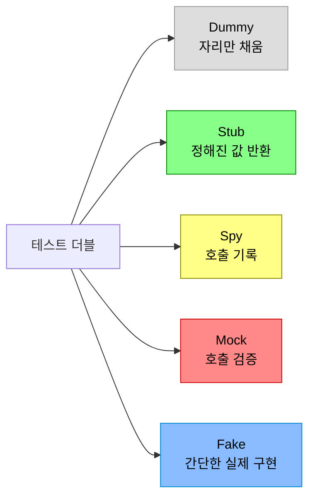
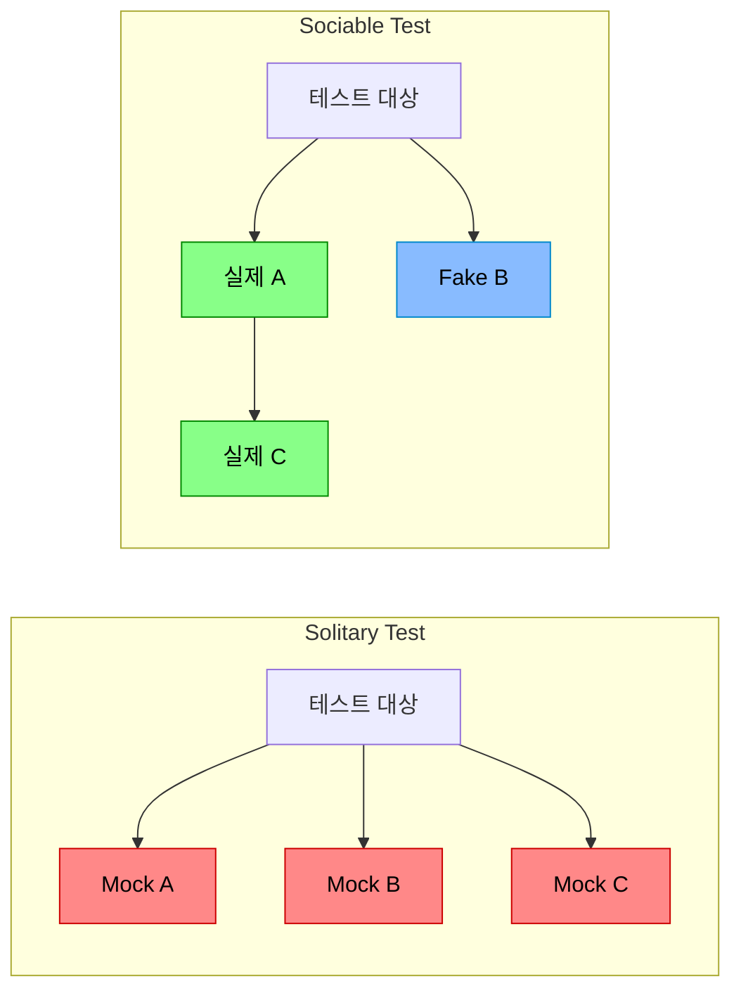

테스트를 작성할 때 "그냥 Mock 쓰면 되지"라고 생각하기 쉽다. 하지만 Mock은 테스트 더블의 다섯 가지 유형 중 하나일 뿐이다. **Dummy, Stub, Spy, Mock, Fake는 각각 다른 목적을 가지며, 잘못 선택하면 깨지기 쉬운 테스트가 만들어진다.** 이 글에서는 각 유형의 정확한 차이를 이해하고, Mockito 심화 기법, Mock 남용의 위험, 그리고 테스트 가독성을 높이는 패턴까지 다룬다.

---

## 테스트 더블이란 무엇인가

> **비유:** 영화 촬영에서 위험한 장면에 배우 대신 투입되는 "스턴트 더블"을 떠올려보자. 스턴트 더블은 진짜 배우가 아니지만, 특정 장면에서 배우의 역할을 대신한다. 테스트 더블도 마찬가지다. 실제 객체(진짜 배우) 대신 테스트에서 사용하는 가짜 객체(스턴트 더블)다. 그런데 스턴트 더블에도 종류가 있다 — 멀리서 서 있기만 하는 엑스트라(Dummy), 정해진 대사만 하는 대역(Stub), 카메라가 몇 번 찍었는지 기록하는 감독(Spy), 대본대로 연기하는지 검증하는 감독(Mock), 실제 배우처럼 연기할 수 있는 배우 지망생(Fake).



Gerard Meszaros가 *xUnit Test Patterns*에서 정의한 이 다섯 가지 유형은 테스트에서 "실제 객체를 대신하는 모든 것"을 분류한 것이다. 실무에서는 "Mock"이라는 단어를 이 다섯 가지를 통칭하는 의미로 쓰는 경우가 많지만, 정확한 구분을 아는 것이 좋은 테스트를 짜는 출발점이다.

---

## 다섯 가지 테스트 더블 — 하나씩 파헤치기

### 1️⃣ Dummy — 자리만 채우는 빈 껍데기

Dummy는 실제로 사용되지 않는다. 메서드 시그니처를 만족시키기 위해 넘기는 값이다. 호출되면 안 되고, 호출되면 테스트가 잘못된 것이다.

> **비유:** 가구점 전시장의 가짜 TV다. 소파를 팔기 위해 거실 느낌을 내려고 올려둔 것이지, 실제로 전원을 켜지는 않는다. 누가 리모컨을 누르면 문제가 있는 것이다.

Dummy는 코드가 필요하지 않은 파라미터를 채우는 용도로만 쓰인다. 예를 들어 생성자에 `Logger`를 받지만 테스트하려는 로직에서 로깅이 발생하지 않는 경우, `null`이나 빈 객체를 넘기면 된다.

```java
class OrderServiceTest {

    @Test
    void 주문_총액을_계산한다() {
        // Logger는 이 테스트에서 사용되지 않는다 — Dummy
        Logger dummyLogger = mock(Logger.class);

        OrderService service = new OrderService(
            new FakeProductRepository(),
            dummyLogger  // 자리만 채움
        );

        int total = service.calculateTotal(List.of(
            new OrderItem(1L, 2, 10_000),
            new OrderItem(2L, 1, 5_000)
        ));

        assertThat(total).isEqualTo(25_000);
    }
}
```

**이 코드의 핵심:** `dummyLogger`는 어떤 메서드도 호출되지 않는다. 단지 생성자의 파라미터를 채우기 위해 존재한다.

### 2️⃣ Stub — 정해진 답을 돌려주는 응답 기계

Stub은 특정 입력에 대해 미리 정해진 값을 반환한다. 테스트 대상이 의존하는 객체의 반환값을 제어할 때 사용한다. "이 메서드가 호출되면 이 값을 돌려줘라"가 Stub의 전부다.

> **비유:** 고객센터 ARS 시스템이다. "1번을 누르면 잔액 안내, 2번을 누르면 카드 분실 신고." 정해진 입력에 정해진 응답만 한다. 실제 상담원처럼 유연하게 대응하지는 못하지만, 특정 시나리오를 테스트하기에는 충분하다.

Stub의 핵심은 **상태 검증(state verification)**이다. "이 Stub이 호출되었는가"가 아니라 "Stub이 반환한 값을 받아서 테스트 대상이 올바른 결과를 만들었는가"를 확인한다.

```java
class PricingServiceTest {

    @Test
    void VIP_회원은_10퍼센트_할인을_받는다() {
        // Stub — 특정 입력에 정해진 값 반환
        MemberRepository stubRepo = mock(MemberRepository.class);
        given(stubRepo.findById(1L))
            .willReturn(Optional.of(new Member(1L, "김철수", Grade.VIP)));

        PricingService service = new PricingService(stubRepo);

        // when
        int discountedPrice = service.calculatePrice(1L, 100_000);

        // then — Stub의 반환값을 기반으로 결과를 검증 (상태 검증)
        assertThat(discountedPrice).isEqualTo(90_000);
    }
}
```

**이 코드의 핵심:** `stubRepo`는 "1번 회원을 조회하면 VIP 김철수를 돌려줘라"는 고정 응답만 한다. 테스트는 `findById`가 호출되었는지가 아니라, 할인된 가격이 올바른지를 검증한다.

### 3️⃣ Spy — 몰래 기록하는 관찰자

Spy는 실제 객체를 감싸서 메서드 호출을 기록한다. 실제 로직이 실행되면서 동시에 "몇 번 호출되었는가", "어떤 인자로 호출되었는가"를 추적한다.

> **비유:** 식당에 잠입한 미슐랭 가이드 조사원이다. 실제로 음식을 주문하고 먹으면서(실제 동작) 동시에 서비스 속도, 맛, 청결도를 기록한다(호출 추적). 가짜 손님이 아니라 진짜 손님인데, 메모를 한다.

Spy와 Mock의 차이가 여기서 갈린다. Mock은 실제 로직을 실행하지 않는다(가짜 객체). Spy는 실제 로직을 실행하면서 기록만 추가한다(진짜 객체 + 관찰).

```java
class EventPublisherTest {

    @Test
    void 주문_완료_시_이벤트가_발행된다() {
        // Spy — 실제 객체를 감싸서 호출을 기록
        EventPublisher realPublisher = new EventPublisher();
        EventPublisher spyPublisher = spy(realPublisher);

        OrderService service = new OrderService(
            new FakeOrderRepository(), spyPublisher
        );

        // when
        service.completeOrder(1L);

        // then — 실제로 이벤트가 발행되었고, 그 사실을 기록으로 확인
        verify(spyPublisher).publish(any(OrderCompletedEvent.class));
        // 실제 publish 메서드가 실행됨 (Mock과 다른 점)
    }
}
```

**이 코드의 핵심:** `spyPublisher`는 실제 `publish()` 메서드를 실행한다. 동시에 호출 여부를 기록하여 `verify()`로 확인할 수 있다. Mock이었다면 `publish()`의 실제 로직은 실행되지 않았을 것이다.

### 4️⃣ Mock — 기대한 대로 호출되었는지 검증하는 심판

Mock은 "이 메서드가 이 인자로 정확히 N번 호출되어야 한다"는 **행위 검증(behavior verification)**을 수행한다. Stub과 가장 혼동되는 유형이다.

> **비유:** 연극 리허설에서 감독이 배우에게 "2막에서 정확히 두 번 문을 열어야 합니다"라고 지시하고, 공연이 끝나면 실제로 두 번 열었는지 확인하는 것이다. 문을 열었을 때 무슨 일이 일어나는지(결과)보다 문을 열었는지(행위) 자체를 검증한다.

Mock의 핵심은 **"어떻게 호출되었는가"**를 검증하는 것이다. 결과값이 아니라 상호작용 자체가 올바른지를 확인한다. 이것이 Stub과의 결정적 차이다.

```java
class NotificationServiceTest {

    @Test
    void 결제_완료_시_SMS와_이메일을_모두_발송한다() {
        // Mock — 행위를 검증할 객체
        SmsSender mockSms = mock(SmsSender.class);
        EmailSender mockEmail = mock(EmailSender.class);

        NotificationService service = new NotificationService(
            mockSms, mockEmail
        );

        // when
        service.notifyPaymentComplete("010-1234-5678", "user@test.com", 50_000);

        // then — 행위 검증: 정확한 인자로 정확히 1번 호출되었는가
        then(mockSms).should(times(1))
            .send(eq("010-1234-5678"), contains("50,000원 결제"));
        then(mockEmail).should(times(1))
            .send(eq("user@test.com"), any(), contains("결제 완료"));
    }
}
```

**이 코드의 핵심:** SMS와 이메일이 실제로 발송되지는 않지만, 올바른 인자로 정확히 한 번 호출되었는지를 검증한다. 이것이 Mock의 역할이다.

### 5️⃣ Fake — 단순하지만 실제로 동작하는 대체 구현

Fake는 실제 객체와 동일한 인터페이스를 구현하되, 내부 로직을 단순화한 것이다. 실제로 동작한다. 데이터를 저장하고, 조회하고, 삭제한다 — 다만 MySQL 대신 `HashMap`을 쓸 뿐이다.

> **비유:** 진짜 은행 대신 모노폴리 게임의 은행이다. 돈을 입금하고, 출금하고, 잔액을 확인할 수 있다. 실제 이자 계산이나 규제 준수는 없지만, "돈을 넣으면 잔고가 늘고 빼면 줄어든다"는 핵심 동작은 동일하다.

Fake는 Mock이나 Stub보다 유지보수 비용이 높지만, 테스트가 구현 세부사항에 결합되지 않는다는 큰 장점이 있다. Mock은 "findById가 호출되었는가"를 검증하지만, Fake는 "저장한 데이터가 실제로 조회되는가"를 검증한다.

```java
public class FakeOrderRepository implements OrderRepository {

    private final Map<Long, Order> store = new HashMap<>();
    private final AtomicLong idGenerator = new AtomicLong(1);

    @Override
    public Order save(Order order) {
        if (order.getId() == null) {
            // 리플렉션 또는 빌더로 ID 할당
            order = order.toBuilder()
                .id(idGenerator.getAndIncrement())
                .build();
        }
        store.put(order.getId(), order);
        return order;
    }

    @Override
    public Optional<Order> findById(Long id) {
        return Optional.ofNullable(store.get(id));
    }

    @Override
    public List<Order> findByUserId(Long userId) {
        return store.values().stream()
            .filter(o -> o.getUserId().equals(userId))
            .toList();
    }

    @Override
    public void deleteById(Long id) {
        store.remove(id);
    }
}
```

```java
class OrderServiceTest {

    @Test
    void 주문을_생성하고_조회할_수_있다() {
        // Fake — 실제로 동작하는 인메모리 구현
        FakeOrderRepository fakeRepo = new FakeOrderRepository();
        OrderService service = new OrderService(fakeRepo);

        // when
        Order created = service.createOrder(1L, 2, 10_000);

        // then — Fake가 실제로 저장했으므로 조회 가능
        Optional<Order> found = fakeRepo.findById(created.getId());
        assertThat(found).isPresent();
        assertThat(found.get().getQuantity()).isEqualTo(2);
    }
}
```

**이 코드의 핵심:** `FakeOrderRepository`는 `HashMap`으로 실제 저장/조회/삭제가 동작한다. Mock처럼 "save가 호출되었는가"를 검증하는 것이 아니라, "저장한 데이터를 실제로 조회할 수 있는가"를 검증한다.

### 한눈에 보는 비교표

| 유형 | 실제 동작 | 용도 | 검증 방식 |
|------|-----------|------|-----------|
| Dummy | 안 함 | 파라미터 채우기 | 없음 |
| Stub | 고정값 반환 | 의존 객체의 반환값 제어 | 상태 검증 |
| Spy | 실제 실행 + 기록 | 호출 추적 | 행위 + 상태 |
| Mock | 안 함 | 호출 검증 | 행위 검증 |
| Fake | 단순 구현 실행 | 인프라 대체 | 상태 검증 |

---

## Mockito 심화 — 실전에서 쓰는 고급 기법

### ArgumentCaptor — 넘겨진 인자를 잡아서 검증하기

`verify()`로 "호출되었는가"만 확인하는 것이 아니라, "어떤 객체가 넘겨졌는가"를 상세히 검증하고 싶을 때 사용한다.

> **비유:** 편지를 우체국에 맡기는 상황이다. "편지를 보냈다"는 것만 확인하는 것이 아니라, 우체통을 열어서 "받는 사람 주소가 맞는지, 우표가 붙어 있는지"까지 확인하는 것이다.

ArgumentCaptor는 Mock에 전달된 인자를 캡처하여 나중에 상세한 검증을 할 수 있게 해준다. 특히 테스트 대상이 내부에서 새 객체를 생성해 의존 객체에 넘기는 경우에 유용하다. `eq()`나 `any()`로는 부족한 복잡한 검증이 필요할 때 쓴다.

```java
@Test
void 주문_생성_시_정확한_이벤트가_발행된다() {
    // given
    EventPublisher mockPublisher = mock(EventPublisher.class);
    OrderService service = new OrderService(
        new FakeOrderRepository(), mockPublisher
    );

    // when
    service.createOrder(1L, "노트북", 2, 1_000_000);

    // then — 발행된 이벤트의 내용을 상세히 검증
    ArgumentCaptor<OrderCreatedEvent> captor =
        ArgumentCaptor.forClass(OrderCreatedEvent.class);
    verify(mockPublisher).publish(captor.capture());

    OrderCreatedEvent event = captor.getValue();
    assertThat(event.getProductName()).isEqualTo("노트북");
    assertThat(event.getQuantity()).isEqualTo(2);
    assertThat(event.getTotalPrice()).isEqualTo(2_000_000);
}
```

**이 코드의 핵심:** `captor.capture()`가 `publish()`에 전달된 이벤트 객체를 잡아둔다. `captor.getValue()`로 꺼내서 필드 하나하나를 검증할 수 있다.

### InOrder — 호출 순서 검증

여러 Mock이 특정 순서대로 호출되어야 할 때 사용한다. 예를 들어 "검증 → 저장 → 알림" 순서가 비즈니스 규칙인 경우다.

> **비유:** 요리 레시피다. 양파를 먼저 볶고, 고기를 넣고, 마지막에 소스를 뿌려야 한다. 순서가 바뀌면 맛이 달라진다. InOrder는 "정말 이 순서대로 했는가"를 검증한다.

```java
@Test
void 결제는_검증_후_처리_후_알림_순서로_실행된다() {
    // given
    PaymentValidator validator = mock(PaymentValidator.class);
    PaymentProcessor processor = mock(PaymentProcessor.class);
    NotificationSender notifier = mock(NotificationSender.class);

    PaymentService service = new PaymentService(
        validator, processor, notifier
    );

    // when
    service.pay(new PaymentRequest(1L, 50_000));

    // then — 순서 검증
    InOrder inOrder = inOrder(validator, processor, notifier);
    inOrder.verify(validator).validate(any());     // 1. 검증
    inOrder.verify(processor).process(any());      // 2. 처리
    inOrder.verify(notifier).sendReceipt(any());   // 3. 알림
}
```

**이 코드의 핵심:** `inOrder()`로 세 Mock을 묶고, `verify()`를 순서대로 호출하면 실제 호출 순서가 일치하는지 검증한다.

### BDD Style — given/when/then에 맞춘 Mockito

Mockito의 기본 API(`when().thenReturn()`)는 문법적으로 BDD의 given 절에 어울리지 않는다. BDDMockito는 `given().willReturn()` 형태를 제공하여 테스트 구조와 자연스럽게 맞아떨어진다.

`when`이라는 키워드가 given 절에 있으면 읽는 사람이 혼란스럽다. BDD 스타일은 이 어색함을 해소한다.

```java
import static org.mockito.BDDMockito.*;

@Test
void BDD_스타일로_작성한_테스트() {
    // given — "~가 주어졌을 때"
    given(memberRepository.findById(1L))
        .willReturn(Optional.of(new Member(1L, "김철수", Grade.VIP)));

    // when — "~를 실행하면"
    int price = pricingService.calculatePrice(1L, 100_000);

    // then — "~이어야 한다"
    assertThat(price).isEqualTo(90_000);
    then(memberRepository).should(times(1)).findById(1L);
}
```

**이 코드의 핵심:** `given()`, `willReturn()`, `then()`, `should()`가 BDD의 Given/When/Then 구조와 일치한다. `when().thenReturn()` 대비 가독성이 높다.

### 비교 정리: 기본 vs BDD 스타일

| 기본 Mockito | BDD Mockito |
|-------------|-------------|
| `when(mock.method()).thenReturn(value)` | `given(mock.method()).willReturn(value)` |
| `verify(mock).method()` | `then(mock).should().method()` |
| `doThrow().when(mock).method()` | `willThrow().given(mock).method()` |

---

## 언제 Mock을 쓰고 언제 Fake를 쓰는가

> **비유:** 자동차 충돌 테스트에서 사람 대신 마네킹(Mock)을 태우는 것은 합리적이다. 마네킹은 충돌 시 어떤 힘을 받는지 측정한다. 하지만 "편안한 승차감"을 테스트하려면 마네킹이 아니라 실제 사람에 가까운 로봇(Fake)이 필요하다. 테스트하려는 것이 "충돌 충격"인지 "승차 경험"인지에 따라 적합한 더블이 달라진다.

```mermaid
flowchart TD
    Q1{"의존 객체가\n외부 시스템인가?"}
    Q1 -->|"예\n(결제 API, SMS)"|  MOCK["Mock 사용\n호출 여부만 검증"]
    Q1 -->|"아니오"| Q2{"의존 객체의 상태가\n중요한가?"}
    Q2 -->|"예\n(저장 후 조회)"| FAKE["Fake 사용\n인메모리 구현"]
    Q2 -->|"아니오\n(반환값만 필요)"| STUB["Stub 사용\n고정값 반환"]

    style MOCK fill:#f88,stroke:#c00,color:#000
    style FAKE fill:#8bf,stroke:#08c,color:#000
    style STUB fill:#8f8,stroke:#080,color:#000
```

### Mock이 적합한 경우

- **외부 시스템과의 상호작용**: 결제 API, SMS 발송, 이메일 발송처럼 실제 호출하면 비용이 들거나 부작용이 있는 경우
- **호출 자체가 중요한 경우**: "알림이 발송되었는가", "로그가 기록되었는가"처럼 행위 자체를 검증해야 할 때
- **단방향 의존성**: 결과를 돌려받지 않고 명령만 보내는 경우 (Command)

### Fake가 적합한 경우

- **저장/조회 패턴**: Repository처럼 "넣은 것을 다시 꺼낸다"는 상태가 중요한 경우
- **복잡한 상호작용**: 여러 메서드가 연쇄적으로 호출되어 상태를 변경하는 경우
- **리팩토링 내성**: 내부 구현이 바뀌어도 테스트가 깨지지 않아야 할 때

### 실전 판단 기준

```java
// Mock이 적합 — 외부 시스템, 행위 검증
@Test
void 결제_성공_시_SMS를_발송한다() {
    SmsSender mockSms = mock(SmsSender.class);
    // ... 결제 로직 실행 ...
    verify(mockSms).send(any());  // "발송했는가"가 핵심
}

// Fake가 적합 — 저장/조회, 상태 검증
@Test
void 회원_가입_후_조회할_수_있다() {
    FakeMemberRepository fakeRepo = new FakeMemberRepository();
    MemberService service = new MemberService(fakeRepo);

    service.register("user@test.com", "password");

    // "저장된 데이터를 꺼낼 수 있는가"가 핵심
    assertThat(fakeRepo.findByEmail("user@test.com")).isPresent();
}
```

**이 코드의 핵심:** SMS 발송은 "보냈는가"가 중요하므로 Mock, 회원 저장은 "저장된 데이터가 올바른가"가 중요하므로 Fake를 쓴다.

---

## Mock 남용의 위험과 대안

### 문제 1: 구현에 결합된 테스트

Mock으로 테스트를 짜면 "어떤 메서드가 어떤 순서로 호출되는가"를 검증하게 된다. 이것은 구현 세부사항이다. 내부 리팩토링(메서드 추출, 호출 순서 변경)만 해도 테스트가 깨진다.

```java
// 나쁜 예 — 구현에 결합
@Test
void 주문_생성() {
    // given
    given(productRepo.findById(1L)).willReturn(Optional.of(product));
    given(discountService.calculate(any())).willReturn(1000);
    given(orderRepo.save(any())).willReturn(order);

    // when
    orderService.createOrder(request);

    // then — 내부 호출 순서까지 검증
    InOrder inOrder = inOrder(productRepo, discountService, orderRepo);
    inOrder.verify(productRepo).findById(1L);
    inOrder.verify(discountService).calculate(any());
    inOrder.verify(orderRepo).save(any());
    // 리팩토링하면 이 테스트는 깨진다!
}
```

```java
// 좋은 예 — 결과에 집중
@Test
void 주문_생성_시_할인이_적용된다() {
    FakeProductRepository fakeProducts = new FakeProductRepository();
    fakeProducts.save(Product.builder().id(1L).price(10_000).build());

    OrderService service = new OrderService(fakeProducts, new RealDiscountService());

    Order order = service.createOrder(new OrderRequest(1L, 2));

    // 내부 호출이 아닌 결과를 검증
    assertThat(order.getTotalPrice()).isEqualTo(18_000);  // 10% 할인
}
```

### 문제 2: Mock이 너무 많은 테스트

Mock이 3개 이상 필요한 테스트는 설계 문제를 알려주는 신호다. 클래스가 너무 많은 의존성을 갖고 있다는 뜻이다.

```java
// 위험 신호 — Mock이 5개
@Test
void 복잡한_테스트() {
    ProductRepository mockProducts = mock(ProductRepository.class);
    OrderRepository mockOrders = mock(OrderRepository.class);
    PaymentGateway mockPayment = mock(PaymentGateway.class);
    NotificationService mockNotification = mock(NotificationService.class);
    InventoryService mockInventory = mock(InventoryService.class);
    // ... 이런 테스트는 클래스 분리가 필요하다는 신호
}
```

### 대안: Sociable Test (사교적 테스트)

Sociable Test는 테스트 대상과 그 의존성을 함께 실행한다. Mock 대신 실제 객체나 Fake를 사용한다. Martin Fowler가 분류한 두 가지 스타일 중 하나다.



Solitary Test는 테스트 대상만 실제이고 나머지는 모두 Mock이다. 격리도가 높지만 실제 협력을 검증하지 못한다. Sociable Test는 테스트 대상과 협력 객체를 함께 실행하므로 "실제로 맞물려 돌아가는가"를 확인할 수 있다.

외부 시스템(결제 API, DB)만 Fake로 대체하고, 비즈니스 로직 클래스끼리는 실제 객체를 사용하는 것이 Sociable Test의 핵심이다.

```java
@Test
void Sociable_테스트_주문_할인_통합() {
    // Fake는 인프라만 — 비즈니스 로직은 실제 객체
    FakeProductRepository fakeProducts = new FakeProductRepository();
    fakeProducts.save(Product.builder().id(1L).price(100_000).build());

    DiscountPolicy realDiscount = new VipDiscountPolicy();  // 실제 객체
    PricingService realPricing = new PricingService(realDiscount);  // 실제 객체
    OrderService orderService = new OrderService(fakeProducts, realPricing);

    // when
    Order order = orderService.createOrder(
        new OrderRequest(1L, 1, Grade.VIP)
    );

    // then — 전체 흐름이 올바른지 검증
    assertThat(order.getTotalPrice()).isEqualTo(90_000);
}
```

**이 코드의 핵심:** `DiscountPolicy`와 `PricingService`는 실제 객체다. DB만 Fake로 대체했다. 할인 정책 → 가격 계산 → 주문 생성이라는 전체 흐름을 하나의 테스트로 검증한다.

---

## 테스트 가독성을 높이는 패턴

### Test Data Builder — 테스트 데이터를 읽기 쉽게

테스트마다 `new Order(1L, 2L, "노트북", 2, 1_000_000, OrderStatus.CREATED, ...)`처럼 긴 생성자를 쓰면 가독성이 떨어진다. 어떤 값이 중요하고 어떤 값이 기본값인지 구분이 안 된다.

> **비유:** 주민등록등본을 떠올려보자. 매번 모든 칸을 빈칸 없이 채우는 것은 번거롭다. 이사할 때는 주소만 바뀌니까 주소만 적고 나머지는 기존 값을 유지하면 된다. Test Data Builder는 "이 테스트에서 중요한 값만 명시하고 나머지는 기본값으로"를 가능하게 한다.

Builder 패턴을 사용하면 테스트에서 중요한 필드만 명시적으로 설정하고, 나머지는 합리적인 기본값을 사용할 수 있다. 이렇게 하면 테스트를 읽는 사람이 "이 테스트에서 핵심은 VIP 등급이구나"를 즉시 파악한다.

```java
public class TestMemberBuilder {

    private Long id = 1L;
    private String name = "테스트유저";
    private String email = "test@example.com";
    private Grade grade = Grade.NORMAL;

    public static TestMemberBuilder aMember() {
        return new TestMemberBuilder();
    }

    public TestMemberBuilder withGrade(Grade grade) {
        this.grade = grade;
        return this;
    }

    public TestMemberBuilder withEmail(String email) {
        this.email = email;
        return this;
    }

    public Member build() {
        return new Member(id, name, email, grade);
    }
}
```

```java
// 사용 — 핵심만 드러난다
@Test
void VIP_회원은_무료_배송이다() {
    Member vip = aMember().withGrade(Grade.VIP).build();
    // name, email 등은 이 테스트에서 중요하지 않으므로 기본값 사용

    assertThat(shippingService.calculateFee(vip)).isEqualTo(0);
}

@Test
void 일반_회원은_배송비_3000원이다() {
    Member normal = aMember().withGrade(Grade.NORMAL).build();

    assertThat(shippingService.calculateFee(normal)).isEqualTo(3_000);
}
```

**이 코드의 핵심:** 두 테스트 모두 `grade`만 다르다. 나머지 필드는 기본값이므로 "등급에 따른 배송비 차이"라는 테스트 의도가 명확히 드러난다.

### Test Fixture — 공통 설정을 한곳에

여러 테스트에서 반복되는 설정 코드를 하나의 Fixture 클래스로 추출하면, 변경 시 한 곳만 수정하면 된다.

```java
public class OrderFixture {

    public static Order createPendingOrder() {
        return Order.builder()
            .id(1L)
            .userId(1L)
            .productId(1L)
            .quantity(2)
            .totalPrice(100_000)
            .status(OrderStatus.PENDING)
            .createdAt(LocalDateTime.of(2026, 5, 3, 10, 0))
            .build();
    }

    public static Order createPaidOrder() {
        return createPendingOrder().toBuilder()
            .status(OrderStatus.PAID)
            .paidAt(LocalDateTime.of(2026, 5, 3, 10, 5))
            .build();
    }

    public static OrderRequest createOrderRequest(Long productId, int quantity) {
        return new OrderRequest(productId, quantity);
    }
}
```

```java
// 사용
@Test
void 결제_완료된_주문은_취소할_수_없다() {
    Order paidOrder = OrderFixture.createPaidOrder();

    assertThatThrownBy(() -> orderService.cancel(paidOrder))
        .isInstanceOf(IllegalStateException.class)
        .hasMessageContaining("결제 완료");
}
```

**이 코드의 핵심:** `OrderFixture.createPaidOrder()`라는 이름만으로 어떤 상태의 주문인지 알 수 있다. 주문 구조가 바뀌면 Fixture만 수정하면 모든 테스트에 반영된다.

---

<details class="extreme-scenario-details">
<summary class="extreme-scenario-summary">
<span class="extreme-scenario-icon">🔥</span>
<span class="extreme-scenario-label">극한 시나리오 — 클릭하여 펼치기</span>
<span class="extreme-scenario-toggle"></span>
</summary>
<div class="extreme-scenario-body">

<div class="extreme-scenario-content" markdown="1">

### 시나리오 1: Mock이 실제 동작과 다르게 설정되어 프로덕션 장애 발생

> **비유:** Mock 테스트만 믿는 것은 **지도만 보고 등산하는 것**과 같다. 지도(Mock)에는 길이 평탄하게 그려져 있지만, 실제 산(프로덕션)에는 절벽과 낙석 구간이 있다. 지도를 보고 "안전하겠지"라고 판단하면, 실제 산에서 사고가 난다. Mock 테스트(지도 확인)와 통합 테스트(실제 답사)를 함께 해야 안전하다.

Stub으로 `given(repo.findById(1L)).willReturn(Optional.of(order))`를 설정했다. 실제 DB에서는 해당 쿼리가 N+1 문제를 일으키거나, LazyInitializationException이 발생한다. Mock 테스트는 통과하지만 프로덕션에서 터진다.

**해결:** 핵심 비즈니스 흐름에는 Mock 테스트 외에 Testcontainers 기반 통합 테스트를 반드시 추가한다. Mock 테스트는 "로직이 올바른가"를, 통합 테스트는 "실제 환경에서도 동작하는가"를 검증한다. 두 가지를 조합해야 안전하다.

### 시나리오 2: Fake와 실제 구현의 동작이 달라진다

> **비유:** Fake가 실제 구현과 달라지는 것은 **연습용 시뮬레이터의 소프트웨어 업데이트를 빼먹는 것**과 같다. 실제 비행기(프로덕션 DB)에 새 계기판(메서드)이 추가되었는데, 시뮬레이터(Fake)는 옛날 버전 그대로다. 조종사(개발자)가 시뮬레이터에서 연습한 대로 조작하면, 실제 비행기에서는 다르게 동작하여 사고가 난다.

`FakeOrderRepository`를 만들었는데, 실제 `OrderRepository`에 새 메서드가 추가되거나 기존 메서드의 동작이 바뀌었다. Fake는 업데이트되지 않았고, 테스트는 통과하지만 실제 동작과 다르다.

**해결:** Fake에 대한 계약 테스트(Contract Test)를 작성한다. 실제 구현과 Fake가 동일한 테스트를 통과하는지 확인하는 추상 테스트 클래스를 만든다.

```java
abstract class OrderRepositoryContract {

    abstract OrderRepository createRepository();

    @Test
    void save_and_findById() {
        OrderRepository repo = createRepository();
        Order saved = repo.save(Order.builder().userId(1L).build());
        assertThat(repo.findById(saved.getId())).isPresent();
    }
}

// 두 구현이 같은 테스트를 통과해야 한다
class FakeOrderRepositoryTest extends OrderRepositoryContract {
    OrderRepository createRepository() { return new FakeOrderRepository(); }
}

@DataJpaTest
class JpaOrderRepositoryTest extends OrderRepositoryContract {
    @Autowired OrderRepository repo;
    OrderRepository createRepository() { return repo; }
}
```

### 시나리오 3: verify()의 함정 — 너무 많이 검증하기

> **비유:** 모든 호출에 `verify()`를 붙이는 것은 **직원의 모든 행동을 CCTV로 감시하는 것**과 같다. "고객에게 인사했는가"만 확인하면 될 것을 "몇 시에 물을 마셨는가", "화장실은 몇 번 갔는가"까지 체크하면, 화장실 한 번 더 가는 것만으로도 감사(테스트) 결과가 FAIL이 된다. 핵심 행위만 검증해야 테스트가 유지보수 가능하다.

`verify(mock, times(1)).method()`를 모든 호출에 붙이면, 새 기능 추가 시 기존 테스트가 깨진다. "이 메서드가 호출되지 않았다"는 검증(`verifyNoMoreInteractions`)이 특히 위험하다.

**해결:** `verify()`는 테스트의 핵심 행위에만 사용한다. "이 알림이 발송되었는가"는 핵심이지만, "로그가 기록되었는가"는 대부분 핵심이 아니다. `verifyNoMoreInteractions()`는 정말 필요한 경우에만 쓴다.

**Invocation 리스트 전수 검사 메커니즘:** Mockito가 `verifyNoMoreInteractions(mock)`을 실행하면 내부적으로 무슨 일이 일어나는지 이해하면 왜 위험한지 명확해진다. Mockito는 Mock 객체에 대한 모든 호출을 `InvocationContainer`에 기록한다. `verify(mock).method()`를 호출하면 해당 invocation을 "검증됨(verified)"으로 마킹한다. `verifyNoMoreInteractions()`는 InvocationContainer의 **전체 invocation 리스트를 순회**하면서 "검증되지 않은(unverified)" 호출이 하나라도 있으면 `NoInteractionsWanted` 예외를 던진다. 문제는 새 기능을 추가하면서 Mock에 `logger.debug()` 같은 부수적 호출이 하나 추가되기만 해도, 해당 호출이 unverified 상태이므로 기존 테스트가 전부 깨진다는 점이다.

따라서 `verifyNoMoreInteractions()`를 꼭 써야 하는 경우(예: 보안 감사 로직에서 정확히 허가된 호출만 발생했는지 확인)에는, `ignoreStubs(mock)`을 함께 사용하여 Stub 설정에 의한 호출을 제외하거나, `verifyNoInteractions()`(아예 호출이 없어야 함)로 대체하는 것이 안전하다.

### 시나리오 4: Mock 대량 생성 시 GC 압력

> **비유:** Mock 1,000개를 생성하는 것은 **사무실에 더미 직원(마네킹) 1,000명을 앉혀두는 것**과 같다. 마네킹 하나는 가벼워 보이지만, 각각 책상(메모리)을 차지하고 CCTV(invocation 기록)가 모든 동작을 녹화하고 있다. 1,000명분의 CCTV 영상이 쌓이면 저장소(힙)가 가득 차고, 청소부(GC)가 쉬지 않고 정리해야 해서 사무실 전체가 느려진다.

루프 안에서 `mock()`을 호출하거나, 파라미터화된 테스트에서 케이스마다 Mock을 새로 생성하면, 수백~수천 개의 Mock 객체가 힙에 쌓인다. Mockito의 Mock은 단순한 프록시가 아니다. 각 Mock마다 `InvocationContainer`(호출 기록), `MockHandler`(stubbing 정보), CGLIB/Byte Buddy로 생성된 서브클래스 인스턴스가 함께 생성된다. Mock 1개당 약 2~5KB의 메모리를 점유하며, 1,000개면 2~5MB, invocation 기록이 쌓이면 수십 MB까지 증가한다.

**증상:** 테스트 스위트 후반부로 갈수록 점점 느려지고, `java.lang.OutOfMemoryError: GC overhead limit exceeded`가 발생한다. GC 로그를 보면 Young GC 빈도가 비정상적으로 높고, Full GC가 반복된다.

**해결:**

1️⃣ **Mock 재사용:** `@BeforeEach`에서 `Mockito.reset(mock)`으로 stubbing과 invocation 기록을 초기화하여 같은 Mock 인스턴스를 재사용한다. `reset()`은 Mock의 모든 stubbing과 호출 기록을 제거하지만 객체 자체를 재생성하지 않으므로 GC 압력이 줄어든다.

2️⃣ **Fake로 대체:** 대량 케이스를 테스트하는 경우, Mock 대신 하나의 Fake 인스턴스를 재사용하면 메모리 문제가 근본적으로 해결된다. Fake는 invocation 기록을 저장하지 않으므로 메모리 효율이 훨씬 높다.

3️⃣ **테스트 JVM 힙 조정:** `build.gradle`에서 `test { jvmArgs = ['-Xmx1g'] }`로 테스트 전용 힙을 설정한다. 기본값(256MB~512MB)이 부족할 수 있다.

4️⃣ **MockitoSession 사용:** `MockitoSession`을 사용하면 각 테스트 종료 시 자동으로 Mock 상태를 검증하고 정리하여, 메모리 누수를 방지한다.

---
</div>
</div>
</details>

## 실무에서 자주 하는 실수

### 실수 1: Stub과 Mock을 구분하지 않는다

`given().willReturn()`으로 값을 설정하고 `verify()`로 호출을 검증하면, 하나의 테스트에서 Stub과 Mock을 동시에 사용하는 것이다. 이 자체가 나쁜 것은 아니지만, 테스트의 의도가 "반환값이 올바른가(Stub)"인지 "호출이 되었는가(Mock)"인지 명확하지 않으면 혼란을 준다. 하나의 테스트에서 하나의 관심사만 검증하라.

### 실수 2: `any()`를 남발한다

`given(repo.findById(any())).willReturn(...)` 처럼 `any()`를 쓰면 어떤 ID가 와도 같은 결과를 반환한다. 실제로는 ID 1이 전달되어야 하는데 ID 999가 전달되어도 테스트가 통과한다. 가능한 한 정확한 값(`eq(1L)`)을 사용하라.

### 실수 3: Mock에 로직을 넣는다

`given(mock.calculate(anyInt())).willAnswer(inv -> inv.getArgument(0) * 2)` 처럼 Mock에 계산 로직을 넣으면, Mock이 사실상 Fake가 된다. 이런 경우 차라리 Fake 클래스를 명시적으로 만드는 것이 낫다.

### 실수 4: `@MockBean`과 `@Mock`을 혼동한다

`@Mock`은 Mockito가 관리하는 Mock 객체를 만든다 (단위 테스트용). `@MockBean`은 Spring ApplicationContext에 등록된 Bean을 Mock으로 교체한다 (통합 테스트용). 단위 테스트에 `@MockBean`을 쓰면 불필요하게 Spring 컨텍스트가 올라간다.

### 실수 5: 모든 것을 Mock으로 테스트한다

"단위 테스트는 빨라야 하니까 전부 Mock!" — 이렇게 하면 테스트가 구현 세부사항에 결합된다. 비즈니스 로직 클래스끼리는 실제 객체를 사용하고, 인프라(DB, 외부 API)만 Fake/Mock으로 대체하는 것이 균형 잡힌 접근이다.

---

## 면접 포인트

### Q1: Mock과 Stub의 차이를 설명해주세요

Stub은 **상태 검증**이다. 미리 정해진 값을 반환하고, 테스트는 그 반환값을 받아 만들어진 결과가 올바른지 확인한다. Mock은 **행위 검증**이다. 특정 메서드가 특정 인자로 몇 번 호출되었는지를 검증한다. Stub은 "무엇을 반환하는가", Mock은 "어떻게 호출되었는가"에 초점을 맞춘다.

### Q2: 왜 테스트에서 Mock을 남용하면 안 되는가?

Mock은 테스트를 구현 세부사항에 결합시킨다. 내부에서 `findById`를 `findAll().filter()`로 리팩토링하면 동작은 같지만 Mock 테스트는 깨진다. 또한 Mock이 많아지면 테스트가 "원래 코드보다 복잡한 Mock 설정 코드"가 되어 유지보수 비용이 올라간다.

### Q3: Fake 객체는 언제 사용하는가?

Repository처럼 "저장하고 조회하는" 패턴에서 유용하다. Mock은 `save()` 호출 여부만 검증하지만, Fake는 실제로 데이터를 저장하고 `findById()`로 꺼낼 수 있다. 리팩토링에 강하고, 테스트 의도가 명확해진다. 단, Fake의 동작이 실제 구현과 일치하는지 Contract Test로 보장해야 한다.

### Q4: ArgumentCaptor는 언제 사용하는가?

테스트 대상이 내부에서 객체를 생성해 의존 객체에 전달하는 경우에 사용한다. 예를 들어 Service가 Event 객체를 만들어 Publisher에 넘기는 경우, Captor로 Event를 잡아서 필드 값을 상세히 검증할 수 있다.

### Q5: Sociable Test와 Solitary Test의 차이는?

Solitary Test는 테스트 대상만 실제이고 모든 의존성은 Mock이다. 완전히 격리되지만 실제 협력을 검증하지 못한다. Sociable Test는 비즈니스 로직 객체끼리 실제로 협력하게 하고, 인프라(DB, 외부 API)만 Fake로 대체한다. 현실적인 검증이 가능하고 리팩토링에 강하다.

---

## 핵심 정리

| 항목 | 핵심 |
|------|------|
| 테스트 더블 5종 | Dummy(자리 채움), Stub(고정값), Spy(기록), Mock(행위 검증), Fake(간단 구현) |
| Stub vs Mock | Stub = 상태 검증, Mock = 행위 검증 |
| Mock 적합 | 외부 시스템, 부작용 있는 호출, Command 패턴 |
| Fake 적합 | 저장/조회 패턴, 복잡한 상호작용, 리팩토링 내성 필요 |
| Mock 남용 방지 | Sociable Test + Fake로 구현 결합 제거 |
| 가독성 패턴 | Test Data Builder(핵심만 명시) + Fixture(공통 데이터 추출) |
