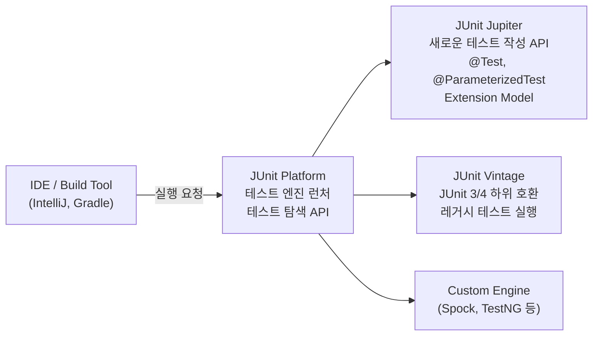
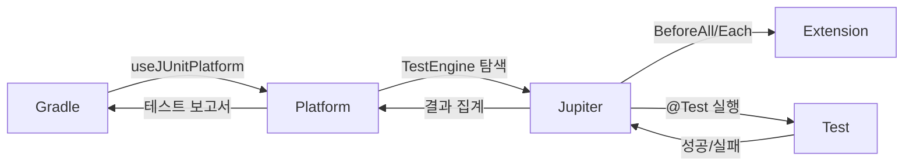

테스트 코드는 프로덕션 코드만큼 중요합니다. 잘 작성된 테스트는 리팩토링의 안전망이고, 버그의 조기 감지망이며, 살아있는 명세서입니다. JUnit 5는 JUnit 4와 비교해 아키텍처부터 Extension 모델까지 전면 재설계되었습니다. 이 포스트에서는 JUnit 5의 핵심 기능을 깊이 파헤치고, 실무에서 바로 쓸 수 있는 테스트 전략까지 다룹니다.

---

## 1. JUnit 5 아키텍처 — 세 모듈의 역할

JUnit 4는 단일 JAR이었습니다. JUnit 5는 세 개의 독립 모듈로 분리됩니다.

```
JUnit 5 = JUnit Platform + JUnit Jupiter + JUnit Vintage
```



**JUnit Platform:** 테스트 엔진을 실행하는 런타임 기반. IDE와 빌드 툴이 이 API를 통해 테스트를 탐색하고 실행합니다.

**JUnit Jupiter:** 우리가 직접 쓰는 테스트 작성 API입니다. `@Test`, `@ParameterizedTest`, `@BeforeEach`, Extension 모델 전부 여기에 속합니다.

**JUnit Vintage:** JUnit 3/4로 작성된 레거시 테스트를 Platform 위에서 실행할 수 있게 해주는 어댑터입니다.

### 의존성 설정

```groovy
// build.gradle
dependencies {
    testImplementation 'org.junit.jupiter:junit-jupiter:5.10.0'
    testImplementation 'org.mockito:mockito-junit-jupiter:5.4.0'

    // Spring Boot는 spring-boot-starter-test에 포함되어 있음
    testImplementation 'org.springframework.boot:spring-boot-starter-test'
}

test {
    useJUnitPlatform() // Platform을 통해 Jupiter 엔진 실행
}
```

---

## 2. @ParameterizedTest — 반복 테스트의 끝판왕

### 왜 필요한가

이메일 유효성 검사를 테스트한다고 가정합니다. 정상 케이스, 잘못된 형식 케이스, 빈 문자열 케이스, null 케이스를 각각 별도 테스트로 작성하면 코드가 중복됩니다. `@ParameterizedTest`는 **하나의 테스트 로직에 여러 입력값을 주입**해 중복 없이 다양한 케이스를 검증합니다.

### @ValueSource — 단순 값 주입

```java
@ParameterizedTest
@ValueSource(strings = {"user@example.com", "admin@test.org", "support@company.co.kr"})
void 유효한_이메일_형식은_검증을_통과한다(String email) {
    assertThat(emailValidator.isValid(email)).isTrue();
}

@ParameterizedTest
@ValueSource(ints = {1, 5, 10, 100, Integer.MAX_VALUE})
void 양수는_상품_수량으로_유효하다(int quantity) {
    assertThat(productValidator.isValidQuantity(quantity)).isTrue();
}

// null과 빈 문자열 추가
@ParameterizedTest
@NullAndEmptySource
@ValueSource(strings = {"invalid", "no-at-sign", "@nodomain", "double@@sign.com"})
void 잘못된_이메일은_검증에_실패한다(String email) {
    assertThat(emailValidator.isValid(email)).isFalse();
}
```

### @CsvSource — 입력과 기대값을 함께

```java
@ParameterizedTest(name = "{0}원 주문에 {1} 할인 적용 시 {2}원")
@CsvSource({
    "10000, VIP,     8000",
    "10000, COUPON,  9000",
    "10000, EVENT,   7000",
    "10000, NONE,   10000",
    "0,     VIP,       0"  // 경계값
})
void 할인_정책별_금액_계산(double price, String discountType, double expected) {
    double result = discountService.applyDiscount(discountType, price);
    assertThat(result).isEqualTo(expected);
}
```

### @MethodSource — 복잡한 객체 주입

```java
@ParameterizedTest
@MethodSource("provideOrderScenarios")
void 주문_상태_전이_시나리오(OrderStatus from, String action, OrderStatus expectedTo) {
    Order order = new Order(from);
    order.transition(action);
    assertThat(order.getStatus()).isEqualTo(expectedTo);
}

// 같은 클래스의 static 메서드
static Stream<Arguments> provideOrderScenarios() {
    return Stream.of(
        Arguments.of(OrderStatus.PENDING, "pay",     OrderStatus.PAID),
        Arguments.of(OrderStatus.PAID,    "ship",    OrderStatus.SHIPPED),
        Arguments.of(OrderStatus.SHIPPED, "deliver", OrderStatus.DELIVERED),
        Arguments.of(OrderStatus.PENDING, "cancel",  OrderStatus.CANCELLED)
    );
}
```

### @ArgumentsSource — 재사용 가능한 ArgumentsProvider

```java
// 프로젝트 전반에서 재사용할 경계값 Provider
public class BoundaryValueProvider implements ArgumentsProvider {

    @Override
    public Stream<? extends Arguments> provideArguments(ExtensionContext context) {
        return Stream.of(
            Arguments.of(Integer.MIN_VALUE, "최솟값"),
            Arguments.of(-1,               "음수 경계"),
            Arguments.of(0,                "영"),
            Arguments.of(1,                "양수 경계"),
            Arguments.of(Integer.MAX_VALUE,"최댓값")
        );
    }
}

@ParameterizedTest(name = "입력={0} ({1})")
@ArgumentsSource(BoundaryValueProvider.class)
void 경계값_테스트(int value, String description) {
    // 경계값에 대한 검증
}
```

### @EnumSource — Enum 기반 테스트

```java
@ParameterizedTest
@EnumSource(value = OrderStatus.class, names = {"PENDING", "PAID"})
void 취소_가능한_상태에서_취소가_성공한다(OrderStatus cancellableStatus) {
    Order order = new Order(cancellableStatus);
    assertThatNoException().isThrownBy(() -> order.cancel());
}

@ParameterizedTest
@EnumSource(value = OrderStatus.class, names = {"SHIPPED", "DELIVERED"}, mode = Mode.EXCLUDE)
void 배송_이후_상태_외_모든_상태에서_취소가_허용된다(OrderStatus status) {
    // SHIPPED, DELIVERED를 제외한 모든 OrderStatus 케이스 실행
}
```

---

## 3. Extension Model — JUnit 5의 핵심 확장 메커니즘

JUnit 4의 `@RunWith`와 `@Rule`을 통합하고 확장한 것이 JUnit 5의 Extension Model입니다. 하나의 `@ExtendWith`로 다양한 확장 지점(Extension Point)을 구현할 수 있습니다.

### 주요 Extension 콜백 지점

```
테스트 클래스 생성
    ↓ TestInstanceFactory
    ↓ TestInstancePostProcessor
BeforeAllCallback
    ↓ BeforeEachCallback
    ↓ BeforeTestExecutionCallback
        [테스트 메서드 실행]
    ↓ AfterTestExecutionCallback
    ↓ AfterEachCallback
AfterAllCallback
```

### 실전 Extension — 실행 시간 측정

```java
// 테스트 실행 시간을 측정해 경고를 출력하는 Extension
public class SlowTestExtension
        implements BeforeTestExecutionCallback, AfterTestExecutionCallback {

    private static final long THRESHOLD_MS = 1000; // 1초 초과 시 경고
    private static final String START_TIME_KEY = "startTime";

    @Override
    public void beforeTestExecution(ExtensionContext context) {
        getStore(context).put(START_TIME_KEY, System.currentTimeMillis());
    }

    @Override
    public void afterTestExecution(ExtensionContext context) {
        long startTime = getStore(context).remove(START_TIME_KEY, long.class);
        long duration = System.currentTimeMillis() - startTime;

        if (duration > THRESHOLD_MS) {
            System.out.printf(
                "[SLOW TEST] %s.%s took %dms%n",
                context.getRequiredTestClass().getSimpleName(),
                context.getRequiredTestMethod().getName(),
                duration
            );
        }
    }

    private ExtensionContext.Store getStore(ExtensionContext context) {
        return context.getStore(
            ExtensionContext.Namespace.create(getClass(), context.getRequiredTestMethod())
        );
    }
}

// 사용
@ExtendWith(SlowTestExtension.class)
class OrderServiceTest { ... }
```

### 실전 Extension — ParameterResolver (의존성 주입)

```java
// 테스트 메서드 파라미터에 자동으로 객체를 주입하는 Extension
public class RandomOrderExtension implements ParameterResolver {

    @Override
    public boolean supportsParameter(ParameterContext paramCtx,
                                     ExtensionContext extCtx) {
        return paramCtx.getParameter().isAnnotationPresent(RandomOrder.class);
    }

    @Override
    public Object resolveParameter(ParameterContext paramCtx,
                                   ExtensionContext extCtx) {
        return Order.builder()
            .id(new Random().nextLong())
            .status(OrderStatus.PENDING)
            .totalAmount(ThreadLocalRandom.current().nextDouble(1000, 100000))
            .build();
    }
}

// 커스텀 어노테이션
@Retention(RetentionPolicy.RUNTIME)
@Target(ElementType.PARAMETER)
public @interface RandomOrder {}

// 사용
@ExtendWith(RandomOrderExtension.class)
class OrderTest {

    @Test
    void 무작위_주문에_결제를_처리할_수_있다(@RandomOrder Order order) {
        // order는 Extension이 생성한 무작위 Order
        assertThatNoException().isThrownBy(() -> paymentService.process(order));
    }
}
```

### 실전 Extension — TestExecutionCondition (조건부 실행)

```java
// 특정 환경에서만 테스트를 실행하는 Extension
public class ProfileCondition implements ExecutionCondition {

    @Override
    public ConditionEvaluationResult evaluateExecutionCondition(ExtensionContext context) {
        Optional<EnableOnProfile> annotation = findAnnotation(
            context.getElement(), EnableOnProfile.class
        );

        return annotation.map(a -> {
            String activeProfile = System.getProperty("spring.profiles.active", "test");
            if (Arrays.asList(a.value()).contains(activeProfile)) {
                return ConditionEvaluationResult.enabled("Profile matched: " + activeProfile);
            }
            return ConditionEvaluationResult.disabled(
                "Disabled: active profile is " + activeProfile
            );
        }).orElse(ConditionEvaluationResult.enabled("No @EnableOnProfile annotation"));
    }
}

@Target({ElementType.TYPE, ElementType.METHOD})
@Retention(RetentionPolicy.RUNTIME)
@ExtendWith(ProfileCondition.class)
public @interface EnableOnProfile {
    String[] value();
}

// 사용 — CI 환경에서만 실행
@Test
@EnableOnProfile("ci")
void 통합_결제_API_호출_테스트() {
    // CI 프로필일 때만 실행, 로컬에서는 skip
}
```

---

## 4. @Nested — 테스트 구조화의 기술

`@Nested`는 테스트를 계층적으로 구조화합니다. 하나의 클래스를 기준으로 "상황(Given)에 따른 행동(When)과 결과(Then)"를 그룹화합니다.

```java
@DisplayName("주문 서비스")
class OrderServiceTest {

    @Nested
    @DisplayName("주문 생성 시")
    class 주문_생성 {

        @Test
        @DisplayName("재고가 충분하면 주문이 생성된다")
        void 재고_충분_주문_생성() { ... }

        @Test
        @DisplayName("재고가 부족하면 예외가 발생한다")
        void 재고_부족_예외() { ... }

        @Nested
        @DisplayName("VIP 회원이 주문할 때")
        class VIP_회원_주문 {

            @BeforeEach
            void VIP_회원_설정() {
                // 각 테스트 전에 VIP 회원 셋업
            }

            @Test
            @DisplayName("20% 할인이 자동 적용된다")
            void VIP_할인_자동_적용() { ... }

            @Test
            @DisplayName("무료 배송이 제공된다")
            void VIP_무료_배송() { ... }
        }
    }

    @Nested
    @DisplayName("주문 취소 시")
    class 주문_취소 {

        @Test
        @DisplayName("결제 전 주문은 취소 가능하다")
        void 결제_전_취소() { ... }

        @Test
        @DisplayName("배송 중 주문은 취소 불가능하다")
        void 배송_중_취소_불가() { ... }
    }
}
```

테스트 결과 창에서 이렇게 표시됩니다.

```
주문 서비스
├── 주문 생성 시
│   ├── ✓ 재고가 충분하면 주문이 생성된다
│   ├── ✓ 재고가 부족하면 예외가 발생한다
│   └── VIP 회원이 주문할 때
│       ├── ✓ 20% 할인이 자동 적용된다
│       └── ✓ 무료 배송이 제공된다
└── 주문 취소 시
    ├── ✓ 결제 전 주문은 취소 가능하다
    └── ✓ 배송 중 주문은 취소 불가능하다
```

**@Nested 클래스의 특성:** 비static 내부 클래스이므로 외부 클래스의 필드에 접근 가능합니다. `@BeforeAll`은 사용 불가(`static` 메서드 불가이므로) — `@TestInstance(Lifecycle.PER_CLASS)`로 해결.

---

## 5. @TestFactory + DynamicTest — 런타임에 테스트 생성

`@ParameterizedTest`는 컴파일 타임에 파라미터가 결정되어야 합니다. `@TestFactory`와 `DynamicTest`는 **런타임에 테스트를 동적으로 생성**합니다. DB에서 테스트 데이터를 읽거나, 파일에서 시나리오를 로드하는 경우에 유용합니다.

```java
@TestFactory
Stream<DynamicTest> 할인_정책_동적_테스트() {
    // 런타임에 DB나 파일에서 테스트 케이스를 로드
    List<DiscountTestCase> testCases = loadTestCasesFromDb();

    return testCases.stream()
        .map(tc -> DynamicTest.dynamicTest(
            tc.getDescription(), // 테스트 이름
            () -> {              // 실행 로직
                double result = discountService.calculate(tc.getType(), tc.getPrice());
                assertThat(result).isEqualTo(tc.getExpected());
            }
        ));
}

@TestFactory
Collection<DynamicNode> 상태_전이_트리() {
    return List.of(
        DynamicContainer.dynamicContainer("결제 흐름",
            Stream.of(
                DynamicTest.dynamicTest("PENDING → PAID", () -> {
                    Order order = new Order(OrderStatus.PENDING);
                    order.pay();
                    assertThat(order.getStatus()).isEqualTo(OrderStatus.PAID);
                }),
                DynamicTest.dynamicTest("PAID → SHIPPED", () -> {
                    Order order = new Order(OrderStatus.PAID);
                    order.ship();
                    assertThat(order.getStatus()).isEqualTo(OrderStatus.SHIPPED);
                })
            )
        ),
        DynamicContainer.dynamicContainer("취소 흐름",
            Stream.of(
                DynamicTest.dynamicTest("PENDING → CANCELLED", () -> {
                    Order order = new Order(OrderStatus.PENDING);
                    order.cancel();
                    assertThat(order.getStatus()).isEqualTo(OrderStatus.CANCELLED);
                })
            )
        )
    );
}
```

---

## 6. 핵심 Assertion — assertAll, assertThrows, assertTimeout

### assertAll — 실패해도 모든 검증 실행

일반 `assertEquals`는 첫 번째 실패에서 중단됩니다. `assertAll`은 **모든 검증을 실행한 뒤 결과를 한꺼번에 보고**합니다.

```java
@Test
void 주문_생성_후_모든_필드_검증() {
    Order order = orderService.createOrder(createRequest());

    assertAll("주문 객체 검증",
        () -> assertThat(order.getId()).isNotNull(),
        () -> assertThat(order.getStatus()).isEqualTo(OrderStatus.PENDING),
        () -> assertThat(order.getTotalAmount()).isPositive(),
        () -> assertThat(order.getMember()).isNotNull(),
        () -> assertThat(order.getCreatedAt()).isBeforeOrEqualTo(LocalDateTime.now())
    );
    // 5개 중 3개가 실패해도 5개 모두 실행하고 3개 실패를 한 번에 보고
}
```

### assertThrows — 예외 타입과 메시지 검증

```java
@Test
void 재고_부족_시_예외_메시지_검증() {
    // assertThrows는 예외 객체를 반환
    InsufficientStockException exception = assertThrows(
        InsufficientStockException.class,
        () -> orderService.createOrder(new OrderRequest(productId, 9999))
    );

    assertThat(exception.getMessage())
        .contains("재고가 부족합니다")
        .contains(String.valueOf(productId));
    assertThat(exception.getAvailableStock()).isLessThan(9999);
}

// AssertJ의 assertThatThrownBy — 더 유연한 예외 검증
@Test
void 권한_없는_사용자_주문_취소_예외() {
    assertThatThrownBy(() -> orderService.cancel(orderId, unauthorizedUserId))
        .isInstanceOf(AccessDeniedException.class)
        .hasMessageContaining("권한이 없습니다")
        .hasFieldOrPropertyWithValue("userId", unauthorizedUserId);
}
```

### assertTimeout — 성능 기준 테스트

```java
@Test
void 주문_목록_조회는_1초_이내에_완료된다() {
    // assertTimeout: 시간 초과 시 테스트 실패, 실행은 완료될 때까지 대기
    assertTimeout(Duration.ofSeconds(1), () -> {
        orderService.findAll(PageRequest.of(0, 100));
    });
}

@Test
void 대량_주문_처리는_500ms_이내에_중단된다() {
    // assertTimeoutPreemptively: 시간 초과 시 즉시 중단
    assertTimeoutPreemptively(Duration.ofMillis(500), () -> {
        orderBatchService.processLargeOrders();
    }, "대량 주문 처리가 500ms를 초과했습니다");
}
```

---

## 7. Mockito + BDDMockito 연동

### Mockito 기본 패턴

```java
@ExtendWith(MockitoExtension.class)
class OrderServiceTest {

    @Mock
    private OrderRepository orderRepository;

    @Mock
    private PaymentClient paymentClient;

    @InjectMocks
    private OrderService orderService;

    @Test
    void 결제_성공_시_주문_상태가_PAID로_변경된다() {
        // given
        Order order = new Order(1L, OrderStatus.PENDING, 10000.0);
        when(orderRepository.findById(1L)).thenReturn(Optional.of(order));
        when(paymentClient.pay(any(PaymentRequest.class)))
            .thenReturn(new PaymentResult(true, "TX_123"));

        // when
        orderService.pay(1L);

        // then
        assertThat(order.getStatus()).isEqualTo(OrderStatus.PAID);
        verify(orderRepository).save(order);
        verify(paymentClient).pay(argThat(req -> req.getAmount() == 10000.0));
    }
}
```

### BDDMockito — 더 읽기 좋은 BDD 스타일

```java
@ExtendWith(MockitoExtension.class)
class OrderServiceBDDTest {

    @Mock private OrderRepository orderRepository;
    @Mock private PaymentClient paymentClient;
    @InjectMocks private OrderService orderService;

    @Test
    void BDD_스타일로_결제_성공_테스트() {
        // given — BDDMockito.given() 사용
        Order order = new Order(1L, OrderStatus.PENDING, 10000.0);
        given(orderRepository.findById(1L)).willReturn(Optional.of(order));
        given(paymentClient.pay(any())).willReturn(new PaymentResult(true, "TX_123"));

        // when
        orderService.pay(1L);

        // then — BDDMockito.then() 사용
        then(orderRepository).should().save(order);
        then(paymentClient).should(times(1)).pay(any());
        then(orderRepository).should(never()).delete(any());
    }

    @Test
    void 결제_실패_시_예외가_전파된다() {
        // given
        Order order = new Order(1L, OrderStatus.PENDING, 10000.0);
        given(orderRepository.findById(1L)).willReturn(Optional.of(order));
        given(paymentClient.pay(any()))
            .willThrow(new PaymentException("카드 한도 초과"));

        // when & then
        assertThatThrownBy(() -> orderService.pay(1L))
            .isInstanceOf(PaymentException.class)
            .hasMessageContaining("카드 한도 초과");

        then(orderRepository).should(never()).save(any());
    }
}
```

### ArgumentCaptor — 전달된 인자 검증

```java
@Test
void 주문_저장_시_올바른_타임스탬프가_설정된다() {
    ArgumentCaptor<Order> orderCaptor = ArgumentCaptor.forClass(Order.class);

    given(orderRepository.findById(1L))
        .willReturn(Optional.of(new Order(1L, OrderStatus.PENDING, 10000.0)));
    given(paymentClient.pay(any())).willReturn(new PaymentResult(true, "TX"));

    orderService.pay(1L);

    verify(orderRepository).save(orderCaptor.capture());
    Order savedOrder = orderCaptor.getValue();

    assertThat(savedOrder.getStatus()).isEqualTo(OrderStatus.PAID);
    assertThat(savedOrder.getPaidAt())
        .isAfter(LocalDateTime.now().minusSeconds(1));
}
```

---

## 8. 테스트 격리 전략

### @Transactional — 가장 일반적인 DB 격리

```java
@SpringBootTest
@Transactional  // 각 테스트 후 롤백
class OrderIntegrationTest {

    @Autowired private OrderService orderService;
    @Autowired private OrderRepository orderRepository;

    @Test
    void 주문_생성_후_조회() {
        // given
        Order created = orderService.createOrder(new OrderRequest(1L, 2));

        // when
        Order found = orderRepository.findById(created.getId()).orElseThrow();

        // then
        assertThat(found.getStatus()).isEqualTo(OrderStatus.PENDING);
    }
    // 테스트 종료 후 자동 롤백 → DB 초기화
}
```

**주의:** `@Transactional` 테스트에서 `@Async` 메서드나 별도 트랜잭션(`REQUIRES_NEW`)으로 저장된 데이터는 롤백되지 않습니다.

### @DirtiesContext — 비용이 큰 마지막 수단

```java
@SpringBootTest
@DirtiesContext(classMode = DirtiesContext.ClassMode.AFTER_EACH_TEST_METHOD)
class StatefulBeanTest {
    // 각 테스트 후 Spring ApplicationContext 재생성
    // 매우 느림 — 꼭 필요한 경우에만 사용
}
```

### Testcontainers — 실제 DB로 통합 테스트

도커 컨테이너로 실제 DB를 띄워 테스트합니다. 인메모리 DB(H2)와 실제 DB의 동작 차이를 없앨 수 있습니다.

```java
@SpringBootTest
@Testcontainers
class OrderRepositoryIntegrationTest {

    @Container
    static MySQLContainer<?> mysql = new MySQLContainer<>("mysql:8.0")
        .withDatabaseName("testdb")
        .withUsername("test")
        .withPassword("test");

    @DynamicPropertySource
    static void configureProperties(DynamicPropertyRegistry registry) {
        registry.add("spring.datasource.url", mysql::getJdbcUrl);
        registry.add("spring.datasource.username", mysql::getUsername);
        registry.add("spring.datasource.password", mysql::getPassword);
    }

    @Autowired private OrderRepository orderRepository;

    @Test
    void MySQL_실제_DB로_주문_저장_조회() {
        Order order = Order.builder()
            .status(OrderStatus.PENDING)
            .totalAmount(10000.0)
            .build();

        Order saved = orderRepository.save(order);
        Order found = orderRepository.findById(saved.getId()).orElseThrow();

        assertThat(found.getTotalAmount()).isEqualTo(10000.0);
    }
}
```

**컨테이너 공유로 성능 최적화:**

```java
// 추상 클래스로 공통 컨테이너 설정 — 모든 통합 테스트가 공유
@Testcontainers
public abstract class IntegrationTestBase {

    @Container
    static MySQLContainer<?> mysql = new MySQLContainer<>("mysql:8.0")
        .withReuse(true); // 동일 컨테이너 재사용

    @DynamicPropertySource
    static void properties(DynamicPropertyRegistry registry) {
        registry.add("spring.datasource.url", mysql::getJdbcUrl);
        // ...
    }
}

// 상속해서 사용
class OrderRepositoryTest extends IntegrationTestBase {
    @Test void 테스트1() { ... }
}

class MemberRepositoryTest extends IntegrationTestBase {
    @Test void 테스트2() { ... }
    // 같은 컨테이너 인스턴스 재사용 → 빠름
}
```

---

## 9. 테스트 커버리지 — 무엇을 테스트할 것인가

### 3가지 기본 시나리오

좋은 테스트는 세 가지 시나리오를 반드시 다룹니다.

**행복 경로(Happy Path):** 모든 것이 정상일 때 기대 결과가 나오는가.

```java
@Test
void 정상_주문_생성() {
    // 재고 충분, 회원 정상, 결제 수단 유효 → 주문 생성 성공
}
```

**실패 경로(Failure Path):** 비즈니스 규칙 위반, 외부 시스템 장애 등 예외 상황.

```java
@Test
void 재고_부족_시_주문_실패() { ... }

@Test
void 결제_시스템_장애_시_예외_처리() { ... }

@Test
void 만료된_쿠폰_적용_시_예외() { ... }
```

**경계값(Boundary Value):** 0, 1, 최댓값, 최솟값, null, 빈 컬렉션.

```java
@ParameterizedTest
@ValueSource(ints = {0, -1, Integer.MIN_VALUE})
void 수량이_0_이하면_주문_불가(int quantity) { ... }

@Test
void 빈_장바구니로_주문_불가() {
    assertThatThrownBy(() -> orderService.createOrder(List.of()))
        .isInstanceOf(EmptyCartException.class);
}
```

### 커버리지 숫자보다 중요한 것

라인 커버리지 80%가 목표인데, 중요한 비즈니스 로직은 50%이고 getter/setter가 100%라면 의미 없습니다.

```java
// 이런 테스트는 커버리지를 높이지만 의미가 없음
@Test
void 게터_세터_테스트() {
    Order order = new Order();
    order.setId(1L);
    assertThat(order.getId()).isEqualTo(1L); // 아무것도 테스트하지 않음
}
```

**진짜 중요한 것은 핵심 비즈니스 로직의 분기 커버리지(Branch Coverage)입니다.** 모든 `if/else`, `switch` 분기를 테스트했는가를 확인합니다.

```yaml
# build.gradle의 JaCoCo 설정
jacocoTestCoverageVerification {
    violationRules {
        rule {
            element = 'CLASS'
            // 비즈니스 로직 패키지만 커버리지 강제
            includes = ['com.example.domain.*', 'com.example.service.*']
            limit {
                counter = 'BRANCH'
                value = 'COVEREDRATIO'
                minimum = 0.80
            }
        }
    }
}
```

---

## 극한 시나리오 3가지

### 시나리오 1: @ParameterizedTest + @SpringBootTest = ApplicationContext 폭발

`@SpringBootTest`를 사용하면 ApplicationContext를 띄웁니다. `@ParameterizedTest`와 함께 쓰면 케이스 수만큼 Context가 재생성될 수 있습니다.

```java
// 위험: 100개 케이스 × ApplicationContext 재생성 = 극도로 느린 테스트
@SpringBootTest
@ParameterizedTest
@CsvSource({/* 100개 케이스 */})
void 통합_테스트(String input, String expected) { ... }
```

**해결책:** `@SpringBootTest`는 기본적으로 Context를 캐싱합니다. `@DirtiesContext`를 붙이지 않으면 동일 Context를 재사용합니다. 단 `@MockBean`을 사용하면 새 Context를 생성합니다. `@MockBean` 남용을 피하고, 통합 테스트용 공통 Base Class를 만들어 동일 Context를 공유하세요.

### 시나리오 2: Mockito와 @Transactional 프록시 충돌

Spring의 `@Transactional`은 AOP 프록시로 동작합니다. `@InjectMocks`로 Service를 직접 생성하면 프록시가 없어 `@Transactional`이 동작하지 않습니다.

```java
@ExtendWith(MockitoExtension.class)
class OrderServiceTest {

    @InjectMocks
    private OrderService orderService; // 프록시 없음 → @Transactional 무시
    // 트랜잭션 없이 JPA 작업하면 LazyInitializationException 발생 가능
}
```

**해결책:** 트랜잭션 동작을 테스트해야 한다면 `@SpringBootTest + @Autowired`를 사용합니다. 단순 비즈니스 로직만 테스트한다면 `@ExtendWith(MockitoExtension.class) + @InjectMocks`로 충분합니다. 두 가지를 분리하세요.

### 시나리오 3: Testcontainers 병렬 실행 시 포트 충돌

JUnit 5는 기본적으로 테스트 클래스를 순차 실행하지만, `junit.jupiter.execution.parallel.enabled=true`로 병렬 실행을 켜면 여러 컨테이너가 같은 포트를 점유하려 합니다.

```properties
# 병렬 실행 설정
junit.jupiter.execution.parallel.enabled=true
junit.jupiter.execution.parallel.mode.default=concurrent
```

**해결책:** `@Container static`으로 선언하면 테스트 클래스당 하나의 컨테이너만 생성됩니다. 컨테이너에 고정 포트를 쓰지 않고 랜덤 포트를 사용하면 충돌을 피할 수 있습니다. MySQL 컨테이너의 호스트 포트는 항상 랜덤이므로 `mysql::getJdbcUrl`을 사용하면 안전합니다.

---

## 실무 실수 Top 5

**1. 테스트 메서드 이름을 `test1`, `test2`로 짓기**

```java
// Bad
@Test
void test1() { ... }

// Good — 무엇을 테스트하는지 명확히
@Test
@DisplayName("재고가 충분한 경우 주문 생성이 성공한다")
void 재고_충분_주문_생성_성공() { ... }
```

**2. 하나의 테스트에 여러 시나리오 넣기**

```java
// Bad: 하나의 테스트에 결제 성공과 실패를 모두 검증
@Test
void 결제_테스트() {
    // 성공 케이스
    assertThat(paymentService.pay(validCard, 1000)).isTrue();
    // 실패 케이스
    assertThat(paymentService.pay(invalidCard, 1000)).isFalse();
    // 첫 번째가 실패하면 두 번째는 실행되지 않음
}

// Good: 각 시나리오를 별도 테스트로
@Test void 유효한_카드로_결제_성공() { ... }
@Test void 유효하지_않은_카드로_결제_실패() { ... }
```

**3. given/when/then 구분 없이 순서대로 작성**

가독성 저하의 주요 원인입니다. 주석으로라도 `// given`, `// when`, `// then`을 반드시 구분하세요.

**4. Mock 객체에 verify 없이 상태만 검증**

```java
// 불완전한 테스트
@Test
void 결제_성공_테스트() {
    orderService.pay(1L);
    assertThat(order.getStatus()).isEqualTo(OrderStatus.PAID);
    // 결제 API가 실제로 호출됐는지 검증하지 않음!
}

// 완전한 테스트
@Test
void 결제_성공_테스트() {
    orderService.pay(1L);
    assertThat(order.getStatus()).isEqualTo(OrderStatus.PAID);
    verify(paymentClient).pay(any()); // 외부 호출 검증 추가
}
```

**5. @SpringBootTest를 기본으로 쓰기**

`@SpringBootTest`는 전체 Application Context를 로드합니다. 단순 서비스 로직 테스트에 `@SpringBootTest`를 쓰면 테스트가 10배 이상 느려집니다. 계층별로 적절한 슬라이스 테스트를 사용하세요.

```java
// Controller 테스트 — MVC 레이어만 로드
@WebMvcTest(OrderController.class)
class OrderControllerTest { ... }

// Repository 테스트 — JPA 레이어만 로드
@DataJpaTest
class OrderRepositoryTest { ... }

// Service 테스트 — Spring Context 불필요
@ExtendWith(MockitoExtension.class)
class OrderServiceTest { ... }

// 전체 통합 테스트 — 진짜 필요한 경우에만
@SpringBootTest
class OrderIntegrationTest { ... }
```

---

## 면접 포인트 5가지

### Q1. JUnit 5의 Extension Model이 JUnit 4의 @RunWith/@Rule과 어떻게 다른가?

JUnit 4는 `@RunWith`로 단 하나의 Runner만 지정할 수 있었습니다. Spring 테스트(`SpringJUnit4ClassRunner`)와 Mockito(`MockitoJUnitRunner`)를 동시에 사용하려면 불편한 우회법이 필요했습니다. JUnit 5의 `@ExtendWith`는 **여러 Extension을 동시에 등록**할 수 있습니다. `@ExtendWith({SpringExtension.class, MockitoExtension.class})`처럼 조합이 자유롭습니다. 또한 Extension이 구현할 수 있는 콜백 지점(BeforeEachCallback, ParameterResolver 등)이 세분화되어 원하는 동작만 선택적으로 구현할 수 있습니다.

### Q2. @Mock과 @MockBean의 차이는?

`@Mock`은 Mockito가 제공하는 순수 Mock 객체입니다. Spring ApplicationContext와 무관하며 `@ExtendWith(MockitoExtension.class)`와 함께 단위 테스트에서 사용합니다.

`@MockBean`은 Spring Boot Test가 제공합니다. Spring ApplicationContext 내의 실제 Bean을 Mock으로 교체합니다. `@SpringBootTest`나 `@WebMvcTest`와 함께 사용합니다. **중요 주의사항:** `@MockBean`을 사용하면 해당 테스트 클래스에 맞춰 ApplicationContext를 새로 생성하므로 Context 캐싱이 깨집니다. 같은 MockBean 설정을 가진 테스트끼리 묶거나, `@MockBean`을 Base Class로 옮겨 캐시 히트를 유도하세요.

### Q3. @Transactional 테스트의 주의사항은?

`@Transactional` 테스트는 각 테스트 후 롤백되어 편리하지만, 실제 운영 환경과 다른 동작을 보일 수 있습니다.

첫째, `@Async` 메서드가 별도 스레드에서 실행되면 테스트 트랜잭션에 참여하지 않아 롤백되지 않습니다. 둘째, `REQUIRES_NEW` 전파 속성으로 열린 트랜잭션도 독립적으로 커밋되어 롤백 대상이 아닙니다. 셋째, `@EventListener`로 처리되는 이벤트가 별도 트랜잭션에서 실행되면 테스트 종료 후 데이터가 남습니다. 이런 경우엔 Testcontainers를 사용하고 `@Sql`로 데이터를 직접 관리하는 방식을 선택합니다.

### Q4. ParameterizedTest에서 null을 테스트하는 방법은?

`@ValueSource`는 null을 직접 넣을 수 없습니다. 대신 세 가지 방법을 씁니다.

`@NullSource`는 null만 단독으로 주입합니다. `@EmptySource`는 빈 문자열/컬렉션을 주입합니다. `@NullAndEmptySource`는 둘 다 주입합니다. 이들을 `@ValueSource`와 함께 조합할 수 있습니다.

```java
@ParameterizedTest
@NullAndEmptySource
@ValueSource(strings = {" ", "\t", "\n"})
void 공백_null_빈값은_모두_유효하지_않다(String value) {
    assertThat(validator.isValid(value)).isFalse();
}
```

### Q5. 테스트 커버리지 80%를 달성했는데 버그가 계속 나온다. 왜인가?

라인 커버리지는 해당 라인이 실행됐는지만 확인합니다. 실행됐다고 해서 올바른 결과가 나왔다는 뜻은 아닙니다. 흔한 원인은 세 가지입니다.

첫째, `assertThat(result)` 없이 그냥 실행만 하는 테스트입니다. 라인은 커버되지만 아무것도 검증하지 않습니다. 둘째, 분기 커버리지가 낮은 경우입니다. `if/else` 중 한 쪽만 테스트해도 라인 커버리지는 올라갑니다. 셋째, 경계값 미테스트입니다. `quantity > 0`인 조건에서 `quantity = 0`, `quantity = -1`을 테스트하지 않으면 경계에서 터집니다. 커버리지 숫자보다 **핵심 비즈니스 분기의 모든 케이스를 테스트했는가**에 집중하세요.

---

## JUnit 5 테스트 흐름 한눈에 보기



```mermaid
graph LR
    TM["TestMethod"] -->|"@Mock 주입 요청"| ME["MockitoExtension"]
    ME -->|"Mock 객체 생성"| MK["Mock"]
    ME -->|"@InjectMocks 주입"| TM
    TM -->|"given stubbing"| MK
    TM -->|"pay(1L)"| SUT["SUT"]
    SUT -->|"findById"| MK
    MK -->|"order stubbed"| SUT

    TestMethod->>Mock: then(repo).should().save(order)
    Mock-->>TestMethod: 호출 검증 완료
```

---

JUnit 5는 도구입니다. 도구를 아무리 잘 써도 **테스트할 대상을 잘못 선택하면** 의미가 없습니다. "이 코드가 실패하면 비즈니스에 영향을 주는가?"를 기준으로 테스트 우선순위를 정하세요. 중요한 비즈니스 규칙은 철저하게, getter/setter는 생략하는 것이 현명한 전략입니다.
