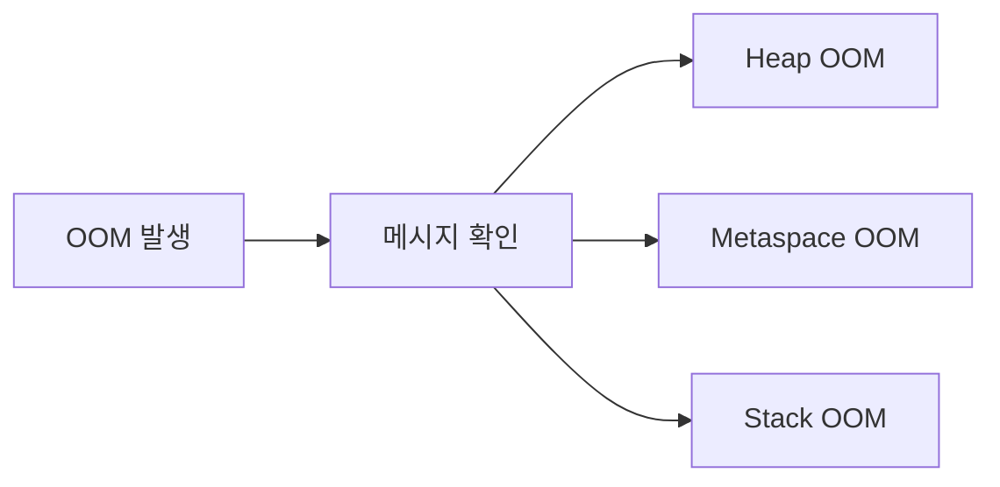
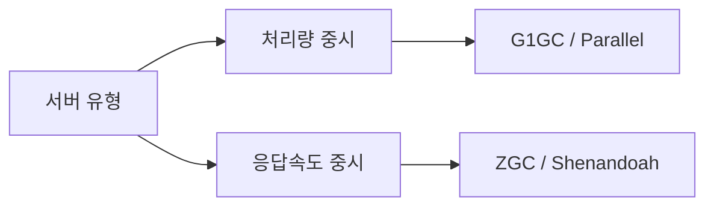
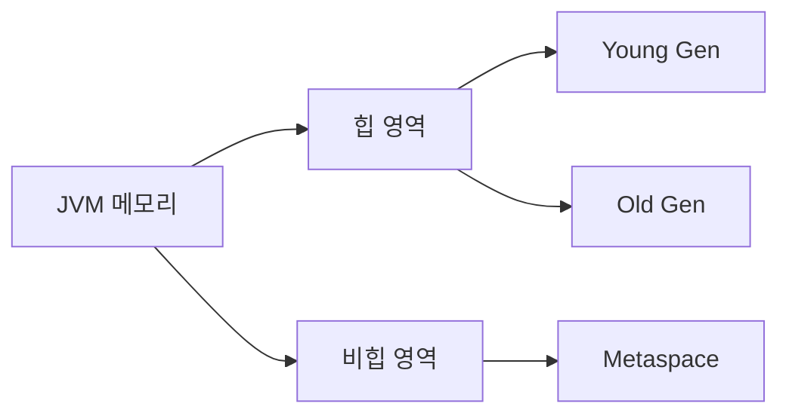

`java.lang.OutOfMemoryError` — 개발자라면 누구나 한 번쯤 새벽에 이 에러 알람을 받아본 경험이 있을 것이다. 서버가 갑자기 멈추고, 재시작해도 일정 시간이 지나면 또 터진다. 이 글은 JVM OOM 에러를 체계적으로 분석하고, 영구적으로 해결하는 방법을 단계별로 설명한다.

> **비유:** JVM 메모리는 책상과 같다. 책상(힙)이 작거나 책(객체)을 치우지 않으면 결국 가득 차서 아무것도 올려놓을 수 없게 된다. OOM은 그 순간이다.

---

## 1. OOM 에러 유형 구분

OOM을 해결하기 전에 어떤 종류의 OOM인지 정확히 구분해야 한다. 에러 메시지가 다르면 원인도 다르고 해결법도 완전히 달라진다.



---

### 유형 1. Java Heap Space

```
java.lang.OutOfMemoryError: Java heap space
```

힙 메모리가 가득 찬 경우다. 가장 흔한 OOM이다. 원인은 두 가지로 나뉜다.

- **메모리 누수**: 참조가 해제되지 않아 GC가 수거하지 못하는 객체가 쌓인다.
- **힙 크기 부족**: 실제로 필요한 메모리가 설정된 힙 크기를 초과한다.

---

### 유형 2. GC Overhead Limit Exceeded

```
java.lang.OutOfMemoryError: GC overhead limit exceeded
```

JVM이 전체 시간의 98% 이상을 GC에 쓰고 있지만 힙의 2% 미만을 회수할 때 발생한다.

> **비유:** 청소부가 하루 종일 청소를 하는데 쓰레기가 계속 쌓여 청소보다 쓰레기가 더 빨리 들어오는 상황이다. 결국 청소부가 손을 놓아버린다.

---

### 유형 3. Metaspace

```
java.lang.OutOfMemoryError: Metaspace
```

클래스 메타데이터를 저장하는 공간이 부족한 경우다. 클래스가 동적으로 과도하게 생성될 때 발생한다(리플렉션, 코드 생성 프레임워크 과다 사용, 클래스로더 누수).

---

### 유형 4. Unable to Create New Native Thread

```
java.lang.OutOfMemoryError: unable to create new native thread
```

새 스레드를 생성할 OS 리소스가 부족하다. 스레드가 너무 많이 생성되거나 스레드가 종료되지 않고 쌓이는 경우다.

---

### 유형 5. Direct Buffer Memory

```
java.lang.OutOfMemoryError: Direct buffer memory
```

NIO `ByteBuffer.allocateDirect()`로 할당된 오프힙(off-heap) 메모리가 부족하다.

---

## 2. OOM 발생 전 징후 감지

OOM은 갑자기 오는 것 같지만 대부분 사전 징후가 있다. 조기에 발견하면 장애로 이어지지 않을 수 있다.

### GC 로그 활성화

```bash
# JVM 실행 옵션에 추가
-Xms2g -Xmx4g
-verbose:gc
-Xlog:gc*:file=/var/log/app/gc.log:time,uptime,level,tags:filecount=10,filesize=10m
```

GC 빈도가 갑자기 늘어나거나 Full GC 후에도 메모리가 충분히 회수되지 않으면 메모리 누수 징후다.

### jstat으로 실시간 모니터링

```bash
# PID 확인
jps -l

# 1초 간격으로 GC 통계 출력
jstat -gcutil <PID> 1000

# 출력 예시
S0     S1     E      O      M     CCS    YGC     YGCT    FGC    FGCT     GCT
 0.00  75.00  50.00  85.00  95.00  92.00    150    3.200    10    5.000    8.200
```

- `O` (Old Gen) 사용률이 80% 이상 지속되면 주의
- `FGC` (Full GC 횟수)가 빠르게 증가하면 위험 신호
- `M` (Metaspace) 사용률이 지속 증가하면 클래스 누수 의심

---

## 3. Heap Dump 수집

메모리 문제를 분석하려면 Heap Dump가 필수다. Heap Dump는 특정 시점의 JVM 메모리 스냅샷이다.

> **비유:** Heap Dump는 범행 현장 사진과 같다. 사건이 발생한 순간 메모리에 무엇이 있었는지 고스란히 담겨 있어 사후 분석이 가능하다.

### 방법 1. OOM 발생 시 자동 수집

```bash
# JVM 옵션 추가 — 운영 환경 필수 설정
-XX:+HeapDumpOnOutOfMemoryError
-XX:HeapDumpPath=/var/log/app/heapdump.hprof
```

OOM이 발생하는 순간 자동으로 힙 덤프를 파일로 저장한다.

### 방법 2. 운영 중 수동 수집

```bash
# jmap으로 수집
jmap -dump:format=b,file=/tmp/heap.hprof <PID>

# 라이브 객체만 수집 (더 작고 분석이 쉬움)
jmap -dump:live,format=b,file=/tmp/heap-live.hprof <PID>
```

주의: `jmap` 실행 중 JVM이 일시 정지(STW)될 수 있으므로 운영 환경에서는 트래픽이 적은 시간을 선택한다.

### 방법 3. jcmd로 수집 (권장)

```bash
# jcmd가 더 안전하고 유연함
jcmd <PID> GC.heap_dump /tmp/heap.hprof
```

---

## 4. MAT(Eclipse Memory Analyzer)로 Heap Dump 분석

MAT는 힙 덤프 분석의 표준 도구다. [공식 사이트](https://www.eclipse.org/mat/)에서 무료로 다운로드할 수 있다.

### 4.1 MAT 실행 및 덤프 로드

1. MAT 실행 후 `File → Open Heap Dump` 선택
2. `.hprof` 파일 선택
3. 분석 완료까지 대기 (파일 크기에 따라 수분 소요)

### 4.2 Leak Suspects Report

MAT가 자동으로 메모리 누수 의심 항목을 보고서로 만들어준다.

```
Problem Suspect 1:
One instance of "com.example.UserCache" loaded by "app" occupies
2,147,483,648 (87.5%) bytes.

Shortest paths to the accumulation point:
UserCache.userMap -> HashMap -> ...
```

위 보고서가 나왔다면 `UserCache`의 `userMap`이 메모리를 과도하게 점유하고 있음을 즉시 파악할 수 있다.

### 4.3 Dominator Tree 분석

Dominator Tree는 어떤 객체가 얼마나 많은 메모리를 점유하고 있는지 계층적으로 보여준다.

- `Retained Heap`이 큰 객체가 주요 용의자
- 예상치 못한 객체가 상위에 있으면 누수 가능성이 높음

### 4.4 OQL로 특정 객체 쿼리

```sql
-- 모든 UserSession 객체 조회
SELECT * FROM com.example.session.UserSession

-- 특정 필드 값으로 필터
SELECT * FROM java.util.HashMap WHERE size > 10000
```

---

## 5. 메모리 누수 패턴

실무에서 자주 등장하는 메모리 누수 패턴을 알아두면 Heap Dump 없이도 코드 리뷰만으로 잡을 수 있다.

### 패턴 1. Static Collection에 계속 추가

```java
// 위험한 코드 — 절대 지워지지 않는 캐시
public class EventTracker {
    // static으로 선언된 컬렉션 — JVM 종료까지 유지됨
    private static final List<Event> events = new ArrayList<>();

    public static void track(Event event) {
        events.add(event); // 계속 쌓이기만 함
    }
}
```

> **비유:** 아파트 복도에 택배를 계속 쌓아두고 절대 치우지 않는 것과 같다. 처음에는 괜찮지만 결국 복도를 막는다.

**해결법**

```java
// 크기 제한이 있는 캐시 사용
private static final int MAX_SIZE = 1000;
private static final Queue<Event> events = new ArrayDeque<>();

public static void track(Event event) {
    if (events.size() >= MAX_SIZE) {
        events.poll(); // 오래된 것 제거
    }
    events.add(event);
}

// 또는 Guava Cache 사용
private static final Cache<String, Event> cache = CacheBuilder.newBuilder()
    .maximumSize(1000)
    .expireAfterAccess(10, TimeUnit.MINUTES)
    .build();
```

---

### 패턴 2. 이벤트 리스너 미해제

```java
// 위험한 코드 — 리스너가 계속 등록됨
public class DataProcessor {
    public void process(EventSource source) {
        source.addListener(new DataListener() {
            @Override
            public void onData(Data data) {
                // 처리 로직
            }
        });
        // 작업이 끝나도 리스너가 source에 남아 있음
        // source가 살아있으면 DataProcessor도 GC되지 않음
    }
}
```

**해결법**

```java
public class DataProcessor {
    private DataListener listener;

    public void process(EventSource source) {
        listener = data -> handleData(data);
        source.addListener(listener);
        try {
            // 실제 처리
        } finally {
            source.removeListener(listener); // 반드시 해제
        }
    }
}
```

---

### 패턴 3. ThreadLocal 미해제

```java
// 위험한 코드 — 스레드 풀 환경에서 특히 위험
private static final ThreadLocal<UserContext> userContext = new ThreadLocal<>();

public void handleRequest(User user) {
    userContext.set(new UserContext(user));
    // 처리 로직
    // remove() 호출 없이 끝남
}
```

스레드 풀에서는 스레드가 재사용되므로 `ThreadLocal`에 남은 데이터가 다음 요청으로 오염되고, 강한 참조로 인해 GC되지 않는다.

**해결법**

```java
public void handleRequest(User user) {
    try {
        userContext.set(new UserContext(user));
        // 처리 로직
    } finally {
        userContext.remove(); // 항상 finally에서 제거
    }
}
```

---

### 패턴 4. 캐시 구현 실수

```java
// 위험한 코드 — 만료 없는 무한 캐시
private final Map<String, byte[]> imageCache = new HashMap<>();

public byte[] getImage(String url) {
    return imageCache.computeIfAbsent(url, this::downloadImage);
}
// 이미지가 계속 쌓여 힙을 가득 채움
```

**해결법**

```java
// WeakReference 기반 캐시 — GC가 필요할 때 자동 수거
private final Map<String, WeakReference<byte[]>> imageCache =
    new WeakHashMap<>();

// 또는 크기 제한 + 만료 설정
private final Cache<String, byte[]> imageCache = CacheBuilder.newBuilder()
    .maximumSize(500)
    .expireAfterWrite(1, TimeUnit.HOURS)
    .build();
```

---

### 패턴 5. 클로저(람다)의 암묵적 참조

```java
public class ReportService {
    private final byte[] largeData = new byte[100 * 1024 * 1024]; // 100MB

    public Runnable createTask() {
        // 이 람다는 ReportService 인스턴스(= largeData 포함)를 암묵적으로 참조
        return () -> System.out.println("Task complete: " + this.getClass().getName());
    }
}
```

**해결법**

필요한 데이터만 지역 변수로 캡처한다.

```java
public Runnable createTask() {
    String className = this.getClass().getName(); // 필요한 값만 캡처
    return () -> System.out.println("Task complete: " + className);
    // largeData는 참조되지 않으므로 GC 가능
}
```

---

### 패턴 6. Connection / Stream 미해제

```java
// 위험한 코드
public void readFile(String path) throws Exception {
    FileInputStream fis = new FileInputStream(path);
    // 예외 발생 시 close() 미호출 → 리소스 누수
    processStream(fis);
    fis.close();
}
```

**해결법**

```java
// try-with-resources 항상 사용
public void readFile(String path) throws Exception {
    try (FileInputStream fis = new FileInputStream(path)) {
        processStream(fis);
    } // 자동으로 close() 호출
}
```

---

## 6. GC 튜닝

메모리 누수가 없는데도 성능이 좋지 않다면 GC 설정 최적화가 필요하다.

### GC 알고리즘 선택



| GC | 특징 | 사용 시나리오 |
|---|---|---|
| Serial GC | 단일 스레드, 소규모 | 클라이언트 앱 |
| Parallel GC | 처리량 최적화 | 배치 처리 |
| G1 GC | 균형형 (Java 9+ 기본) | 대부분의 서버 |
| ZGC | 초저지연 (< 1ms STW) | 지연 민감 서비스 |
| Shenandoah | 초저지연 | 대용량 힙 |

### G1 GC 튜닝 예시

```bash
# G1 GC 권장 설정
-XX:+UseG1GC
-Xms4g
-Xmx4g           # Xms == Xmx 권장 (동적 확장 방지)
-XX:MaxGCPauseMillis=200   # 목표 STW 200ms
-XX:G1HeapRegionSize=16m
-XX:G1NewSizePercent=20
-XX:G1MaxNewSizePercent=40
-XX:InitiatingHeapOccupancyPercent=45
```

### ZGC 튜닝 예시 (Java 15+)

```bash
-XX:+UseZGC
-Xms8g
-Xmx8g
-XX:SoftMaxHeapSize=6g     # 소프트 상한
-XX:ZCollectionInterval=5  # 5초마다 GC
```

> **비유:** GC 알고리즘 선택은 청소 방식 선택과 같다. 한꺼번에 대청소(Parallel GC)를 할지, 매일 조금씩 청소(G1/ZGC)를 할지는 서비스 특성에 따라 다르다.

---

## 7. Metaspace OOM 해결

### 원인 파악

```bash
# 로드된 클래스 수 확인
jcmd <PID> VM.class_hierarchy | wc -l

# Metaspace 사용량 확인
jstat -gcmetacapacity <PID>
```

### 해결법

```bash
# Metaspace 크기 제한 설정
-XX:MetaspaceSize=256m
-XX:MaxMetaspaceSize=512m
```

동적 클래스 생성이 과도하다면 코드를 검토한다. Groovy 스크립트, 리플렉션 과다 사용, ClassLoader 누수를 확인한다.

```java
// ClassLoader 누수 예시 — 절대 하면 안 됨
while (true) {
    URLClassLoader cl = new URLClassLoader(urls);
    Class<?> clazz = cl.loadClass("com.example.Plugin");
    // cl.close()를 호출하지 않으면 Metaspace 누수
}

// 올바른 방법
try (URLClassLoader cl = new URLClassLoader(urls)) {
    Class<?> clazz = cl.loadClass("com.example.Plugin");
}
```

---

## 8. Native Thread OOM 해결

```
java.lang.OutOfMemoryError: unable to create new native thread
```

### 원인 파악

```bash
# 현재 스레드 수 확인
jstack <PID> | grep "Thread" | wc -l

# OS 레벨 스레드 수 확인
cat /proc/<PID>/status | grep Threads
```

### 해결법

```bash
# OS 스레드 한도 확인 및 증가
ulimit -u          # 현재 프로세스 한도
sudo ulimit -u 65536

# 또는 /etc/security/limits.conf 수정
* soft nproc 65536
* hard nproc 65536
```

스레드 풀 설정을 검토한다.

```java
// 스레드 수를 제한하는 ExecutorService 사용
ExecutorService executor = Executors.newFixedThreadPool(
    Runtime.getRuntime().availableProcessors() * 2
);
// 반드시 종료
Runtime.getRuntime().addShutdownHook(new Thread(executor::shutdown));
```

---

## 9. 실제 장애 사례 — 분석 및 해결

### 사례 1. 세션 객체 누적으로 인한 Heap OOM

**증상**: 배포 후 6~8시간마다 OOM으로 서버 재시작

**Heap Dump 분석 결과**

MAT Dominator Tree에서 `SessionManager.sessionMap` (HashMap)이 전체 힙의 90%를 차지하고 있었다.

**원인 코드**

```java
@Component
public class SessionManager {
    private final Map<String, UserSession> sessionMap = new HashMap<>();

    public void createSession(String sessionId, UserSession session) {
        sessionMap.put(sessionId, session);
        // 세션 만료 처리 없음
    }
}
```

**해결 코드**

```java
@Component
public class SessionManager {
    private final Cache<String, UserSession> sessionMap = CacheBuilder.newBuilder()
        .maximumSize(10000)
        .expireAfterAccess(30, TimeUnit.MINUTES)
        .removalListener(notification ->
            log.info("Session removed: {}", notification.getKey()))
        .build();

    public void createSession(String sessionId, UserSession session) {
        sessionMap.put(sessionId, session);
    }
}
```

---

### 사례 2. ThreadLocal 누수로 인한 점진적 메모리 증가

**증상**: 트래픽이 많을수록 메모리 사용량이 계속 증가, 재시작 전까지 회복 안 됨

**원인 코드**

```java
public class RequestContextFilter implements Filter {
    private static final ThreadLocal<RequestContext> context = new ThreadLocal<>();

    @Override
    public void doFilter(ServletRequest req, ...) {
        context.set(new RequestContext((HttpServletRequest) req));
        chain.doFilter(req, response);
        // remove() 없음
    }
}
```

**해결 코드**

```java
@Override
public void doFilter(ServletRequest req, ...) {
    context.set(new RequestContext((HttpServletRequest) req));
    try {
        chain.doFilter(req, response);
    } finally {
        context.remove(); // 반드시 제거
    }
}
```

---

### 사례 3. GC Overhead로 인한 서비스 응답 불가

**증상**: 특정 시간대에 API 응답 시간이 30초 이상 증가

**GC 로그 분석**

```
[GC pause (G1 Evacuation Pause) (young) 3800M->3750M(4096M), 12.5 secs]
[Full GC (Allocation Failure) 3900M->3850M(4096M), 45.3 secs]
```

Full GC가 45초 동안 발생하고 있었다.

**해결 과정**

1. 힙 크기를 4G에서 8G로 증가
2. G1GC로 전환
3. 대용량 리포트 생성 로직에서 페이징 처리 도입

```java
// 전체 데이터를 한번에 로드하던 코드
List<Report> reports = reportRepository.findAll(); // 수십만 건

// 페이징으로 변경
Pageable pageable = PageRequest.of(0, 1000);
Page<Report> page;
do {
    page = reportRepository.findAll(pageable);
    processReports(page.getContent());
    pageable = pageable.next();
} while (page.hasNext());
```

---

## 10. 예방 및 모니터링 설정

### Actuator + Prometheus + Grafana

```xml
<!-- pom.xml -->
<dependency>
    <groupId>org.springframework.boot</groupId>
    <artifactId>spring-boot-starter-actuator</artifactId>
</dependency>
<dependency>
    <groupId>io.micrometer</groupId>
    <artifactId>micrometer-registry-prometheus</artifactId>
</dependency>
```

```yaml
# application.yml
management:
  endpoints:
    web:
      exposure:
        include: health,metrics,prometheus
  metrics:
    export:
      prometheus:
        enabled: true
```

Grafana 대시보드에서 JVM 메모리 메트릭을 시각화한다.

```
# 주요 메트릭
jvm_memory_used_bytes{area="heap"}
jvm_gc_pause_seconds_count
jvm_gc_memory_promoted_bytes_total
```

### 알람 설정 예시 (Prometheus Alert)

```yaml
groups:
  - name: jvm_alerts
    rules:
      - alert: HeapUsageHigh
        expr: jvm_memory_used_bytes{area="heap"} /
              jvm_memory_max_bytes{area="heap"} > 0.85
        for: 5m
        annotations:
          summary: "Heap usage exceeds 85%"

      - alert: FullGCFrequent
        expr: rate(jvm_gc_pause_seconds_count{action="end of major GC"}[5m]) > 0.1
        for: 2m
        annotations:
          summary: "Full GC occurring more than once per 10 minutes"
```

---

## 11. JVM 메모리 구조 이해

OOM을 근본적으로 이해하려면 JVM 메모리 구조를 알아야 한다.



- **Young Generation**: 새로 생성된 객체가 위치. Minor GC로 빠르게 청소됨
- **Old Generation**: Young에서 살아남은 장수 객체들. Full GC 대상
- **Metaspace**: 클래스 메타데이터 저장 (Java 8+, PermGen 대체)
- **Stack**: 각 스레드의 로컬 변수와 호출 스택

---

## 12. 빠른 체크리스트

OOM 발생 시 즉시 수행할 단계다.

1. **에러 메시지 정확히 읽기** — `Java heap space` vs `Metaspace` vs `GC overhead`
2. **Heap Dump 수집** — 이미 죽었다면 `-XX:+HeapDumpOnOutOfMemoryError` 미리 설정했는지 확인
3. **jstat으로 GC 현황 확인** — Old Gen 사용률과 Full GC 빈도
4. **MAT로 Dominator Tree 분석** — 가장 큰 Retained Heap 객체 찾기
5. **코드에서 Static Collection, ThreadLocal, 리스너 미해제 확인**
6. **힙 크기 임시 증가** — 근본 원인 파악 전 서비스 안정화
7. **모니터링 강화** — GC 로그, Actuator 메트릭, 알람 설정

> **비유:** OOM 대응은 화재 진압과 같다. 먼저 불을 끄고(힙 증가, 재시작), 그 다음 화재 원인(메모리 누수)을 조사하고, 마지막으로 방화 시스템(모니터링)을 구축한다.

---

## 마무리

JVM OOM은 무섭지만 체계적으로 접근하면 반드시 해결할 수 있다. 핵심은 세 가지다.

1. **에러 유형을 정확히 구분**한다 — Heap, Metaspace, Thread OOM은 원인과 해결법이 다르다.
2. **Heap Dump를 반드시 분석**한다 — 추측으로 해결하려 하지 말고 증거를 확인한다.
3. **예방 시스템을 구축**한다 — GC 로그, 메트릭 모니터링, 알람으로 사전에 감지한다.

메모리 누수 패턴 6가지(Static Collection, 리스너 미해제, ThreadLocal, 캐시 실수, 클로저 참조, 리소스 미해제)를 코드 리뷰에서 항상 확인하는 습관을 들이면 OOM의 대부분을 사전에 방지할 수 있다.
