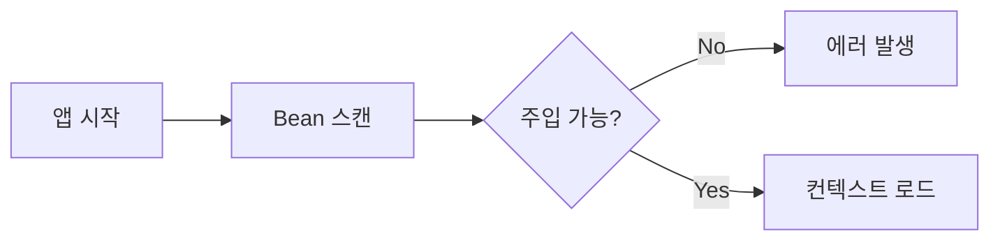
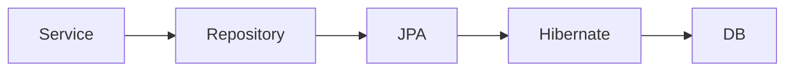
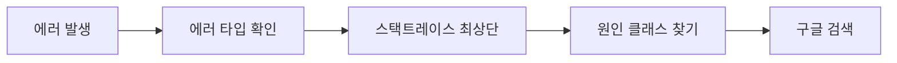

Spring Boot를 처음 배울 때, 혹은 실무에서 개발하다 보면 처음 보는 에러 메시지가 콘솔을 가득 채우는 순간을 누구나 겪는다. 이 글은 그 당황스러운 순간을 최대한 빠르게 해결할 수 있도록, 실무에서 자주 등장하는 에러 50개를 카테고리별로 모아 원인과 해결법을 정리한 참고서다.

> **비유:** Spring Boot 에러 메시지는 자동차 계기판의 경고등과 같다. 경고등이 켜졌을 때 무조건 당황하는 게 아니라 어떤 등이 켜졌는지 확인하고 매뉴얼을 펴면 된다. 이 글은 그 매뉴얼이다.

---

## 1. Bean 관련 에러

Bean 관련 에러는 Spring의 핵심인 IoC 컨테이너가 객체를 생성하거나 주입하는 과정에서 발생한다. 애플리케이션이 시작조차 못 하는 경우가 대부분이므로 가장 먼저 만나는 에러 유형이다.



---

### 에러 1. NoSuchBeanDefinitionException

**에러 메시지**

```
org.springframework.beans.factory.NoSuchBeanDefinitionException:
No qualifying bean of type 'com.example.MyService' available
```

**원인**

- `@Service`, `@Component`, `@Repository` 등의 어노테이션 누락
- 컴포넌트 스캔 범위 밖에 클래스가 위치
- 인터페이스 타입으로 주입 시 구현체가 없음

**해결법**

```java
// 잘못된 예 — 어노테이션 없음
public class MyService {
    public void doWork() {}
}

// 올바른 예
@Service
public class MyService {
    public void doWork() {}
}
```

컴포넌트 스캔 범위를 확인한다. `@SpringBootApplication`이 있는 패키지와 그 하위만 스캔된다.

```java
@SpringBootApplication(scanBasePackages = {"com.example", "com.other"})
public class Application { ... }
```

**예방법**

클래스를 새로 만들 때 반드시 역할에 맞는 스테레오타입 어노테이션을 붙이는 것을 습관화한다.

---

### 에러 2. UnsatisfiedDependencyException

**에러 메시지**

```
org.springframework.beans.factory.UnsatisfiedDependencyException:
Error creating bean with name 'orderService':
Unsatisfied dependency expressed through field 'paymentService'
```

**원인**

의존성 주입 대상 Bean이 존재하지 않거나, 같은 타입의 Bean이 여러 개 존재해 어떤 것을 주입할지 모호한 상황이다.

**해결법**

같은 타입 Bean이 여러 개일 때는 `@Qualifier`로 명시한다.

```java
@Autowired
@Qualifier("kakaoPaymentService")
private PaymentService paymentService;
```

또는 `@Primary`로 기본 Bean을 지정한다.

```java
@Service
@Primary
public class KakaoPaymentService implements PaymentService { ... }
```

**예방법**

인터페이스를 구현하는 클래스가 2개 이상일 때는 항상 `@Primary` 또는 `@Qualifier`를 설계 단계에서 결정해 둔다.

---

### 에러 3. BeanCreationException — 순환 의존성

**에러 메시지**

```
The dependencies of some of the beans in the application context
form a cycle:
orderService → paymentService → orderService
```

**원인**

A Bean이 B를 필요로 하고, B Bean이 다시 A를 필요로 하는 순환 참조가 발생한 경우다.

> **비유:** 닭이 먼저냐 달걀이 먼저냐와 같다. Spring은 이 상황에서 어떤 Bean도 먼저 만들 수 없어 포기한다.

**해결법**

가장 좋은 방법은 설계를 개선해 순환 참조를 없애는 것이다. 임시 방편으로는 `@Lazy`를 사용한다.

```java
@Service
public class OrderService {
    private final PaymentService paymentService;

    public OrderService(@Lazy PaymentService paymentService) {
        this.paymentService = paymentService;
    }
}
```

Spring Boot 2.6부터는 기본적으로 순환 참조를 차단한다. `application.properties`에서 허용하는 설정도 있지만 근본 해결을 권장한다.

```properties
# 임시 허용 — 근본 해결 권장
spring.main.allow-circular-references=true
```

**예방법**

서비스 계층 설계 시 단방향 의존성을 원칙으로 한다. Facade 패턴이나 이벤트 기반 통신으로 순환 참조를 끊는다.

---

### 에러 4. BeanDefinitionOverrideException

**에러 메시지**

```
Invalid bean definition with name 'dataSource' defined in ...
Cannot register bean definition [...] for bean 'dataSource':
There is already [...] bound.
```

**원인**

같은 이름의 Bean이 두 군데에서 정의된 경우다.

**해결법**

```properties
# Bean 재정의 허용 (임시)
spring.main.allow-bean-definition-overriding=true
```

근본 해결은 Bean 이름 중복을 제거하거나 `@ConditionalOnMissingBean`을 활용한다.

```java
@Bean
@ConditionalOnMissingBean
public DataSource dataSource() {
    return new HikariDataSource();
}
```

---

### 에러 5. ApplicationContextException — 포트 충돌

**에러 메시지**

```
org.springframework.boot.web.server.WebServerException:
Unable to start embedded Tomcat. Port 8080 was already in use.
```

**원인**

다른 프로세스가 이미 8080 포트를 점유 중이다.

**해결법**

```bash
# 포트 사용 프로세스 확인 (Mac/Linux)
lsof -i :8080

# 프로세스 종료
kill -9 <PID>

# Windows
netstat -ano | findstr :8080
taskkill /PID <PID> /F
```

또는 포트를 변경한다.

```properties
server.port=8081
```

---

### 에러 6. @Value 주입 실패 — IllegalArgumentException

**에러 메시지**

```
java.lang.IllegalArgumentException:
Could not resolve placeholder 'app.secret.key' in value "${app.secret.key}"
```

**원인**

`application.properties`에 해당 키가 없거나 오타가 있다.

**해결법**

```properties
# application.properties
app.secret.key=my-secret-value
```

기본값을 설정해 방어한다.

```java
@Value("${app.secret.key:default-value}")
private String secretKey;
```

---

### 에러 7. 프록시 Bean 내부 호출 문제 (Self-Invocation)

**에러 메시지**

트랜잭션이나 캐시가 동작하지 않는다. 에러 메시지 없이 조용히 실패한다.

**원인**

같은 클래스 내에서 `@Transactional` 메서드를 직접 호출하면 AOP 프록시를 우회해 어노테이션이 동작하지 않는다.

> **비유:** 전화를 통해서만 통역사가 도와줄 수 있는데, 직접 옆에서 귓속말로 이야기하면 통역사가 개입하지 못하는 것과 같다. Spring AOP 프록시는 외부에서 들어오는 호출만 가로챈다.

**해결법**

```java
// 잘못된 예 — 내부 호출
@Service
public class OrderService {
    public void createOrder() {
        this.processPayment(); // 트랜잭션 미적용
    }

    @Transactional
    public void processPayment() { ... }
}

// 올바른 예 — 별도 클래스로 분리
@Service
public class PaymentService {
    @Transactional
    public void processPayment() { ... }
}
```

---

## 2. JPA / Hibernate 에러

JPA 에러는 데이터베이스와의 통신 과정에서 발생하며, 실무에서 가장 많은 시간을 쏟는 영역 중 하나다.



---

### 에러 8. LazyInitializationException

**에러 메시지**

```
org.hibernate.LazyInitializationException:
failed to lazily initialize a collection of role: com.example.Order.items,
could not initialize proxy - no Session
```

**원인**

트랜잭션이 종료된 후 LAZY 로딩 관계를 접근하려 할 때 발생한다.

> **비유:** 도서관 사서에게 책을 빌렸는데 도서관 문을 닫은 뒤 "책의 부록도 보여달라"고 요청하는 것과 같다. 사서(Session)가 이미 없어졌다.

**해결법**

1. 트랜잭션 범위 안에서 접근하도록 수정
2. FETCH JOIN으로 미리 로딩

```java
@Query("SELECT o FROM Order o JOIN FETCH o.items WHERE o.id = :id")
Optional<Order> findByIdWithItems(@Param("id") Long id);
```

3. DTO로 변환해 반환

```java
@Transactional(readOnly = true)
public OrderDto getOrder(Long id) {
    Order order = orderRepository.findByIdWithItems(id)
        .orElseThrow(() -> new EntityNotFoundException("Order not found"));
    return OrderDto.from(order); // 트랜잭션 안에서 변환
}
```

**예방법**

Controller에서 Entity를 직접 반환하지 않는다. 반드시 DTO로 변환한다.

---

### 에러 9. N+1 문제 (성능 에러)

**에러 메시지**

직접적인 에러는 없지만 쿼리가 N+1회 실행되어 성능이 급격히 저하된다.

**원인**

```java
List<Order> orders = orderRepository.findAll(); // 1회
for (Order order : orders) {
    order.getItems().size(); // orders 수만큼 추가 쿼리
}
```

**해결법**

```java
// FETCH JOIN 사용
@Query("SELECT DISTINCT o FROM Order o JOIN FETCH o.items")
List<Order> findAllWithItems();

// 또는 EntityGraph 사용
@EntityGraph(attributePaths = {"items"})
List<Order> findAll();
```

**예방법**

`spring.jpa.show-sql=true`와 `logging.level.org.hibernate.SQL=DEBUG`로 실행 쿼리를 항상 모니터링한다. 개발 중에는 p6spy 라이브러리로 쿼리를 추적한다.

---

### 에러 10. DataIntegrityViolationException

**에러 메시지**

```
org.springframework.dao.DataIntegrityViolationException:
could not execute statement; SQL [n/a];
constraint [UK_email]; nested exception is ...ConstraintViolationException
```

**원인**

DB 유니크 제약, 외래키 제약, NOT NULL 제약 위반이다.

**해결법**

```java
// 저장 전 중복 확인
if (userRepository.existsByEmail(email)) {
    throw new DuplicateEmailException("이미 존재하는 이메일입니다.");
}
```

또는 예외를 잡아 사용자 친화적 메시지로 변환한다.

```java
@ExceptionHandler(DataIntegrityViolationException.class)
public ResponseEntity<ErrorResponse> handleDataIntegrity(DataIntegrityViolationException e) {
    return ResponseEntity.badRequest()
        .body(new ErrorResponse("데이터 제약 조건 위반: " + e.getMostSpecificCause().getMessage()));
}
```

---

### 에러 11. OptimisticLockingFailureException

**에러 메시지**

```
org.springframework.orm.ObjectOptimisticLockingFailureException:
Row was updated or deleted by another transaction
```

**원인**

낙관적 락(`@Version`)이 적용된 엔티티를 두 트랜잭션이 동시에 수정하려 할 때 발생한다.

**해결법**

재시도 로직을 구현한다.

```java
@Retryable(
    value = ObjectOptimisticLockingFailureException.class,
    maxAttempts = 3,
    backoff = @Backoff(delay = 100)
)
@Transactional
public void updateOrder(Long orderId, OrderUpdateRequest request) {
    Order order = orderRepository.findById(orderId).orElseThrow();
    order.update(request);
}
```

---

### 에러 12. TransactionRequiredException

**에러 메시지**

```
javax.persistence.TransactionRequiredException:
Executing an update/delete query
```

**원인**

JPQL UPDATE/DELETE 쿼리를 트랜잭션 없이 실행하려 했다.

**해결법**

```java
@Transactional
@Modifying
@Query("UPDATE User u SET u.status = :status WHERE u.id = :id")
int updateStatus(@Param("id") Long id, @Param("status") String status);
```

`@Modifying`과 `@Transactional`을 함께 붙여야 한다.

---

### 에러 13. StackOverflowError — 양방향 관계 직렬화

**에러 메시지**

```
java.lang.StackOverflowError
at com.fasterxml.jackson.databind.ser.BeanSerializer.serialize(...)
```

**원인**

양방향 JPA 관계(`@OneToMany`, `@ManyToOne`)를 그대로 JSON 직렬화하면 무한 루프가 발생한다.

**해결법**

```java
// 방법 1: @JsonIgnore
@JsonIgnore
@ManyToOne
private Order order;

// 방법 2: @JsonManagedReference / @JsonBackReference
@JsonManagedReference
@OneToMany(mappedBy = "order")
private List<OrderItem> items;

@JsonBackReference
@ManyToOne
private Order order;

// 방법 3 (권장): DTO로 변환
```

---

### 에러 14. JPA Schema 자동 생성 실패

**에러 메시지**

```
org.hibernate.tool.schema.spi.CommandAcceptanceException:
Error executing DDL "alter table orders add constraint ..."
```

**원인**

`spring.jpa.hibernate.ddl-auto=create`나 `update` 사용 시 기존 스키마와 충돌한다.

**해결법**

운영 환경에서는 절대 `create`, `create-drop`을 사용하지 않는다.

```properties
# 개발
spring.jpa.hibernate.ddl-auto=create-drop

# 운영
spring.jpa.hibernate.ddl-auto=validate
```

Flyway나 Liquibase로 마이그레이션을 관리한다.

---

### 에러 15. Could not determine type for: java.util.List

**에러 메시지**

```
org.hibernate.MappingException:
Could not determine type for: java.util.List,
at table: user, for columns: [org.hibernate.mapping.Column(roles)]
```

**원인**

컬렉션 필드에 JPA 매핑 어노테이션이 없다.

**해결법**

```java
@ElementCollection
@CollectionTable(name = "user_roles", joinColumns = @JoinColumn(name = "user_id"))
@Column(name = "role")
private List<String> roles;
```

---

## 3. Spring Security 에러

Security 에러는 대부분 설정 문제다. 401과 403을 구분하는 것이 첫 번째 단계다.

> **비유:** 401은 "당신이 누구인지 모릅니다(미인증)", 403은 "당신이 누구인지는 알지만 여기 들어올 권한이 없습니다(미인가)"다.

---

### 에러 16. 401 Unauthorized

**원인**

인증 토큰이 없거나 만료되었거나 형식이 잘못되었다.

**해결법**

```java
// JWT 필터 디버깅
@Slf4j
public class JwtAuthenticationFilter extends OncePerRequestFilter {
    @Override
    protected void doFilterInternal(HttpServletRequest request, ...) {
        String token = extractToken(request);
        log.debug("Token: {}", token); // 토큰 확인
        if (token != null && jwtProvider.validateToken(token)) {
            Authentication auth = jwtProvider.getAuthentication(token);
            SecurityContextHolder.getContext().setAuthentication(auth);
        }
        filterChain.doFilter(request, response);
    }
}
```

---

### 에러 17. 403 Forbidden

**원인**

인증은 되었지만 해당 리소스에 접근 권한이 없다.

**해결법**

```java
@Configuration
@EnableWebSecurity
public class SecurityConfig {
    @Bean
    public SecurityFilterChain filterChain(HttpSecurity http) throws Exception {
        http.authorizeHttpRequests(auth -> auth
            .requestMatchers("/api/admin/**").hasRole("ADMIN")
            .requestMatchers("/api/user/**").hasAnyRole("USER", "ADMIN")
            .requestMatchers("/api/public/**").permitAll()
            .anyRequest().authenticated()
        );
        return http.build();
    }
}
```

`@PreAuthorize`로 메서드 레벨 권한 제어도 활용한다.

```java
@PreAuthorize("hasRole('ADMIN') or #userId == authentication.principal.id")
public UserDto getUser(Long userId) { ... }
```

---

### 에러 18. CSRF Token 관련 403

**에러 메시지**

REST API 호출 시 403이 발생하는데, 인증은 정상이다.

**원인**

Spring Security 기본 CSRF 보호가 활성화되어 있어 POST/PUT/DELETE 요청에 CSRF 토큰이 필요하다.

**해결법**

REST API는 대부분 Stateless이므로 CSRF를 비활성화한다.

```java
http.csrf(csrf -> csrf.disable())
    .sessionManagement(session -> session
        .sessionCreationPolicy(SessionCreationPolicy.STATELESS)
    );
```

---

### 에러 19. CORS 에러

**에러 메시지**

```
Access to XMLHttpRequest at 'http://localhost:8080/api/...'
from origin 'http://localhost:3000' has been blocked by CORS policy
```

**원인**

브라우저가 다른 오리진의 요청을 차단한다.

**해결법**

```java
@Configuration
public class CorsConfig {
    @Bean
    public CorsConfigurationSource corsConfigurationSource() {
        CorsConfiguration config = new CorsConfiguration();
        config.setAllowedOrigins(List.of("http://localhost:3000"));
        config.setAllowedMethods(List.of("GET", "POST", "PUT", "DELETE", "OPTIONS"));
        config.setAllowedHeaders(List.of("*"));
        config.setAllowCredentials(true);

        UrlBasedCorsConfigurationSource source = new UrlBasedCorsConfigurationSource();
        source.registerCorsConfiguration("/**", config);
        return source;
    }
}
```

Security 설정에서도 CORS를 활성화해야 한다.

```java
http.cors(cors -> cors.configurationSource(corsConfigurationSource()));
```

---

### 에러 20. UserDetailsService 구현 오류

**에러 메시지**

```
java.lang.IllegalArgumentException:
There is no PasswordEncoder mapped for the id "null"
```

**원인**

비밀번호를 인코딩하지 않고 저장했거나 `PasswordEncoder` 설정이 없다.

**해결법**

```java
@Bean
public PasswordEncoder passwordEncoder() {
    return new BCryptPasswordEncoder();
}

// 회원가입 시 반드시 인코딩
user.setPassword(passwordEncoder.encode(rawPassword));
```

---

## 4. Web / REST API 에러

---

### 에러 21. HttpMessageNotReadableException

**에러 메시지**

```
org.springframework.http.converter.HttpMessageNotReadableException:
JSON parse error: Cannot deserialize value of type...
```

**원인**

요청 JSON과 DTO의 타입이 일치하지 않는다.

**해결법**

```java
// 날짜 형식 지정
@JsonFormat(pattern = "yyyy-MM-dd HH:mm:ss")
private LocalDateTime createdAt;

// 커스텀 역직렬화
@JsonDeserialize(using = CustomDeserializer.class)
private MyType customField;
```

`application.properties`에서 전역 설정도 가능하다.

```properties
spring.jackson.date-format=yyyy-MM-dd HH:mm:ss
spring.jackson.time-zone=Asia/Seoul
```

---

### 에러 22. MethodArgumentNotValidException — 유효성 검사 실패

**에러 메시지**

```
org.springframework.web.bind.MethodArgumentNotValidException:
Validation failed for argument [0] in ... with 2 errors
```

**원인**

`@Valid` 또는 `@Validated`로 검사 중 제약 조건 위반이 발생했다.

**해결법**

전역 예외 처리기에서 사용자 친화적으로 변환한다.

```java
@RestControllerAdvice
public class GlobalExceptionHandler {

    @ExceptionHandler(MethodArgumentNotValidException.class)
    public ResponseEntity<ErrorResponse> handleValidation(
            MethodArgumentNotValidException e) {
        List<String> errors = e.getBindingResult()
            .getFieldErrors()
            .stream()
            .map(fe -> fe.getField() + ": " + fe.getDefaultMessage())
            .collect(Collectors.toList());
        return ResponseEntity.badRequest()
            .body(new ErrorResponse("유효성 검사 실패", errors));
    }
}
```

---

### 에러 23. 404 Not Found — 매핑 실패

**에러 메시지**

```
Whitelabel Error Page — This application has no explicit mapping for '/api/v1/users'
```

**원인**

- URL 경로 오타
- `@RequestMapping` 누락
- Context path 설정 미반영

**해결법**

```properties
# context path 확인
server.servlet.context-path=/api
```

Actuator로 등록된 엔드포인트를 확인한다.

```
GET http://localhost:8080/actuator/mappings
```

---

### 에러 24. 500 Internal Server Error — 예외 미처리

예외를 잡지 않으면 Spring이 500을 반환한다.

**해결법**

`@RestControllerAdvice`로 전역 처리한다.

```java
@ExceptionHandler(Exception.class)
public ResponseEntity<ErrorResponse> handleGeneral(Exception e) {
    log.error("Unhandled exception", e);
    return ResponseEntity.internalServerError()
        .body(new ErrorResponse("서버 내부 오류가 발생했습니다."));
}
```

---

### 에러 25. MultipartFile 업로드 실패

**에러 메시지**

```
org.springframework.web.multipart.MaxUploadSizeExceededException:
Maximum upload size exceeded
```

**해결법**

```properties
spring.servlet.multipart.max-file-size=10MB
spring.servlet.multipart.max-request-size=20MB
```

---

### 에러 26. Content Type 불일치

**에러 메시지**

```
org.springframework.web.HttpMediaTypeNotSupportedException:
Content type 'application/x-www-form-urlencoded' not supported
```

**해결법**

```java
// JSON을 받으려면
@PostMapping(value = "/api/data", consumes = MediaType.APPLICATION_JSON_VALUE)
public ResponseEntity<?> create(@RequestBody MyDto dto) { ... }

// Form을 받으려면
@PostMapping(value = "/api/data",
             consumes = MediaType.APPLICATION_FORM_URLENCODED_VALUE)
public ResponseEntity<?> create(@ModelAttribute MyDto dto) { ... }
```

---

### 에러 27. @PathVariable 타입 변환 실패

**에러 메시지**

```
org.springframework.web.method.annotation.MethodArgumentTypeMismatchException:
Failed to convert value of type 'String' to required type 'Long'
```

**해결법**

URL에 숫자가 아닌 값이 들어온 경우다. 예외 처리기를 추가한다.

```java
@ExceptionHandler(MethodArgumentTypeMismatchException.class)
public ResponseEntity<ErrorResponse> handleTypeMismatch(
        MethodArgumentTypeMismatchException e) {
    return ResponseEntity.badRequest()
        .body(new ErrorResponse("잘못된 파라미터 형식: " + e.getName()));
}
```

---

## 5. 트랜잭션 에러

---

### 에러 28. @Transactional 미동작

**증상**

`@Transactional`을 붙였는데 롤백이 안 된다.

**원인들**

1. Checked Exception은 기본적으로 롤백하지 않는다
2. `private` 메서드에 붙인 경우
3. 자기 자신을 호출하는 경우(에러 7 참조)

**해결법**

```java
// Checked Exception도 롤백하려면
@Transactional(rollbackFor = Exception.class)
public void process() throws IOException {
    // ...
}

// private는 AOP가 적용 안 됨 — public으로 변경
@Transactional
public void process() { ... } // public이어야 함
```

---

### 에러 29. UnexpectedRollbackException

**에러 메시지**

```
org.springframework.transaction.UnexpectedRollbackException:
Transaction silently rolled back because it has been marked as rollback-only
```

**원인**

내부 트랜잭션에서 예외가 발생해 롤백 마킹이 되었는데, 외부에서 커밋하려 했다.

**해결법**

내부 메서드에서 예외를 삼키거나 `REQUIRES_NEW`로 독립 트랜잭션을 사용한다.

```java
@Transactional(propagation = Propagation.REQUIRES_NEW)
public void independentOperation() {
    // 이 트랜잭션은 독립적
}
```

---

### 에러 30. 읽기 전용 트랜잭션에서 쓰기 시도

**에러 메시지**

```
org.springframework.dao.TransientDataAccessResourceException:
PreparedStatementCallback; SQL [...]; Connection is read-only.
```

**원인**

`@Transactional(readOnly = true)`로 설정된 메서드에서 insert/update를 시도했다.

**해결법**

조회 서비스는 `readOnly = true`, 변경 서비스는 `readOnly = false`(기본값)로 구분한다.

---

## 6. 테스트 에러

---

### 에러 31. @SpringBootTest 슬라이스 테스트 충돌

**에러 메시지**

```
java.lang.IllegalStateException:
Failed to load ApplicationContext
```

**원인**

테스트 환경에서 실제 DB 연결이나 외부 서비스 연결에 실패한다.

**해결법**

```java
// 웹 계층만 테스트
@WebMvcTest(UserController.class)
class UserControllerTest {
    @MockBean
    private UserService userService; // 실제 서비스 대신 Mock
}

// 전체 컨텍스트가 필요하면 H2 사용
@SpringBootTest
@AutoConfigureTestDatabase(replace = Replace.ANY)
class IntegrationTest { ... }
```

---

### 에러 32. @Transactional 테스트에서 데이터가 롤백 안 됨

**원인**

`@Transactional`이 없거나, 다른 스레드에서 실행되어 롤백이 전파되지 않는다.

**해결법**

```java
@SpringBootTest
@Transactional // 테스트 후 자동 롤백
class UserServiceTest {
    @Test
    void testCreateUser() {
        // 테스트 데이터가 각 테스트 후 자동으로 롤백됨
    }
}
```

---

### 에러 33. MockMvc 테스트 — 직렬화 오류

**에러 메시지**

```
com.fasterxml.jackson.databind.exc.InvalidDefinitionException:
No serializer found for class org.hibernate.proxy.pojo.bytebuddy...
```

**해결법**

테스트에서도 Hibernate 모듈을 등록하거나, DTO를 반환하도록 수정한다.

---

### 에러 34. @DataJpaTest — JPA 관련 Bean만 로드

`@DataJpaTest`는 JPA 관련 Bean만 로드한다. `@Service`는 로드되지 않는다.

```java
@DataJpaTest
class UserRepositoryTest {
    @Autowired
    private UserRepository userRepository; // JPA Repository만 테스트
}
```

---

### 에러 35. Mockito — WantedButNotInvoked

**에러 메시지**

```
Wanted but not invoked: userService.sendEmail(...)
```

**원인**

`verify()`로 검증하려는 메서드가 실제로 호출되지 않았다.

**해결법**

실제로 메서드가 호출되는 경로인지 확인하고, 조건이 맞는지 검토한다.

---

## 7. 설정 및 프로파일 에러

---

### 에러 36. 프로파일별 설정이 적용 안 됨

**원인**

`spring.profiles.active` 설정이 없거나 파일명이 잘못되었다.

**해결법**

```properties
# application-dev.properties — 파일명 형식 준수
spring.datasource.url=jdbc:h2:mem:testdb
```

```bash
# 실행 시 프로파일 지정
java -jar app.jar --spring.profiles.active=dev
```

---

### 에러 37. application.yml YAML 파싱 오류

**에러 메시지**

```
while parsing a block mapping ... expected <block end>, but found '<block sequence start>'
```

**원인**

YAML 들여쓰기 오류 또는 탭 문자 사용이다.

**해결법**

YAML은 탭 대신 스페이스만 사용한다. 온라인 YAML 검증 도구를 활용한다.

---

### 에러 38. @ConfigurationProperties 바인딩 실패

**에러 메시지**

```
Binding to target ... failed ... Property: app.server.host
```

**해결법**

```java
@ConfigurationProperties(prefix = "app.server")
@Component
public class ServerProperties {
    private String host;
    private int port;
    // getter/setter 필수
}
```

`@EnableConfigurationProperties`나 `@Component`가 있어야 Bean으로 등록된다.

---

## 8. 빌드 / 의존성 에러

---

### 에러 39. ClassNotFoundException

**에러 메시지**

```
java.lang.ClassNotFoundException: com.mysql.cj.jdbc.Driver
```

**원인**

의존성이 빠져 있다.

**해결법**

```xml
<!-- pom.xml -->
<dependency>
    <groupId>com.mysql</groupId>
    <artifactId>mysql-connector-j</artifactId>
    <scope>runtime</scope>
</dependency>
```

---

### 에러 40. NoClassDefFoundError vs ClassNotFoundException

`NoClassDefFoundError`는 컴파일 시에는 있었지만 런타임에 없는 경우다. 의존성이 `provided`나 `test` 스코프인지 확인한다.

---

### 에러 41. IllegalAccessError — 모듈 접근 제한 (Java 9+)

**에러 메시지**

```
java.lang.reflect.InaccessibleObjectException:
Unable to make field private ... accessible
```

**해결법**

```
// JVM 옵션 추가
--add-opens java.base/java.lang=ALL-UNNAMED
```

---

## 9. 데이터베이스 연결 에러

---

### 에러 42. HikariPool 커넥션 타임아웃

**에러 메시지**

```
HikariPool-1 - Connection is not available, request timed out after 30000ms
```

**원인**

커넥션 풀이 고갈되었다. 트랜잭션이 닫히지 않거나 풀 크기가 너무 작다.

**해결법**

```properties
spring.datasource.hikari.maximum-pool-size=20
spring.datasource.hikari.connection-timeout=30000
spring.datasource.hikari.idle-timeout=600000
spring.datasource.hikari.max-lifetime=1800000
```

트랜잭션이 제대로 종료되는지 확인한다. 특히 `try-with-resources`나 `@Transactional`이 누락된 곳을 찾는다.

---

### 에러 43. Communications Link Failure

**에러 메시지**

```
com.mysql.cj.jdbc.exceptions.CommunicationsException:
Communications link failure
```

**원인**

DB 서버에 연결할 수 없거나 연결이 끊겼다.

**해결법**

```properties
spring.datasource.hikari.keepalive-time=30000
spring.datasource.url=jdbc:mysql://host:3306/db?serverTimezone=Asia/Seoul&useSSL=false
```

---

### 에러 44. SSL Connection Error

**에러 메시지**

```
javax.net.ssl.SSLHandshakeException:
No appropriate protocol (protocol is disabled or cipher suites are inappropriate)
```

**해결법**

```properties
spring.datasource.url=jdbc:mysql://host:3306/db?useSSL=false&allowPublicKeyRetrieval=true
```

---

## 10. 캐시 / 비동기 / 스케줄링 에러

---

### 에러 45. @Cacheable 미동작

**원인**

`@EnableCaching`이 없거나 같은 클래스 내 self-invocation 문제다.

**해결법**

```java
@SpringBootApplication
@EnableCaching
public class Application { ... }
```

---

### 에러 46. @Async 미동작

**원인**

`@EnableAsync`가 없거나 같은 클래스 내부 호출이다.

```java
@SpringBootApplication
@EnableAsync
public class Application { ... }
```

---

### 에러 47. @Scheduled 미동작

**원인**

`@EnableScheduling`이 없다.

```java
@SpringBootApplication
@EnableScheduling
public class Application { ... }
```

---

### 에러 48. TaskExecutor 스레드 고갈

`@Async` 작업이 많아 스레드 풀이 고갈될 때 커스텀 Executor를 설정한다.

```java
@Bean
public ThreadPoolTaskExecutor taskExecutor() {
    ThreadPoolTaskExecutor executor = new ThreadPoolTaskExecutor();
    executor.setCorePoolSize(10);
    executor.setMaxPoolSize(50);
    executor.setQueueCapacity(100);
    executor.setThreadNamePrefix("Async-");
    executor.initialize();
    return executor;
}
```

---

## 11. 로깅 에러

---

### 에러 49. SLF4J 다중 바인딩 경고

**에러 메시지**

```
SLF4J: Class path contains multiple SLF4J bindings.
SLF4J: Found binding in [jar:file:.../logback-classic-1.x.x.jar!...]
SLF4J: Found binding in [jar:file:.../slf4j-log4j12-1.x.x.jar!...]
```

**해결법**

중복 의존성을 제거한다.

```xml
<dependency>
    <groupId>some.library</groupId>
    <artifactId>library</artifactId>
    <exclusions>
        <exclusion>
            <groupId>org.slf4j</groupId>
            <artifactId>slf4j-log4j12</artifactId>
        </exclusion>
    </exclusions>
</dependency>
```

---

### 에러 50. 로그 레벨 미적용

**원인**

`logging.level` 설정 경로가 패키지 경로와 맞지 않는다.

**해결법**

```properties
logging.level.com.example=DEBUG
logging.level.org.springframework.web=DEBUG
logging.level.org.hibernate.SQL=DEBUG
logging.level.org.hibernate.type.descriptor.sql.BasicBinder=TRACE
```

---

## 종합 정리 — 빠른 체크리스트

에러가 발생했을 때 아래 순서로 확인한다.



1. **스택트레이스를 끝까지 읽는다.** `Caused by:` 이후가 진짜 원인이다.
2. **로그 레벨을 DEBUG로 낮춰 더 많은 정보를 수집한다.**
3. **최근에 변경한 코드를 먼저 의심한다.**
4. **의존성 버전 충돌을 확인한다.** `mvn dependency:tree` 또는 Gradle Dependency Insight를 활용한다.
5. **공식 문서와 GitHub Issues를 확인한다.**

> **비유:** 에러 디버깅은 의사의 진단과 같다. 증상(에러 메시지)만 보지 말고 원인(Caused by)을 추적하고 병력(최근 변경 이력)을 확인해야 정확한 처방을 내릴 수 있다.

---

## 마무리

50가지 에러를 모두 외울 필요는 없다. 중요한 것은 에러 메시지를 두려워하지 않고 **스택트레이스를 차분히 읽는 습관**을 기르는 것이다. 처음에는 낯선 메시지처럼 보이지만 결국 Spring의 구조를 이해하면 대부분의 에러는 패턴이 반복된다. 이 글을 북마크해두고 에러가 날 때마다 참고하길 바란다.
