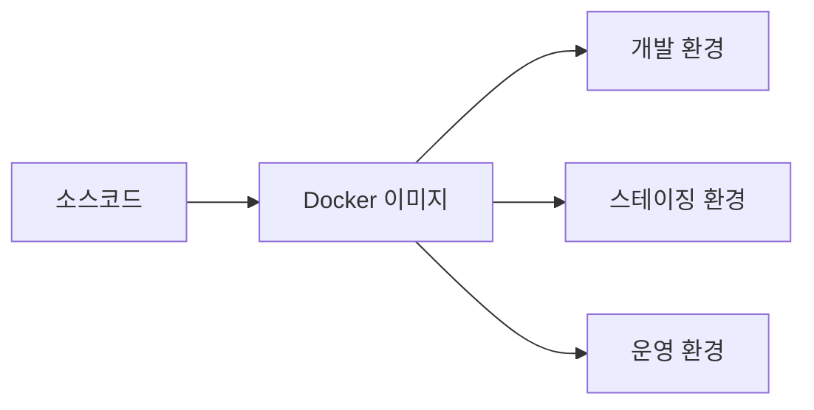
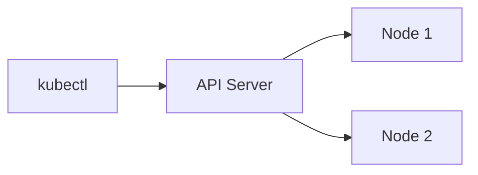
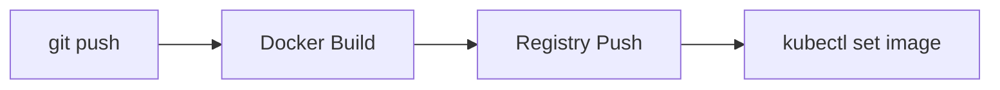
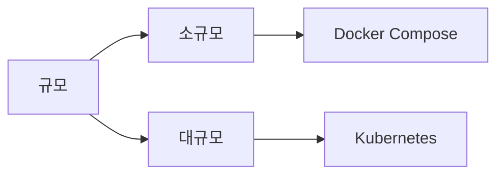

Docker와 Kubernetes는 현대 백엔드 개발자라면 피할 수 없는 기술이다. 처음에는 개념이 낯설고 용어가 많아 진입 장벽이 높게 느껴지지만, 핵심 개념 몇 가지를 이해하면 전체 그림이 보이기 시작한다. 이 글에서는 Docker 기초부터 시작해 Kubernetes 클러스터에 실제 앱을 배포하는 과정까지 비유 중심으로 설명한다.

> **비유:** Docker는 이사 박스, Kubernetes는 이사 업체다. Docker가 앱을 박스에 깔끔하게 포장하면, Kubernetes가 그 박스들을 어디에 놓을지, 몇 개를 쌓을지, 박스가 파손됐을 때 어떻게 처리할지를 관리한다.

---

## 1. 왜 컨테이너가 필요한가

### 전통적인 배포의 문제

"내 PC에서는 되는데 서버에서는 안 된다" — 개발자라면 누구나 들어본 말이다. 이 문제의 근본 원인은 개발 환경과 운영 환경의 차이다. Java 버전, 라이브러리 버전, 환경 변수, OS 설정이 조금만 달라도 앱이 다르게 동작한다.

> **비유:** 전통적인 배포는 레시피만 주고 "알아서 요리해"라고 하는 것과 같다. 같은 레시피라도 도구와 재료가 다르면 결과물이 달라진다.

### 컨테이너가 해결하는 것

컨테이너는 앱 실행에 필요한 코드, 런타임, 라이브러리, 설정을 모두 하나의 패키지로 묶는다. 이 패키지를 어디서 실행해도 동일하게 동작한다.



---

## 2. Docker 핵심 개념

Docker를 이해하려면 세 가지 개념을 먼저 파악해야 한다.

### 이미지 (Image)

이미지는 컨테이너를 만들기 위한 설계도(청사진)다. 읽기 전용이며, 레이어 구조로 이루어져 있다.

> **비유:** 이미지는 붕어빵 틀이다. 틀 하나로 수백 개의 붕어빵(컨테이너)을 만들 수 있고, 틀 자체는 변하지 않는다.

### 컨테이너 (Container)

이미지를 실행한 인스턴스다. 이미지가 같아도 컨테이너는 독립적으로 실행되고 각자의 상태를 가진다.

> **비유:** 컨테이너는 붕어빵 틀로 만든 붕어빵이다. 같은 틀에서 나왔지만 각각 다른 속 재료(환경 변수)를 넣을 수 있다.

### Dockerfile

이미지를 만드는 레시피다. 어떤 베이스 이미지를 쓰고, 어떤 파일을 복사하고, 어떤 명령을 실행할지 단계별로 정의한다.

---

## 3. Docker 설치 및 기본 명령

### 설치

[Docker Desktop](https://www.docker.com/products/docker-desktop/)을 다운로드하면 Mac·Windows에서 GUI와 CLI를 함께 설치할 수 있다. Linux는 다음 명령을 사용한다.

```bash
# Ubuntu
curl -fsSL https://get.docker.com | sh
sudo usermod -aG docker $USER
```

### 기본 명령어

```bash
# 버전 확인
docker --version
docker info

# 이미지 내려받기
docker pull nginx:latest

# 이미지 목록 확인
docker images

# 컨테이너 실행
docker run -d -p 8080:80 --name my-nginx nginx:latest
# -d: 백그라운드 실행
# -p 8080:80: 호스트 8080 → 컨테이너 80 포트 연결
# --name: 컨테이너 이름 지정

# 실행 중인 컨테이너 목록
docker ps

# 모든 컨테이너 목록 (중지된 것 포함)
docker ps -a

# 컨테이너 로그 확인
docker logs my-nginx
docker logs -f my-nginx  # 실시간 스트리밍

# 컨테이너 내부 접속
docker exec -it my-nginx /bin/bash

# 컨테이너 중지 및 삭제
docker stop my-nginx
docker rm my-nginx

# 이미지 삭제
docker rmi nginx:latest
```

---

## 4. Dockerfile 작성

### 기본 Dockerfile 구조

Spring Boot 앱을 컨테이너화하는 Dockerfile을 예로 들어 각 명령어를 설명한다.

```dockerfile
# 1. 베이스 이미지 선택
FROM eclipse-temurin:21-jdk-alpine AS build

# 2. 작업 디렉토리 설정
WORKDIR /app

# 3. 의존성 캐시를 위해 빌드 파일 먼저 복사
COPY build.gradle settings.gradle gradlew ./
COPY gradle ./gradle
RUN ./gradlew dependencies --no-daemon

# 4. 소스코드 복사 및 빌드
COPY src ./src
RUN ./gradlew build -x test --no-daemon

# 5. 실행용 이미지 (가볍게)
FROM eclipse-temurin:21-jre-alpine

WORKDIR /app

# 6. 빌드 결과물만 복사
COPY --from=build /app/build/libs/*.jar app.jar

# 7. 보안: 루트가 아닌 사용자로 실행
RUN addgroup -S appgroup && adduser -S appuser -G appgroup
USER appuser

# 8. 포트 노출 (문서화 목적)
EXPOSE 8080

# 9. 실행 명령
ENTRYPOINT ["java", "-jar", "app.jar"]
```

각 `RUN`, `COPY`, `ADD` 명령은 이미지 레이어를 하나씩 만든다. 레이어는 캐시되므로 변경이 없으면 다시 실행되지 않는다. 그래서 자주 바뀌는 소스코드보다 변경이 드문 의존성을 먼저 복사하면 빌드가 빠르다.

> **비유:** Dockerfile 레이어는 팬케이크 층과 같다. 아랫 층이 변하지 않으면 그 위부터만 다시 굽는다.

### 이미지 빌드 및 실행

```bash
# 이미지 빌드
docker build -t bookapi:1.0.0 .
docker build -t bookapi:latest .

# 태그 추가
docker tag bookapi:latest myusername/bookapi:latest

# Docker Hub에 푸시
docker login
docker push myusername/bookapi:latest

# 컨테이너 실행
docker run -d \
  --name bookapi \
  -p 8080:8080 \
  -e SPRING_PROFILES_ACTIVE=prod \
  -e SPRING_DATASOURCE_URL=jdbc:mysql://host:3306/bookdb \
  bookapi:latest
```

---

## 5. Docker Compose

단일 컨테이너로는 실제 서비스를 구성하기 어렵다. 앱 서버, DB, 캐시를 함께 띄우려면 Docker Compose를 사용한다.

> **비유:** Docker Compose는 교향악단의 지휘자다. 각각의 악기(컨테이너)가 혼자서는 연주할 수 있지만, 지휘자가 있어야 전체가 조화롭게 연주된다.

```yaml
# docker-compose.yml
version: '3.8'

services:
  # 앱 서버
  bookapi:
    build: .
    ports:
      - "8080:8080"
    environment:
      SPRING_PROFILES_ACTIVE: prod
      SPRING_DATASOURCE_URL: jdbc:mysql://db:3306/bookdb?serverTimezone=Asia/Seoul&characterEncoding=UTF-8
      SPRING_DATASOURCE_USERNAME: bookuser
      SPRING_DATASOURCE_PASSWORD: bookpass
      SPRING_DATA_REDIS_HOST: redis
    depends_on:
      db:
        condition: service_healthy
      redis:
        condition: service_started
    restart: unless-stopped

  # MySQL 데이터베이스
  db:
    image: mysql:8.0
    environment:
      MYSQL_ROOT_PASSWORD: rootpassword
      MYSQL_DATABASE: bookdb
      MYSQL_USER: bookuser
      MYSQL_PASSWORD: bookpass
    ports:
      - "3306:3306"
    volumes:
      - mysql_data:/var/lib/mysql
      - ./init.sql:/docker-entrypoint-initdb.d/init.sql
    healthcheck:
      test: ["CMD", "mysqladmin", "ping", "-h", "localhost", "-u", "bookuser", "-pbookpass"]
      interval: 10s
      timeout: 5s
      retries: 5
      start_period: 30s

  # Redis 캐시
  redis:
    image: redis:7-alpine
    ports:
      - "6379:6379"
    volumes:
      - redis_data:/data
    command: redis-server --appendonly yes

volumes:
  mysql_data:
  redis_data:
```

```bash
# 전체 서비스 시작
docker compose up -d

# 특정 서비스만 재시작
docker compose restart bookapi

# 로그 확인
docker compose logs -f

# 서비스 중지 및 컨테이너 삭제 (볼륨은 유지)
docker compose down

# 볼륨까지 삭제 (데이터 초기화)
docker compose down -v
```

---

## 6. Kubernetes 핵심 개념

Docker를 익혔다면 이제 Kubernetes(K8s)로 넘어갈 차례다. Kubernetes는 컨테이너 오케스트레이션 플랫폼이다. 수십~수천 개의 컨테이너를 어떻게 배치하고, 장애가 나면 어떻게 복구하고, 트래픽을 어떻게 분산할지를 자동으로 관리한다.



### Pod

Pod는 Kubernetes에서 배포의 최소 단위다. 하나 이상의 컨테이너를 묶어 같은 네트워크와 스토리지를 공유한다.

> **비유:** Pod는 아파트 한 호다. 보통 한 사람(컨테이너)이 살지만, 사이드카 패턴처럼 두 명이 같이 살기도 한다. 같은 호실이므로 localhost로 서로 통신한다.

### Deployment

Pod를 몇 개 실행할지, 업데이트 전략은 무엇인지를 정의한다. Pod가 죽으면 Deployment가 새 Pod를 자동으로 생성한다.

> **비유:** Deployment는 아파트 관리사무소다. "이 건물에는 항상 3세대가 살아야 한다"는 규칙을 지키고, 한 세대가 이사 나가면 즉시 새 세대를 채운다.

### Service

Pod의 IP는 재시작 시 바뀐다. Service는 Pod 앞에 고정된 엔드포인트를 제공해 클라이언트가 항상 같은 주소로 접근할 수 있게 한다.

> **비유:** Service는 건물 대표 전화번호다. 담당자(Pod)가 바뀌어도 전화번호(Service IP)는 변하지 않는다.

### Ingress

외부 HTTP/HTTPS 트래픽을 클러스터 내부 Service로 라우팅한다. 도메인 기반 라우팅, TLS 종료를 담당한다.

> **비유:** Ingress는 건물 안내 데스크다. `api.example.com`은 API 팀으로, `admin.example.com`은 관리 팀으로 안내한다.

### ConfigMap / Secret

ConfigMap은 설정 값, Secret은 민감한 정보(비밀번호, API 키)를 저장한다. 이미지에 하드코딩하지 않고 런타임에 주입한다.

---

## 7. Kubernetes 설치 — 로컬 환경

### minikube (개발용)

```bash
# minikube 설치 (Mac)
brew install minikube

# 클러스터 시작
minikube start --driver=docker --memory=4g --cpus=2

# kubectl 설치 확인
kubectl version --client

# 클러스터 상태 확인
kubectl cluster-info
kubectl get nodes
```

### kind (Kubernetes in Docker)

```bash
# kind 설치
brew install kind

# 클러스터 생성
kind create cluster --name bookapi-cluster

# 클러스터 삭제
kind delete cluster --name bookapi-cluster
```

---

## 8. 첫 번째 배포 — YAML 작성

Kubernetes 리소스는 YAML 파일로 선언한다. 선언형(declarative) 방식으로, 원하는 상태를 정의하면 Kubernetes가 알아서 그 상태를 유지한다.

### Namespace

리소스를 논리적으로 격리하는 단위다.

```yaml
# namespace.yaml
apiVersion: v1
kind: Namespace
metadata:
  name: bookapi
```

```bash
kubectl apply -f namespace.yaml
kubectl get namespaces
```

### ConfigMap

```yaml
# configmap.yaml
apiVersion: v1
kind: ConfigMap
metadata:
  name: bookapi-config
  namespace: bookapi
data:
  SPRING_PROFILES_ACTIVE: "prod"
  SERVER_PORT: "8080"
  SPRING_JPA_SHOW_SQL: "false"
```

### Secret

```yaml
# secret.yaml
apiVersion: v1
kind: Secret
metadata:
  name: bookapi-secret
  namespace: bookapi
type: Opaque
data:
  # base64 인코딩: echo -n "값" | base64
  DB_PASSWORD: Ym9va3Bhc3M=
  DB_USERNAME: Ym9va3VzZXI=
```

실제 운영에서는 Secret을 파일로 관리하지 않는다. Vault, Sealed Secrets, AWS Secrets Manager를 연동한다.

### Deployment

```yaml
# deployment.yaml
apiVersion: apps/v1
kind: Deployment
metadata:
  name: bookapi
  namespace: bookapi
  labels:
    app: bookapi
spec:
  replicas: 3              # Pod 3개 유지
  selector:
    matchLabels:
      app: bookapi
  strategy:
    type: RollingUpdate    # 무중단 배포
    rollingUpdate:
      maxSurge: 1          # 업데이트 중 최대 1개 추가
      maxUnavailable: 0    # 업데이트 중 0개 미사용 (무중단)
  template:
    metadata:
      labels:
        app: bookapi
    spec:
      containers:
        - name: bookapi
          image: myusername/bookapi:latest
          ports:
            - containerPort: 8080
          envFrom:
            - configMapRef:
                name: bookapi-config
          env:
            - name: DB_USERNAME
              valueFrom:
                secretKeyRef:
                  name: bookapi-secret
                  key: DB_USERNAME
            - name: DB_PASSWORD
              valueFrom:
                secretKeyRef:
                  name: bookapi-secret
                  key: DB_PASSWORD
          resources:
            requests:
              memory: "512Mi"
              cpu: "250m"
            limits:
              memory: "1Gi"
              cpu: "500m"
          readinessProbe:
            httpGet:
              path: /actuator/health/readiness
              port: 8080
            initialDelaySeconds: 30
            periodSeconds: 10
            failureThreshold: 3
          livenessProbe:
            httpGet:
              path: /actuator/health/liveness
              port: 8080
            initialDelaySeconds: 60
            periodSeconds: 30
            failureThreshold: 3
```

**readinessProbe**: 트래픽을 받을 준비가 됐는지 확인한다. 실패하면 Service가 해당 Pod로 트래픽을 보내지 않는다.

**livenessProbe**: Pod가 정상 동작 중인지 확인한다. 실패하면 Pod를 재시작한다.

**resources.requests/limits**: 자원 요청량과 최대 사용량을 지정한다. 이것 없이는 한 Pod가 노드 자원을 독점할 수 있다.

### Service

```yaml
# service.yaml
apiVersion: v1
kind: Service
metadata:
  name: bookapi-service
  namespace: bookapi
spec:
  selector:
    app: bookapi       # 이 라벨을 가진 Pod로 트래픽 전달
  ports:
    - protocol: TCP
      port: 80         # Service 포트
      targetPort: 8080 # Pod 포트
  type: ClusterIP      # 클러스터 내부에서만 접근 가능
```

Service 타입 종류:
- **ClusterIP**: 클러스터 내부 통신용 (기본값)
- **NodePort**: 노드 IP + 포트로 외부 접근 가능 (개발용)
- **LoadBalancer**: 클라우드 로드밸런서 생성 (운영용)

### Ingress

```yaml
# ingress.yaml
apiVersion: networking.k8s.io/v1
kind: Ingress
metadata:
  name: bookapi-ingress
  namespace: bookapi
  annotations:
    nginx.ingress.kubernetes.io/rewrite-target: /
spec:
  ingressClassName: nginx
  rules:
    - host: api.example.com
      http:
        paths:
          - path: /api
            pathType: Prefix
            backend:
              service:
                name: bookapi-service
                port:
                  number: 80
  tls:
    - hosts:
        - api.example.com
      secretName: bookapi-tls
```

---

## 9. 배포 실행

```bash
# 리소스 생성
kubectl apply -f namespace.yaml
kubectl apply -f configmap.yaml
kubectl apply -f secret.yaml
kubectl apply -f deployment.yaml
kubectl apply -f service.yaml
kubectl apply -f ingress.yaml

# 또는 디렉토리 단위로 한번에
kubectl apply -f k8s/

# 배포 상태 확인
kubectl get all -n bookapi

# Pod 상태 확인
kubectl get pods -n bookapi
kubectl describe pod <pod-name> -n bookapi

# 로그 확인
kubectl logs <pod-name> -n bookapi
kubectl logs -f <pod-name> -n bookapi  # 실시간

# 롤링 업데이트 (새 이미지 배포)
kubectl set image deployment/bookapi bookapi=myusername/bookapi:1.1.0 -n bookapi

# 롤아웃 상태 확인
kubectl rollout status deployment/bookapi -n bookapi

# 롤백
kubectl rollout undo deployment/bookapi -n bookapi
```

---

## 10. HPA — 오토스케일링

트래픽에 따라 Pod 수를 자동으로 조절하는 HorizontalPodAutoscaler다.

```yaml
# hpa.yaml
apiVersion: autoscaling/v2
kind: HorizontalPodAutoscaler
metadata:
  name: bookapi-hpa
  namespace: bookapi
spec:
  scaleTargetRef:
    apiVersion: apps/v1
    kind: Deployment
    name: bookapi
  minReplicas: 2
  maxReplicas: 10
  metrics:
    - type: Resource
      resource:
        name: cpu
        target:
          type: Utilization
          averageUtilization: 70    # CPU 70% 초과 시 스케일 아웃
    - type: Resource
      resource:
        name: memory
        target:
          type: Utilization
          averageUtilization: 80
```

> **비유:** HPA는 편의점 알바 스케줄러와 같다. 손님이 많으면(CPU 높음) 알바를 더 부르고, 한산하면(CPU 낮음) 알바를 줄인다.

```bash
kubectl apply -f hpa.yaml
kubectl get hpa -n bookapi
```

---

## 11. MySQL Deployment

```yaml
# mysql-deployment.yaml
apiVersion: apps/v1
kind: Deployment
metadata:
  name: mysql
  namespace: bookapi
spec:
  replicas: 1
  selector:
    matchLabels:
      app: mysql
  template:
    metadata:
      labels:
        app: mysql
    spec:
      containers:
        - name: mysql
          image: mysql:8.0
          env:
            - name: MYSQL_ROOT_PASSWORD
              valueFrom:
                secretKeyRef:
                  name: bookapi-secret
                  key: MYSQL_ROOT_PASSWORD
            - name: MYSQL_DATABASE
              value: bookdb
          ports:
            - containerPort: 3306
          volumeMounts:
            - name: mysql-storage
              mountPath: /var/lib/mysql
      volumes:
        - name: mysql-storage
          persistentVolumeClaim:
            claimName: mysql-pvc
---
apiVersion: v1
kind: PersistentVolumeClaim
metadata:
  name: mysql-pvc
  namespace: bookapi
spec:
  accessModes:
    - ReadWriteOnce
  resources:
    requests:
      storage: 10Gi
---
apiVersion: v1
kind: Service
metadata:
  name: mysql-service
  namespace: bookapi
spec:
  selector:
    app: mysql
  ports:
    - port: 3306
      targetPort: 3306
  type: ClusterIP
```

PersistentVolumeClaim(PVC)은 데이터를 Pod 외부에 영구 저장하기 위한 스토리지 요청이다. Pod가 재시작되어도 데이터가 유지된다.

---

## 12. 유용한 kubectl 명령 모음

```bash
# 리소스 전체 조회
kubectl get all -n bookapi

# YAML 형태로 리소스 확인
kubectl get deployment bookapi -n bookapi -o yaml

# 리소스 상세 정보 (이벤트, 상태)
kubectl describe deployment bookapi -n bookapi

# Pod 내부 접속
kubectl exec -it <pod-name> -n bookapi -- /bin/sh

# 포트 포워딩 (로컬에서 클러스터 서비스 접근)
kubectl port-forward svc/bookapi-service 8080:80 -n bookapi

# 네임스페이스 전체 삭제
kubectl delete namespace bookapi

# 이벤트 확인 (문제 진단 시 유용)
kubectl get events -n bookapi --sort-by='.lastTimestamp'

# 리소스 사용량 확인 (metrics-server 필요)
kubectl top pods -n bookapi
kubectl top nodes
```

---

## 13. 실전 배포 파이프라인

GitHub Actions와 Kubernetes를 연동한 CI/CD 파이프라인이다.

```yaml
# .github/workflows/k8s-deploy.yml
name: K8s Deploy

on:
  push:
    branches: [main]

jobs:
  deploy:
    runs-on: ubuntu-latest
    steps:
      - uses: actions/checkout@v4

      - name: Build and push Docker image
        run: |
          docker build -t myusername/bookapi:${{ github.sha }} .
          echo "${{ secrets.DOCKER_PASSWORD }}" | docker login -u myusername --password-stdin
          docker push myusername/bookapi:${{ github.sha }}

      - name: Set up kubectl
        uses: azure/setup-kubectl@v3
        with:
          version: 'latest'

      - name: Configure kubeconfig
        run: |
          mkdir -p ~/.kube
          echo "${{ secrets.KUBECONFIG }}" | base64 -d > ~/.kube/config

      - name: Deploy to Kubernetes
        run: |
          kubectl set image deployment/bookapi \
            bookapi=myusername/bookapi:${{ github.sha }} \
            -n bookapi
          kubectl rollout status deployment/bookapi -n bookapi --timeout=300s
```



---

## 14. Docker vs Kubernetes 선택 기준



| 기준 | Docker Compose | Kubernetes |
|---|---|---|
| 학습 난이도 | 낮음 | 높음 |
| 운영 복잡도 | 낮음 | 높음 |
| 오토스케일링 | 없음 | 내장 |
| 자가 복구 | 제한적 | 강력 |
| 멀티 서버 | 어려움 | 기본 지원 |
| 추천 규모 | 1~2대 서버 | 3대+ 서버 |

소규모 서비스는 Docker Compose로 시작하고, 서버가 3대 이상이거나 오토스케일링이 필요해지는 시점에 Kubernetes로 전환하는 것이 현실적이다.

---

## 15. 트러블슈팅 — 자주 만나는 문제

### Pod가 CrashLoopBackOff 상태일 때

```bash
# 로그 확인
kubectl logs <pod-name> -n bookapi --previous

# 이벤트 확인
kubectl describe pod <pod-name> -n bookapi
```

원인: 앱 시작 실패, 환경 변수 누락, 메모리 부족이 대부분이다.

### ImagePullBackOff

```bash
kubectl describe pod <pod-name> -n bookapi | grep -A5 Events
```

원인: 이미지 이름·태그 오류, 레지스트리 인증 실패.

```bash
# 프라이빗 레지스트리 인증 Secret 생성
kubectl create secret docker-registry regcred \
  --docker-server=registry.example.com \
  --docker-username=myuser \
  --docker-password=mypass \
  -n bookapi
```

### Pending 상태 지속

```bash
kubectl describe pod <pod-name> -n bookapi | grep -A10 Events
```

원인: 노드 리소스 부족 (CPU/메모리 요청량이 가용 자원 초과).

---

## 마무리

Docker와 Kubernetes는 배우는 데 시간이 걸리지만, 한 번 익히면 배포 방식이 완전히 달라진다. 핵심을 정리하면 다음과 같다.

1. **Docker**: 앱을 이미지로 패키징해 어디서나 동일하게 실행
2. **Docker Compose**: 여러 컨테이너를 로컬에서 함께 실행
3. **Kubernetes**: 수많은 컨테이너를 클러스터에서 자동으로 관리

처음에는 `docker run` 한 줄부터 시작해서 Dockerfile → Compose → Kubernetes 순서로 차근차근 익히길 권한다. 개념 하나하나가 이전 단계의 문제를 해결하기 위해 등장한 것이므로, 순서대로 배우면 왜 이것이 필요한지 자연스럽게 이해된다.

> **비유:** Docker를 배우는 과정은 자전거 → 오토바이 → 자동차 순서와 같다. 각 단계마다 더 강력하고 복잡해지지만, 이전 단계를 잘 익혀야 다음 단계가 빠르게 이해된다.
