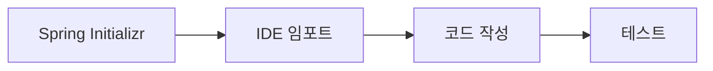
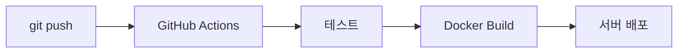

Spring Boot로 REST API를 만드는 과정을 처음부터 끝까지 따라할 수 있도록 정리했다. 프로젝트 생성 → 엔티티·리포지토리 → 서비스·컨트롤러 → 예외 처리 → 테스트 → Docker → 배포까지, 각 단계를 코드와 함께 설명한다. 예제 프로젝트는 간단한 **도서 관리 API**다.

> **비유:** Spring Boot API를 만드는 과정은 집을 짓는 것과 같다. 설계도(엔티티)를 먼저 그리고, 토대(리포지토리)를 놓고, 벽(서비스)을 세우고, 문(컨트롤러)을 달아야 사람(클라이언트)이 드나들 수 있다.

---

## 1. 개발 환경 준비

시작 전에 다음 도구가 설치되어 있어야 한다.

| 도구 | 버전 | 확인 명령 |
|---|---|---|
| JDK | 21 이상 | `java -version` |
| Maven 또는 Gradle | 최신 | `mvn -version` |
| Docker | 최신 | `docker --version` |
| IDE | IntelliJ IDEA 또는 VS Code | — |



---

## 2. 프로젝트 생성

### Spring Initializr 사용

[start.spring.io](https://start.spring.io)에 접속해 다음 설정을 선택한다.

- **Project**: Gradle - Groovy
- **Language**: Java
- **Spring Boot**: 3.3.x
- **Group**: `com.example`
- **Artifact**: `bookapi`
- **Java**: 21

**의존성 추가:**
- Spring Web
- Spring Data JPA
- H2 Database (개발용)
- Validation
- Lombok

GENERATE 버튼을 클릭해 ZIP을 내려받고 IDE에서 연다.

### 프로젝트 구조

```
bookapi/
├── src/
│   ├── main/
│   │   ├── java/com/example/bookapi/
│   │   │   ├── BookapiApplication.java
│   │   │   ├── domain/
│   │   │   │   └── Book.java
│   │   │   ├── repository/
│   │   │   │   └── BookRepository.java
│   │   │   ├── service/
│   │   │   │   └── BookService.java
│   │   │   ├── controller/
│   │   │   │   └── BookController.java
│   │   │   ├── dto/
│   │   │   │   ├── BookRequest.java
│   │   │   │   └── BookResponse.java
│   │   │   └── exception/
│   │   │       ├── BookNotFoundException.java
│   │   │       └── GlobalExceptionHandler.java
│   │   └── resources/
│   │       └── application.yml
│   └── test/
└── build.gradle
```

이 구조는 **계층형 아키텍처**를 따른다. 각 계층은 한 가지 책임만 가진다.

---

## 3. 의존성 설정

`build.gradle`을 열고 의존성을 확인한다.

```groovy
plugins {
    id 'java'
    id 'org.springframework.boot' version '3.3.0'
    id 'io.spring.dependency-management' version '1.1.4'
}

group = 'com.example'
version = '0.0.1-SNAPSHOT'
sourceCompatibility = '21'

configurations {
    compileOnly {
        extendsFrom annotationProcessor
    }
}

repositories {
    mavenCentral()
}

dependencies {
    implementation 'org.springframework.boot:spring-boot-starter-web'
    implementation 'org.springframework.boot:spring-boot-starter-data-jpa'
    implementation 'org.springframework.boot:spring-boot-starter-validation'
    compileOnly 'org.projectlombok:lombok'
    runtimeOnly 'com.h2database:h2'
    annotationProcessor 'org.projectlombok:lombok'
    testImplementation 'org.springframework.boot:spring-boot-starter-test'
}
```

---

## 4. 애플리케이션 설정

`src/main/resources/application.yml`을 작성한다.

```yaml
spring:
  datasource:
    url: jdbc:h2:mem:bookdb
    driver-class-name: org.h2.Driver
    username: sa
    password:
  h2:
    console:
      enabled: true
      path: /h2-console
  jpa:
    hibernate:
      ddl-auto: create-drop
    show-sql: true
    properties:
      hibernate:
        format_sql: true

server:
  port: 8080

logging:
  level:
    com.example: DEBUG
    org.hibernate.SQL: DEBUG
```

개발 중에는 H2 인메모리 DB를 사용한다. `ddl-auto: create-drop`으로 앱 시작 시 테이블을 자동 생성하고 종료 시 삭제한다.

---

## 5. 엔티티 설계

도메인 객체인 `Book` 엔티티를 만든다.

```java
// src/main/java/com/example/bookapi/domain/Book.java
package com.example.bookapi.domain;

import jakarta.persistence.*;
import lombok.*;
import java.time.LocalDate;
import java.time.LocalDateTime;

@Entity
@Table(name = "books")
@Getter
@NoArgsConstructor(access = AccessLevel.PROTECTED)
@ToString
public class Book {

    @Id
    @GeneratedValue(strategy = GenerationType.IDENTITY)
    private Long id;

    @Column(nullable = false, length = 200)
    private String title;

    @Column(nullable = false, length = 100)
    private String author;

    @Column(unique = true, length = 20)
    private String isbn;

    @Column(name = "published_date")
    private LocalDate publishedDate;

    @Column(columnDefinition = "TEXT")
    private String description;

    @Column(nullable = false)
    private Integer price;

    @Column(name = "created_at", updatable = false)
    private LocalDateTime createdAt;

    @Column(name = "updated_at")
    private LocalDateTime updatedAt;

    @PrePersist
    protected void onCreate() {
        createdAt = LocalDateTime.now();
        updatedAt = LocalDateTime.now();
    }

    @PreUpdate
    protected void onUpdate() {
        updatedAt = LocalDateTime.now();
    }

    // 정적 팩토리 메서드 — 생성자 직접 노출 대신 사용
    public static Book create(String title, String author, String isbn,
                               LocalDate publishedDate, String description, Integer price) {
        Book book = new Book();
        book.title = title;
        book.author = author;
        book.isbn = isbn;
        book.publishedDate = publishedDate;
        book.description = description;
        book.price = price;
        return book;
    }

    // 업데이트 메서드 — setter 대신 비즈니스 메서드로 변경
    public void update(String title, String author, String description, Integer price) {
        this.title = title;
        this.author = author;
        this.description = description;
        this.price = price;
    }
}
```

여기서 중요한 설계 원칙이 있다.

- `@NoArgsConstructor(access = AccessLevel.PROTECTED)`: JPA는 기본 생성자가 필요하지만 외부에서 직접 호출은 막는다.
- `setter` 미사용: 엔티티의 상태 변경은 의미 있는 메서드(`update()`)로만 한다.
- `@PrePersist`, `@PreUpdate`: 생성/수정 시각을 자동으로 기록한다.

> **비유:** 엔티티는 부동산 등기부와 같다. 마음대로 값을 바꿀 수 없고, 공식 절차(메서드)를 통해서만 변경이 가능하다.

---

## 6. DTO 설계

엔티티를 직접 API 응답으로 반환하지 않는다. DTO(Data Transfer Object)를 별도로 만든다.

```java
// src/main/java/com/example/bookapi/dto/BookRequest.java
package com.example.bookapi.dto;

import jakarta.validation.constraints.*;
import lombok.Getter;
import java.time.LocalDate;

@Getter
public class BookRequest {

    @NotBlank(message = "제목은 필수입니다")
    @Size(max = 200, message = "제목은 200자 이내여야 합니다")
    private String title;

    @NotBlank(message = "저자는 필수입니다")
    @Size(max = 100, message = "저자는 100자 이내여야 합니다")
    private String author;

    @Pattern(regexp = "^\\d{13}$", message = "ISBN은 13자리 숫자여야 합니다")
    private String isbn;

    private LocalDate publishedDate;

    private String description;

    @NotNull(message = "가격은 필수입니다")
    @Min(value = 0, message = "가격은 0 이상이어야 합니다")
    private Integer price;
}
```

```java
// src/main/java/com/example/bookapi/dto/BookResponse.java
package com.example.bookapi.dto;

import com.example.bookapi.domain.Book;
import lombok.Builder;
import lombok.Getter;
import java.time.LocalDate;
import java.time.LocalDateTime;

@Getter
@Builder
public class BookResponse {

    private Long id;
    private String title;
    private String author;
    private String isbn;
    private LocalDate publishedDate;
    private String description;
    private Integer price;
    private LocalDateTime createdAt;

    // 엔티티를 DTO로 변환하는 정적 팩토리 메서드
    public static BookResponse from(Book book) {
        return BookResponse.builder()
                .id(book.getId())
                .title(book.getTitle())
                .author(book.getAuthor())
                .isbn(book.getIsbn())
                .publishedDate(book.getPublishedDate())
                .description(book.getDescription())
                .price(book.getPrice())
                .createdAt(book.getCreatedAt())
                .build();
    }
}
```

DTO를 분리하는 이유는 세 가지다. 첫째, 엔티티의 민감한 필드(비밀번호 등)가 노출되지 않는다. 둘째, API 응답 형태를 DB 구조와 독립적으로 변경할 수 있다. 셋째, `@Valid` 유효성 검사를 요청 DTO에만 적용할 수 있다.

---

## 7. 리포지토리 작성

```java
// src/main/java/com/example/bookapi/repository/BookRepository.java
package com.example.bookapi.repository;

import com.example.bookapi.domain.Book;
import org.springframework.data.domain.Page;
import org.springframework.data.domain.Pageable;
import org.springframework.data.jpa.repository.JpaRepository;
import org.springframework.data.jpa.repository.Query;
import org.springframework.data.repository.query.Param;
import java.util.Optional;

public interface BookRepository extends JpaRepository<Book, Long> {

    // 제목 또는 저자로 검색 (페이징)
    @Query("SELECT b FROM Book b WHERE " +
           "(:keyword IS NULL OR b.title LIKE %:keyword% OR b.author LIKE %:keyword%)")
    Page<Book> findByKeyword(@Param("keyword") String keyword, Pageable pageable);

    // ISBN으로 조회
    Optional<Book> findByIsbn(String isbn);

    // ISBN 중복 확인
    boolean existsByIsbn(String isbn);
}
```

Spring Data JPA는 인터페이스를 선언만 하면 구현체를 자동으로 만들어준다. `JpaRepository`를 상속하는 것만으로 기본 CRUD(save, findById, findAll, delete)가 모두 준비된다.

> **비유:** JpaRepository는 이미 완성된 창고 관리 시스템이다. 물건 넣기, 꺼내기, 목록 보기가 이미 구현되어 있고, 우리는 특별한 검색 방법만 추가하면 된다.

---

## 8. 예외 처리

서비스를 작성하기 전에 예외 클래스를 먼저 만든다.

```java
// src/main/java/com/example/bookapi/exception/BookNotFoundException.java
package com.example.bookapi.exception;

public class BookNotFoundException extends RuntimeException {
    public BookNotFoundException(Long id) {
        super("ID " + id + "에 해당하는 도서를 찾을 수 없습니다.");
    }
}
```

```java
// src/main/java/com/example/bookapi/exception/DuplicateIsbnException.java
package com.example.bookapi.exception;

public class DuplicateIsbnException extends RuntimeException {
    public DuplicateIsbnException(String isbn) {
        super("ISBN " + isbn + "은(는) 이미 등록되어 있습니다.");
    }
}
```

전역 예외 처리기를 만든다.

```java
// src/main/java/com/example/bookapi/exception/GlobalExceptionHandler.java
package com.example.bookapi.exception;

import lombok.extern.slf4j.Slf4j;
import org.springframework.http.HttpStatus;
import org.springframework.http.ResponseEntity;
import org.springframework.web.bind.MethodArgumentNotValidException;
import org.springframework.web.bind.annotation.ExceptionHandler;
import org.springframework.web.bind.annotation.RestControllerAdvice;
import java.time.LocalDateTime;
import java.util.List;
import java.util.stream.Collectors;

@Slf4j
@RestControllerAdvice
public class GlobalExceptionHandler {

    @ExceptionHandler(BookNotFoundException.class)
    public ResponseEntity<ErrorResponse> handleBookNotFound(BookNotFoundException e) {
        log.warn("Book not found: {}", e.getMessage());
        return ResponseEntity.status(HttpStatus.NOT_FOUND)
                .body(ErrorResponse.of(HttpStatus.NOT_FOUND, e.getMessage()));
    }

    @ExceptionHandler(DuplicateIsbnException.class)
    public ResponseEntity<ErrorResponse> handleDuplicateIsbn(DuplicateIsbnException e) {
        return ResponseEntity.status(HttpStatus.CONFLICT)
                .body(ErrorResponse.of(HttpStatus.CONFLICT, e.getMessage()));
    }

    @ExceptionHandler(MethodArgumentNotValidException.class)
    public ResponseEntity<ErrorResponse> handleValidation(MethodArgumentNotValidException e) {
        List<String> errors = e.getBindingResult()
                .getFieldErrors()
                .stream()
                .map(fe -> fe.getField() + ": " + fe.getDefaultMessage())
                .collect(Collectors.toList());

        return ResponseEntity.status(HttpStatus.BAD_REQUEST)
                .body(ErrorResponse.of(HttpStatus.BAD_REQUEST, "유효성 검사 실패", errors));
    }

    @ExceptionHandler(Exception.class)
    public ResponseEntity<ErrorResponse> handleGeneral(Exception e) {
        log.error("Unhandled exception", e);
        return ResponseEntity.status(HttpStatus.INTERNAL_SERVER_ERROR)
                .body(ErrorResponse.of(HttpStatus.INTERNAL_SERVER_ERROR, "서버 내부 오류가 발생했습니다."));
    }

    // 내부 클래스로 에러 응답 형식 정의
    public record ErrorResponse(
            int status,
            String message,
            List<String> errors,
            LocalDateTime timestamp
    ) {
        public static ErrorResponse of(HttpStatus status, String message) {
            return new ErrorResponse(status.value(), message, List.of(), LocalDateTime.now());
        }

        public static ErrorResponse of(HttpStatus status, String message, List<String> errors) {
            return new ErrorResponse(status.value(), message, errors, LocalDateTime.now());
        }
    }
}
```

---

## 9. 서비스 레이어

```java
// src/main/java/com/example/bookapi/service/BookService.java
package com.example.bookapi.service;

import com.example.bookapi.domain.Book;
import com.example.bookapi.dto.BookRequest;
import com.example.bookapi.dto.BookResponse;
import com.example.bookapi.exception.BookNotFoundException;
import com.example.bookapi.exception.DuplicateIsbnException;
import com.example.bookapi.repository.BookRepository;
import lombok.RequiredArgsConstructor;
import lombok.extern.slf4j.Slf4j;
import org.springframework.data.domain.Page;
import org.springframework.data.domain.Pageable;
import org.springframework.stereotype.Service;
import org.springframework.transaction.annotation.Transactional;

@Slf4j
@Service
@RequiredArgsConstructor
@Transactional(readOnly = true)
public class BookService {

    private final BookRepository bookRepository;

    // 도서 목록 조회 (페이징, 검색)
    public Page<BookResponse> getBooks(String keyword, Pageable pageable) {
        return bookRepository.findByKeyword(keyword, pageable)
                .map(BookResponse::from);
    }

    // 도서 단건 조회
    public BookResponse getBook(Long id) {
        Book book = findBookById(id);
        return BookResponse.from(book);
    }

    // 도서 등록
    @Transactional
    public BookResponse createBook(BookRequest request) {
        // ISBN 중복 확인
        if (request.getIsbn() != null && bookRepository.existsByIsbn(request.getIsbn())) {
            throw new DuplicateIsbnException(request.getIsbn());
        }

        Book book = Book.create(
                request.getTitle(),
                request.getAuthor(),
                request.getIsbn(),
                request.getPublishedDate(),
                request.getDescription(),
                request.getPrice()
        );

        Book savedBook = bookRepository.save(book);
        log.info("Book created: id={}, title={}", savedBook.getId(), savedBook.getTitle());
        return BookResponse.from(savedBook);
    }

    // 도서 수정
    @Transactional
    public BookResponse updateBook(Long id, BookRequest request) {
        Book book = findBookById(id);
        book.update(request.getTitle(), request.getAuthor(),
                    request.getDescription(), request.getPrice());
        return BookResponse.from(book);
        // @Transactional이 있으므로 save() 없이도 변경 감지로 자동 업데이트
    }

    // 도서 삭제
    @Transactional
    public void deleteBook(Long id) {
        Book book = findBookById(id);
        bookRepository.delete(book);
        log.info("Book deleted: id={}", id);
    }

    // 공통 조회 로직 — private 헬퍼 메서드
    private Book findBookById(Long id) {
        return bookRepository.findById(id)
                .orElseThrow(() -> new BookNotFoundException(id));
    }
}
```

서비스 클래스에서 주목할 점이 있다.

- 클래스 레벨에 `@Transactional(readOnly = true)`: 조회 메서드가 대부분이므로 기본을 읽기 전용으로 설정한다.
- 변경 메서드에만 `@Transactional`: 메서드 레벨 어노테이션이 클래스 레벨을 오버라이드한다.
- 더티 체킹(Dirty Checking): `update()` 메서드 후 `save()` 없이도 트랜잭션 종료 시 자동으로 UPDATE SQL이 실행된다.

---

## 10. 컨트롤러 작성

```java
// src/main/java/com/example/bookapi/controller/BookController.java
package com.example.bookapi.controller;

import com.example.bookapi.dto.BookRequest;
import com.example.bookapi.dto.BookResponse;
import com.example.bookapi.service.BookService;
import jakarta.validation.Valid;
import lombok.RequiredArgsConstructor;
import org.springframework.data.domain.Page;
import org.springframework.data.domain.Pageable;
import org.springframework.data.domain.Sort;
import org.springframework.data.web.PageableDefault;
import org.springframework.http.HttpStatus;
import org.springframework.http.ResponseEntity;
import org.springframework.web.bind.annotation.*;

@RestController
@RequestMapping("/api/v1/books")
@RequiredArgsConstructor
public class BookController {

    private final BookService bookService;

    // GET /api/v1/books?keyword=spring&page=0&size=10&sort=createdAt,desc
    @GetMapping
    public ResponseEntity<Page<BookResponse>> getBooks(
            @RequestParam(required = false) String keyword,
            @PageableDefault(size = 10, sort = "createdAt",
                             direction = Sort.Direction.DESC) Pageable pageable) {
        return ResponseEntity.ok(bookService.getBooks(keyword, pageable));
    }

    // GET /api/v1/books/{id}
    @GetMapping("/{id}")
    public ResponseEntity<BookResponse> getBook(@PathVariable Long id) {
        return ResponseEntity.ok(bookService.getBook(id));
    }

    // POST /api/v1/books
    @PostMapping
    public ResponseEntity<BookResponse> createBook(@Valid @RequestBody BookRequest request) {
        BookResponse response = bookService.createBook(request);
        return ResponseEntity.status(HttpStatus.CREATED).body(response);
    }

    // PUT /api/v1/books/{id}
    @PutMapping("/{id}")
    public ResponseEntity<BookResponse> updateBook(
            @PathVariable Long id,
            @Valid @RequestBody BookRequest request) {
        return ResponseEntity.ok(bookService.updateBook(id, request));
    }

    // DELETE /api/v1/books/{id}
    @DeleteMapping("/{id}")
    public ResponseEntity<Void> deleteBook(@PathVariable Long id) {
        bookService.deleteBook(id);
        return ResponseEntity.noContent().build();
    }
}
```

컨트롤러는 얇게 유지한다. 비즈니스 로직은 서비스에, 데이터 접근은 리포지토리에 있어야 한다. 컨트롤러의 역할은 HTTP 요청을 받아 서비스를 호출하고 응답을 반환하는 것뿐이다.

---

## 11. 애플리케이션 실행 및 테스트

```bash
# 빌드 및 실행
./gradlew bootRun

# 또는
./gradlew build
java -jar build/libs/bookapi-0.0.1-SNAPSHOT.jar
```

### API 동작 확인

```bash
# 도서 등록
curl -X POST http://localhost:8080/api/v1/books \
  -H "Content-Type: application/json" \
  -d '{
    "title": "Effective Java",
    "author": "Joshua Bloch",
    "isbn": "9780134685991",
    "price": 45000,
    "publishedDate": "2018-01-06",
    "description": "자바 프로그래밍 바이블"
  }'

# 도서 목록 조회
curl http://localhost:8080/api/v1/books

# 키워드 검색
curl "http://localhost:8080/api/v1/books?keyword=Java&size=5"

# 단건 조회
curl http://localhost:8080/api/v1/books/1

# 수정
curl -X PUT http://localhost:8080/api/v1/books/1 \
  -H "Content-Type: application/json" \
  -d '{"title": "Effective Java 3rd", "author": "Joshua Bloch", "price": 50000}'

# 삭제
curl -X DELETE http://localhost:8080/api/v1/books/1
```

---

## 12. 테스트 작성

### 서비스 단위 테스트

```java
// src/test/java/com/example/bookapi/service/BookServiceTest.java
package com.example.bookapi.service;

import com.example.bookapi.domain.Book;
import com.example.bookapi.dto.BookRequest;
import com.example.bookapi.dto.BookResponse;
import com.example.bookapi.exception.BookNotFoundException;
import com.example.bookapi.exception.DuplicateIsbnException;
import com.example.bookapi.repository.BookRepository;
import org.junit.jupiter.api.DisplayName;
import org.junit.jupiter.api.Test;
import org.junit.jupiter.api.extension.ExtendWith;
import org.mockito.InjectMocks;
import org.mockito.Mock;
import org.mockito.junit.jupiter.MockitoExtension;
import java.util.Optional;
import static org.assertj.core.api.Assertions.*;
import static org.mockito.ArgumentMatchers.any;
import static org.mockito.BDDMockito.*;

@ExtendWith(MockitoExtension.class)
class BookServiceTest {

    @Mock
    private BookRepository bookRepository;

    @InjectMocks
    private BookService bookService;

    @Test
    @DisplayName("존재하지 않는 도서 조회 시 BookNotFoundException 발생")
    void getBook_NotFound() {
        // given
        given(bookRepository.findById(999L)).willReturn(Optional.empty());

        // when & then
        assertThatThrownBy(() -> bookService.getBook(999L))
                .isInstanceOf(BookNotFoundException.class)
                .hasMessageContaining("999");
    }

    @Test
    @DisplayName("중복 ISBN으로 도서 등록 시 DuplicateIsbnException 발생")
    void createBook_DuplicateIsbn() {
        // given
        BookRequest request = createBookRequest("9780134685991");
        given(bookRepository.existsByIsbn("9780134685991")).willReturn(true);

        // when & then
        assertThatThrownBy(() -> bookService.createBook(request))
                .isInstanceOf(DuplicateIsbnException.class);
    }

    @Test
    @DisplayName("정상 도서 등록")
    void createBook_Success() {
        // given
        BookRequest request = createBookRequest("9780134685991");
        given(bookRepository.existsByIsbn(any())).willReturn(false);
        given(bookRepository.save(any(Book.class))).willAnswer(invocation -> {
            Book b = invocation.getArgument(0);
            return b;
        });

        // when
        BookResponse response = bookService.createBook(request);

        // then
        assertThat(response.getTitle()).isEqualTo("Effective Java");
        then(bookRepository).should().save(any(Book.class));
    }

    private BookRequest createBookRequest(String isbn) {
        BookRequest req = new BookRequest();
        // 리플렉션으로 필드 설정 (실무에서는 @Builder나 setter 테스트용 생성자 활용)
        try {
            var titleField = BookRequest.class.getDeclaredField("title");
            titleField.setAccessible(true);
            titleField.set(req, "Effective Java");
            var authorField = BookRequest.class.getDeclaredField("author");
            authorField.setAccessible(true);
            authorField.set(req, "Joshua Bloch");
            var isbnField = BookRequest.class.getDeclaredField("isbn");
            isbnField.setAccessible(true);
            isbnField.set(req, isbn);
            var priceField = BookRequest.class.getDeclaredField("price");
            priceField.setAccessible(true);
            priceField.set(req, 45000);
        } catch (Exception e) {
            throw new RuntimeException(e);
        }
        return req;
    }
}
```

### 컨트롤러 통합 테스트

```java
// src/test/java/com/example/bookapi/controller/BookControllerTest.java
package com.example.bookapi.controller;

import com.example.bookapi.dto.BookResponse;
import com.example.bookapi.exception.BookNotFoundException;
import com.example.bookapi.service.BookService;
import com.fasterxml.jackson.databind.ObjectMapper;
import org.junit.jupiter.api.DisplayName;
import org.junit.jupiter.api.Test;
import org.springframework.beans.factory.annotation.Autowired;
import org.springframework.boot.test.autoconfigure.web.servlet.WebMvcTest;
import org.springframework.boot.test.mock.mockito.MockBean;
import org.springframework.http.MediaType;
import org.springframework.test.web.servlet.MockMvc;
import java.time.LocalDateTime;
import static org.mockito.BDDMockito.*;
import static org.springframework.test.web.servlet.request.MockMvcRequestBuilders.*;
import static org.springframework.test.web.servlet.result.MockMvcResultMatchers.*;

@WebMvcTest(BookController.class)
class BookControllerTest {

    @Autowired
    private MockMvc mockMvc;

    @Autowired
    private ObjectMapper objectMapper;

    @MockBean
    private BookService bookService;

    @Test
    @DisplayName("도서 단건 조회 성공")
    void getBook_Success() throws Exception {
        // given
        BookResponse response = BookResponse.builder()
                .id(1L)
                .title("Effective Java")
                .author("Joshua Bloch")
                .price(45000)
                .createdAt(LocalDateTime.now())
                .build();
        given(bookService.getBook(1L)).willReturn(response);

        // when & then
        mockMvc.perform(get("/api/v1/books/1"))
                .andExpect(status().isOk())
                .andExpect(jsonPath("$.title").value("Effective Java"))
                .andExpect(jsonPath("$.author").value("Joshua Bloch"));
    }

    @Test
    @DisplayName("존재하지 않는 도서 조회 시 404 반환")
    void getBook_NotFound() throws Exception {
        // given
        given(bookService.getBook(999L)).willThrow(new BookNotFoundException(999L));

        // when & then
        mockMvc.perform(get("/api/v1/books/999"))
                .andExpect(status().isNotFound())
                .andExpect(jsonPath("$.status").value(404));
    }

    @Test
    @DisplayName("유효성 검사 실패 시 400 반환")
    void createBook_ValidationFail() throws Exception {
        // given — 제목 없는 요청
        String invalidJson = """
                {
                    "author": "Joshua Bloch",
                    "price": 45000
                }
                """;

        // when & then
        mockMvc.perform(post("/api/v1/books")
                .contentType(MediaType.APPLICATION_JSON)
                .content(invalidJson))
                .andExpect(status().isBadRequest())
                .andExpect(jsonPath("$.status").value(400));
    }
}
```

---

## 13. Docker 컨테이너화

### Dockerfile 작성

```dockerfile
# Dockerfile
FROM eclipse-temurin:21-jdk-alpine AS build
WORKDIR /app
COPY build.gradle settings.gradle gradlew ./
COPY gradle ./gradle
RUN ./gradlew dependencies --no-daemon
COPY src ./src
RUN ./gradlew build -x test --no-daemon

FROM eclipse-temurin:21-jre-alpine
WORKDIR /app
COPY --from=build /app/build/libs/*.jar app.jar

RUN addgroup -S appgroup && adduser -S appuser -G appgroup
USER appuser

EXPOSE 8080
ENTRYPOINT ["java", "-jar", "app.jar"]
```

멀티 스테이지 빌드를 사용하면 최종 이미지에 JDK가 포함되지 않아 용량이 줄어든다.

### Docker Compose 작성

```yaml
# docker-compose.yml
version: '3.8'

services:
  bookapi:
    build: .
    ports:
      - "8080:8080"
    environment:
      - SPRING_PROFILES_ACTIVE=prod
      - SPRING_DATASOURCE_URL=jdbc:mysql://db:3306/bookdb?serverTimezone=Asia/Seoul
      - SPRING_DATASOURCE_USERNAME=bookuser
      - SPRING_DATASOURCE_PASSWORD=bookpass
    depends_on:
      db:
        condition: service_healthy

  db:
    image: mysql:8.0
    environment:
      MYSQL_ROOT_PASSWORD: rootpass
      MYSQL_DATABASE: bookdb
      MYSQL_USER: bookuser
      MYSQL_PASSWORD: bookpass
    ports:
      - "3306:3306"
    volumes:
      - mysql_data:/var/lib/mysql
    healthcheck:
      test: ["CMD", "mysqladmin", "ping", "-h", "localhost"]
      interval: 10s
      timeout: 5s
      retries: 5

volumes:
  mysql_data:
```

### 프로덕션 설정 추가

```yaml
# src/main/resources/application-prod.yml
spring:
  datasource:
    driver-class-name: com.mysql.cj.jdbc.Driver
    hikari:
      maximum-pool-size: 20
      connection-timeout: 30000
  jpa:
    hibernate:
      ddl-auto: validate
    show-sql: false

logging:
  level:
    com.example: INFO
    root: WARN
```

MySQL 의존성을 `build.gradle`에 추가한다.

```groovy
runtimeOnly 'com.mysql:mysql-connector-j'
```

### Docker 빌드 및 실행

```bash
# 이미지 빌드
docker build -t bookapi:latest .

# Docker Compose로 실행
docker compose up -d

# 로그 확인
docker compose logs -f bookapi

# 종료
docker compose down
```

---

## 14. 배포 — GitHub Actions CI/CD

```yaml
# .github/workflows/deploy.yml
name: Deploy

on:
  push:
    branches: [main]

jobs:
  build-and-test:
    runs-on: ubuntu-latest
    steps:
      - uses: actions/checkout@v4

      - name: Set up JDK 21
        uses: actions/setup-java@v4
        with:
          java-version: '21'
          distribution: 'temurin'

      - name: Cache Gradle packages
        uses: actions/cache@v3
        with:
          path: ~/.gradle/caches
          key: gradle-${{ hashFiles('**/*.gradle') }}

      - name: Build and Test
        run: ./gradlew build

      - name: Build Docker image
        run: docker build -t bookapi:${{ github.sha }} .

      - name: Push to Registry
        run: |
          echo "${{ secrets.DOCKER_PASSWORD }}" | docker login -u "${{ secrets.DOCKER_USERNAME }}" --password-stdin
          docker tag bookapi:${{ github.sha }} ${{ secrets.DOCKER_USERNAME }}/bookapi:latest
          docker push ${{ secrets.DOCKER_USERNAME }}/bookapi:latest

  deploy:
    needs: build-and-test
    runs-on: ubuntu-latest
    steps:
      - name: Deploy to Server
        uses: appleboy/ssh-action@v1
        with:
          host: ${{ secrets.SERVER_HOST }}
          username: ${{ secrets.SERVER_USER }}
          key: ${{ secrets.SERVER_SSH_KEY }}
          script: |
            docker pull ${{ secrets.DOCKER_USERNAME }}/bookapi:latest
            docker stop bookapi || true
            docker rm bookapi || true
            docker run -d \
              --name bookapi \
              -p 8080:8080 \
              --env-file /app/.env \
              ${{ secrets.DOCKER_USERNAME }}/bookapi:latest
```



---

## 15. 완성 API 목록

| 메서드 | URL | 설명 | 상태 코드 |
|---|---|---|---|
| GET | `/api/v1/books` | 도서 목록 (페이징, 검색) | 200 |
| GET | `/api/v1/books/{id}` | 도서 단건 조회 | 200, 404 |
| POST | `/api/v1/books` | 도서 등록 | 201, 400, 409 |
| PUT | `/api/v1/books/{id}` | 도서 수정 | 200, 404 |
| DELETE | `/api/v1/books/{id}` | 도서 삭제 | 204, 404 |

---

## 마무리

이 튜토리얼에서 만든 도서 API는 실무 패턴을 그대로 담고 있다. 계층 분리, DTO 변환, 예외 처리, 테스트, Docker, CI/CD까지 하나의 흐름으로 이어진다. 다음 단계로는 Spring Security 인증 추가, Swagger 문서화, Redis 캐싱, 실제 클라우드 배포를 도전해볼 것을 권한다.

> **비유:** 첫 번째 API를 완성하는 것은 자전거를 처음 타는 것과 같다. 처음에는 모든 것이 낯설지만, 한 번 균형을 잡고 나면 그 다음은 빠르게 익숙해진다.
